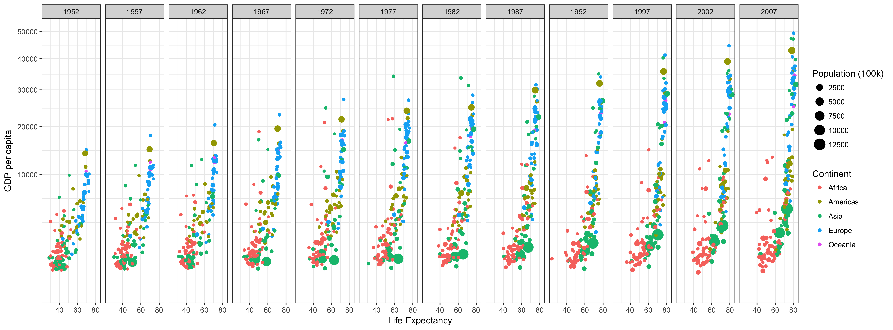
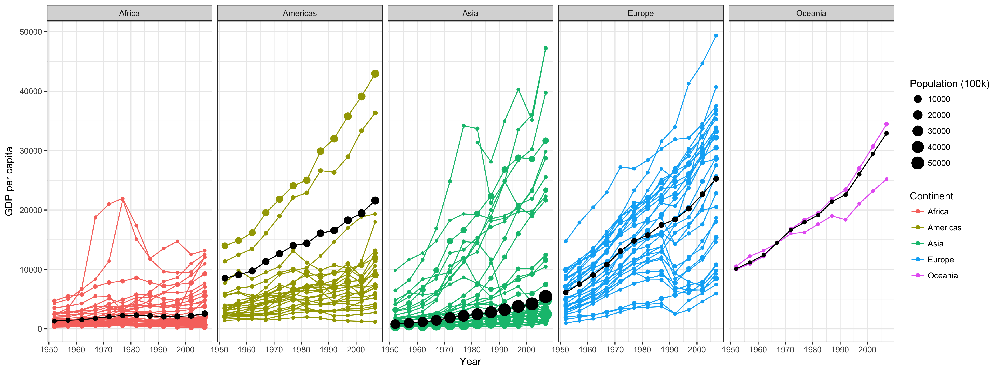

```{r setup, include=FALSE}
knitr::opts_chunk$set(echo = TRUE)
```
## 1) Background
___
These plots were a real challenge. One of the most important lessons that I learned was to be very familiar with the data in order to understand how to represent it well. 

I came across a problem that I didn't understand, so like any good programmer, I printed the data that I was working with and the results that I was getting. After doing so, I immediately understood how to fix my problem.

Something that is really interesting is just how much the visualization changes by using a different axis. Of course, doing so also changes the message that you are trying to get across. 

## 2) Images
___

