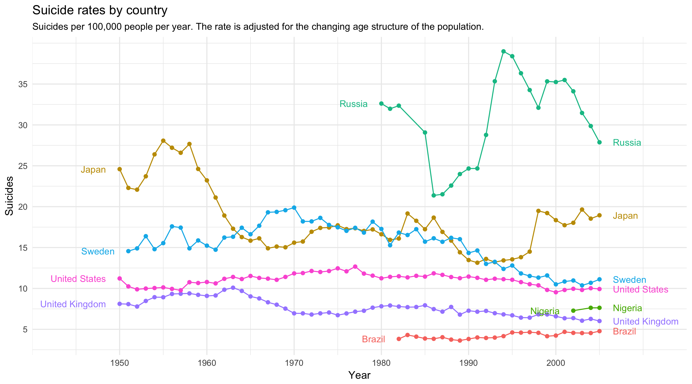
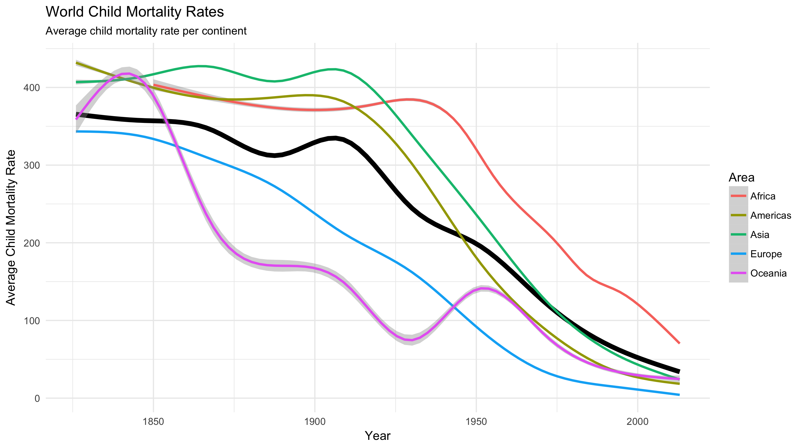

## Suicide Rates in the World
[Here is the link to the original graph](https://ourworldindata.org/suicide)

I found the original chart in the "Health" portion of the "OurWorldinData" website. This intrigued me because I wanted to see if the rates were going down or up, and which countries had higher and lower rates.

This graph ended up being a little difficult to reproduce because of the special features that it had, such as the legend next to its line. At least the data was whole, there was no missing information that I had to deal with.

## Child Mortality Rates in the World

It took me a little bit of time to think of a way to properly represent the child mortality rates in the world. I'm still not very satisfied with what I have right now, but I'm at a loss as to how to make it better. 

I ended up simply getting the mean of the countries for each continent, and then the mean of the continents (thick black line). It's a good thing that the rates for all continents are going down, but of course it is difficult to see the individual countries in this plot.

As an idea, maybe I should plot the median of the countries, and display any outliers as points. However, I don't really have time to do so.

