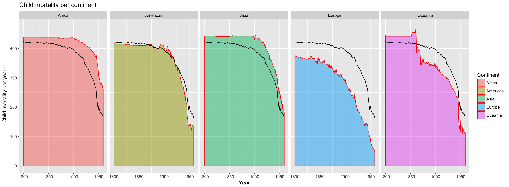

## Child mortality per continent

Here is the chart I made for child mortality per continent. I added the mean on each facet to compare between continents. As you can see, we are all dropping, which is good news.

