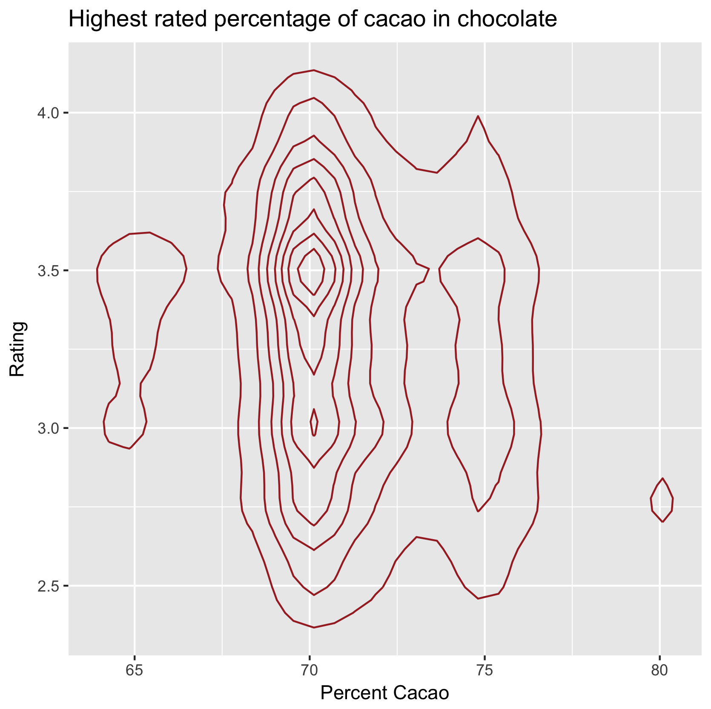
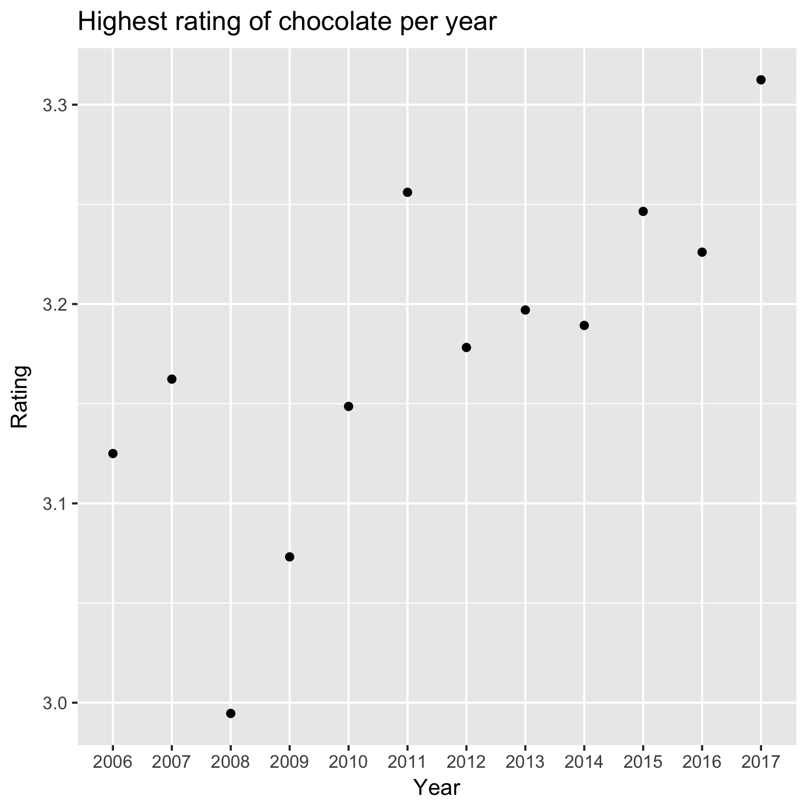
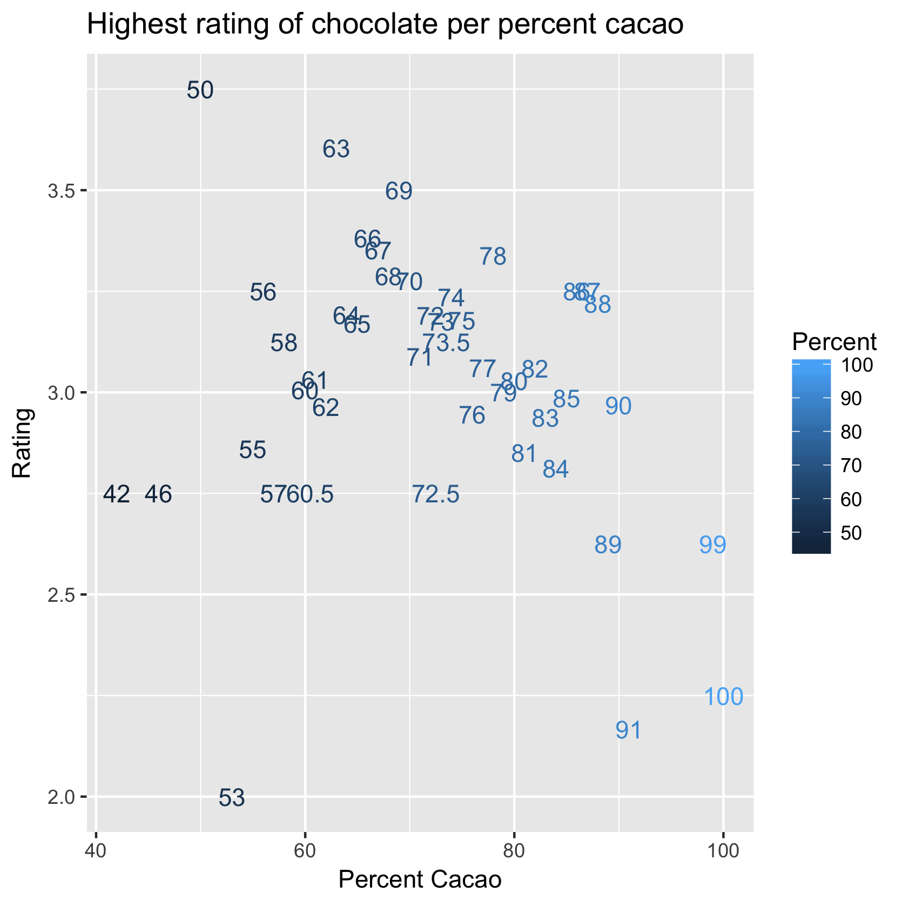

## Summary

So, after searching for a dataset to answer the following question:

> At which rate are people coming up with new words that are being added to dictionaries?

I was unable to find anything remotely useful. Therefore, I went on the search of a new question by looking at potential datasets. (If you can't find a dataset for your question, find a question for your dataset)

### Dataset 1: Chocolate

Who doesn't like chocolate? Well, my cousin. But that's a whole different story. I found this dataset on Kaggle and it seemed interesting to play with. 

Since it was the first one I found and I only had limited time to do some visualization, it is the only one I was able to plot. 

Here are some key things that I learned while working with this specific data:

* Having a ton of categorical data in one column is not very useful when trying to plot it
* Sometimes you just have to rename the columns because it just gets annoyingly complicated
* It's useful to drop any columns that you will not be using, that way the computational time is decreased

Of course, there is a way to fix the first bullet point, but I did not have the time to work on it. 

Here's what I could've done:

* For the country of origin, I could've created an extra column to group them into continents, and then use the continents to visualize the data
* For the bar names, I could've made another column to group them by manufacturer, and selected a few of them to display

Of course, there are a few variations to what I explained, but that is the gist of it.

Here's what I've got for the chocolate dataset (keep in mind that these are very basic):

> This graph displays the density of the percent cacao vs the rating. It shows that the ratings are higher at aroun 70% cacao, and it is also the most popular percentage.



> This simple graph shows the highest chocolate rating per year, and it seems like chocolate is getting better and better! 



> This one shows the average rating of chocolate per percentage of cacao. It sort of clarifies the first graph, showing that it is not actually the 70% that is the best, but 50% and in the 60s.



### Dataset 2: Candy

Alright, I know what you think. This guy has a sweet tooth. It is true. But that's not why I picked these datasets, as you will see from the next one.

This one is interesting because it can also easily be used for Machine Learning, most likely with a decision tree or k-Nearest-Neighbors, since the data is very simple.


```
## # A tibble: 6 x 13
##   comp… choc… frui… cara… pean… noug… cris…  hard   bar plur… sugar… pric…
##   <chr> <int> <int> <int> <int> <int> <int> <int> <int> <int>  <dbl> <dbl>
## 1 100 …     1     0     1     0     0     1     0     1     0 0.732  0.860
## 2 3 Mu…     1     0     0     0     1     0     0     1     0 0.604  0.511
## 3 One …     0     0     0     0     0     0     0     0     0 0.0110 0.116
## 4 One …     0     0     0     0     0     0     0     0     0 0.0110 0.511
## 5 Air …     0     1     0     0     0     0     0     0     0 0.906  0.511
## 6 Almo…     1     0     0     1     0     0     0     1     0 0.465  0.767
## # ... with 1 more variable: winpercent <dbl>
```

### Dataset 3: UFO Sightings

[Here's the full dataset](https://www.kaggle.com/NUFORC/ufo-sightings/data)

Boom. Now you might think I'm just weird, but this is a really interesting dataset! We can find a ton of cool information from this dataset because of its many columns and rich content. It also helps that we could possibly predict UFO sightings using Machine Learning.


```
## # A tibble: 6 x 11
##   datet… city   state coun… shape `dura… `dur… commen… `dat… lati… longit…
##   <chr>  <chr>  <chr> <chr> <chr>  <dbl> <chr> <chr>   <chr> <chr>   <dbl>
## 1 10/10… san m… tx    us    cyli… 2700   45 m… This e… 4/27… 29.8… - 97.9 
## 2 10/10… lackl… tx    <NA>  light 7200   1-2 … 1949 L… 12/1… 29.3… - 98.6 
## 3 10/10… chest… <NA>  gb    circ…   20.0 20 s… Green/… 1/21… 53.2  -  2.92
## 4 10/10… edna   tx    us    circ…   20.0 1/2 … My old… 1/17… 28.9… - 96.6 
## 5 10/10… kaneo… hi    us    light  900   15 m… AS a M… 1/22… 21.4… -158   
## 6 10/10… brist… tn    us    sphe…  300   5 mi… My fat… 4/27… 36.5… - 82.2
```


### So, what's next?

Well, I'm probably going to end up working with the UFO dataset unless I find something more interesting. I have yet to come up with a good question, but it'll probably be along the lines of "Where do aliens like to spend their holidays, and when do they usually take holidays?"
