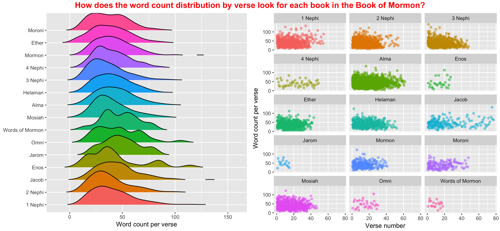

## Counting, graphing, coloring...

When I first read about the task I thought it was going to be a challenge. However, after a little bit of experimentation, I was able to accurately get the information that was required for all 3 questions.

----------

#### What is the average verse length (number of words) in the New Testament compared to the Book of Mormon?

Hint: the Book of Mormon wins. For these I had to learn how to use sapply, which is a very useful function when you want to do individual calculations for each value in a list. There are also other variations of this function that work with different things.
```{r libs, eval=TRUE, echo=FALSE, message=FALSE, warning=FALSE}
library(stringi)
library(stringr)
library(ggplot2)
library(tidyverse)
library(readr)
library(dplyr)
library(ggridges)
library(gridExtra)
```
```{r q1, eval=TRUE, echo=TRUE, message=FALSE, warning=FALSE}
dat_ <- read_csv("lds-scriptures.csv")

dat <- dat_ %>%
  mutate(lower_verse = strsplit(tolower(scripture_text), " "), verse_length = sapply(lower_verse, length))

dat %>%
  filter(volume_id == 2 | volume_id == 3) %>%
  group_by(volume_title) %>%
  summarise(average_verse_length = mean(verse_length))
```

---------

#### How often is the word Jesus in the New Testament compared to the Book of Mormon?

I was really suprised about this data, and I thought that I had done something wrong. Then I remembered that Jesus has a lot of names and that "Jesus" was very popular in the New Testament times.
```{r q2, eval=TRUE, echo=TRUE, message=FALSE, warning=FALSE}
dat %>%
  filter(volume_id == 2 | volume_id == 3) %>%
  mutate(jesus = sapply(sapply(lower_verse, grep, pattern = "jesus"), length)) %>%
  group_by(volume_title) %>%
  summarize(jesus_count = sum(jesus))
```

----------

#### How does the word count distribution by verse look for each book in the Book of Mormon?

I had a hard time representing this one properly. I couldn't really find anything that perfectly answered the question, so I created two graphs. The one on the left is nice because it shows everything on one facet, but it's a little difficult to compare. 



```{r q3, eval=FALSE, echo=TRUE, message=FALSE, warning=FALSE}
new_dat <- dat %>% 
  filter(volume_id == 3)

book_f <- new_dat$book_title %>% factor() %>% fct_inorder()
plot1 <- new_dat %>% 
  ggplot(aes(x = verse_length, y = book_f, fill = book_f)) +
  geom_density_ridges(rel_min_height = 0.01) +
  labs(x = "Word count per verse") +
  guides(fill = FALSE) +
  theme(axis.title.y = element_blank())

plot2 <- new_dat %>% 
  ggplot(aes(x = verse_number, y = verse_length, col = book_title)) +
  geom_point(alpha = 0.5, position = "jitter") +
  facet_wrap(~book_title, ncol = 3) +
  guides(col = FALSE) +
  labs(x = "Verse number", y = "Word count per verse")

ggarrange(plot1, plot2, ncol = 2) %>% 
  annotate_figure(top = text_grob("How does the word count distribution by verse look for each book in the Book of Mormon?", color = "red", face = "bold", size = 14)) +
    ggsave("Case_Study_07/Class_Task_14/distribution.png", width = 12)
```