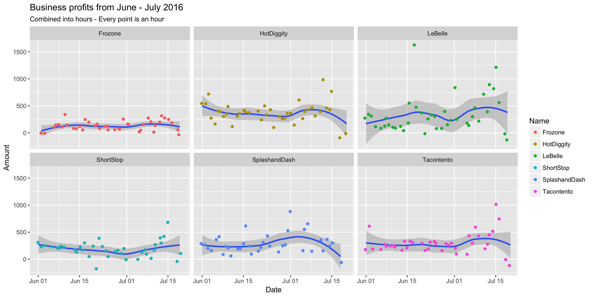
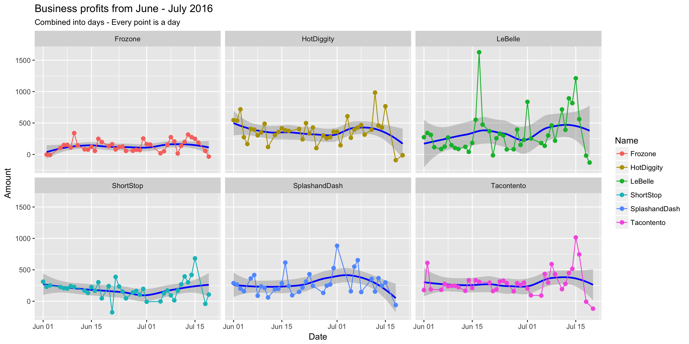
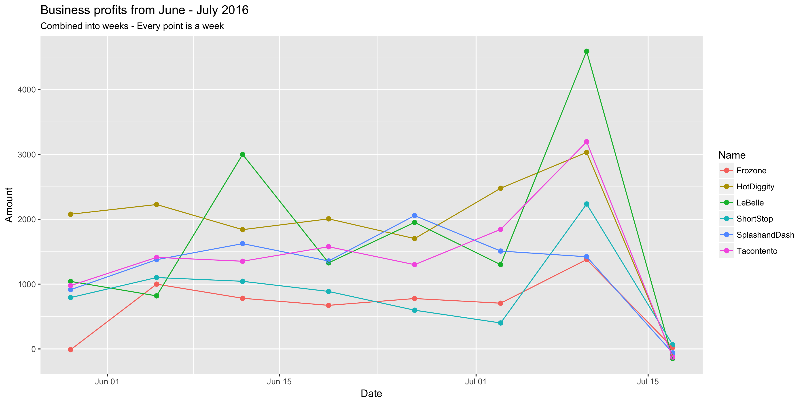
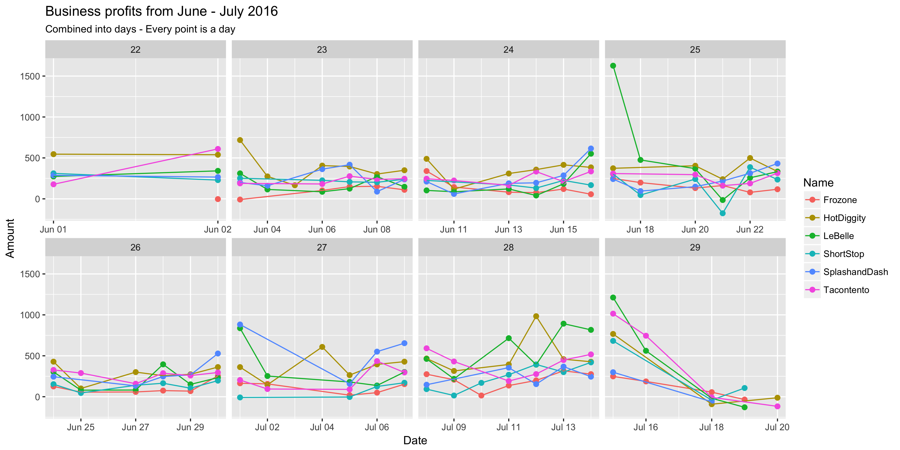
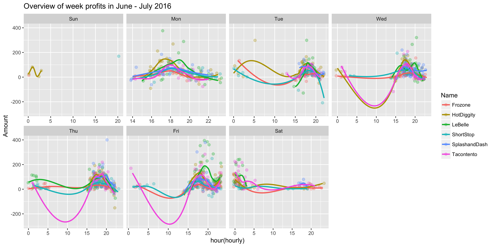

## Business comparison
This was an interesting case study because I had to think in a different way that I usually do to show the data appropriately.

EDIT: I changed some labels to better explain the graphs

Here is my prep code
```{r prepare, echo=TRUE, message=FALSE, warning=FALSE, eval=FALSE}
original_dat <- read_csv("https://byuistats.github.io/M335/data/sales.csv")

dat <- original_dat %>%
  filter(month(Time) > 5 & Name != 'Missing' & Amount <= 500) %>%
  mutate(hourly = floor_date(Time, unit = "hour"),
         daily = floor_date(Time, unit = "day"),
         weekly = floor_date(Time, unit = "week"),
         monthly = floor_date(Time, unit = "month"))

hour_dat <- dat %>%
  group_by(Name, Type, hourly) %>%
  summarise(Amount = sum(Amount))

day_dat <- dat %>%
  group_by(Name, Type, daily) %>%
  summarise(Amount = sum(Amount))

week_dat <- dat %>%
  group_by(Name, Type, weekly) %>%
  summarise(Amount = sum(Amount))

month_dat <- dat %>%
  group_by(Name, Type, monthly) %>%
  summarise(Amount = sum(Amount))
```

### First plot - A preview

This plot simply shows the hourly profits of all 6 businesses using a smooth line to help us understand a little what is going on. This is just a preview of the data.


```{r plot1, echo=TRUE, message=FALSE, warning=FALSE, eval=FALSE}
plot2 <- hour_dat %>% 
  ggplot(aes(x = hourly, y = Amount)) +
  geom_smooth() +
  geom_point(aes(col = Name), position = "jitter") +
  facet_wrap(~Name) +
  labs(title = 'Hourly business profits from June - July 2016')
```

### Second plot - Zoomed in

This plot is a less confusing version of the first one, being simplified as a daily plot instead of an hourly plot. It is a little easier to get meaningful information from the smooth line.



```{r plot2, echo=TRUE, message=FALSE, warning=FALSE, eval=FALSE}
plot3 <- day_dat %>% 
  ggplot(aes(x = daily, y = Amount, col = Name)) +
  geom_smooth(col = 'blue') +
  geom_point(size = 2) +
  geom_line() +
  facet_wrap(~Name) +
  labs(title = 'Daily business profits from June - July 2016')
```

### Third plot - Now to start comparing

Since there was less going on in each facet at a weekly level, I decided to bring all the businesses together in one facet to begin the comparisons



```{r plot3, echo=TRUE, message=FALSE, warning=FALSE, eval=FALSE}
plot4 <- week_dat %>% 
  ggplot(aes(x = weekly, y = Amount, col = Name)) +
  geom_point(size = 2) +
  geom_line() +
  labs(title = 'Weekly business profits from June - July 2016')
```

### Fourth plot - A daily view over facetted weeks

I was thinking that the previous plot might not have enough information to it, so I went back to a daily view but facetted over weeks to make it less confusing. With this one we can start to see that "HotDiggity" usually does quite well.



```{r plot4, echo=TRUE, message=FALSE, warning=FALSE, eval=FALSE}
plot5 <- day_dat %>% 
  ggplot(aes(x = daily, y = Amount, col = Name)) +
  geom_point(size = 2) +
  geom_line() +
  facet_wrap(~week(daily), scales = 'free_x', nrow = 2) +
  labs(title = 'Daily business profits from June - July 2016')
```

### Fifth and final plot - A nice overview of a week

Something that I thought would be important was to see in a week how well each business was doing, so I plotted all weeks into one with hourly data. This allows us to see some interesting things, such as the fact that Sundays are usually closed, and there is little to no business in the morning.

As stated previously, "HotDiggity" does quite well overall and its biggest competitors seems to be "LeBelle" and "Tacontento".



```{r plot5, echo=TRUE, message=FALSE, warning=FALSE, eval=FALSE}
plot6 <- hour_dat %>% 
  ggplot(aes(x = hour(hourly), y = Amount, col = Name)) +
  geom_point(size = 2, position = 'jitter', alpha = 0.3) +
  geom_smooth(aes(group = Name), se = FALSE) +
  facet_wrap(~wday(hourly, label = TRUE), scales = 'free_x', nrow = 2) +
  labs(title = 'Overview of week profits in June - July 2016')
```
