## Foreword

Analyzing things people post on social media can tell you a lot about a person, especially if they post a lot. There are times when you might see one of your connections' post and think to yourself, "Too Much Info" (TMI for short). These are the types of people who make for interesting projects. 

One of the Twitter accounts that have been under the most scrutiny has been President Trump's account due to the various kinds of posts he has delivered and their potential impact on the world. So I decided to mine this rich resource of controversial data to try to find some interesting insights into this figure's life.

## Getting & Analyzing the Data

Getting the data was fairly straightforward: a very generous website with the name of trumptwitterarchive has been saving Trump's tweets for quite some time, so I used their data. On their website, it did say that if there were more than 10,000 rows of data, it would be very laggy. Much to my concern and amazement, there were over 33,000. With much patience, I was able to take the data as a CSV file. 

I loaded it into RStudio using the handy-dandy "readr" package and started my exploration of the data. I converted the created_at column to date format for simpler usage using the "lubridate" package. I then created many more columns that I could use for the analysis, such as extracting the hashtags, mentions, and their total number per tweet. 


```r
dat_plus <- dat_ %>% 
  mutate(year = year(created_at), 
         month = month(created_at), 
         week = week(created_at), 
         day = day(created_at), 
         hour = hour(created_at),
         wday = wday(created_at),
         month_year = floor_date(created_at, "month"),
         hashtags = str_extract_all(text, "#\\S+"),
         num_hashtags = mapply(function(i) length(hashtags[[i]]), 1:length(hashtags)),
         mentions = str_extract_all(text, "@\\S+"),
         num_mentions = mapply(function(i) length(mentions[[i]]), 1:length(mentions)),
  )

dat_plus$wday_name <- factor(dat_plus$wday, levels=1:7,
                      labels = c("Sunday", "Monday", "Tuesday", "Wednesday",
                                 "Thursday", "Friday", "Saturday"))
```

That's when I saw it. I had a **monstrous** tweet that had 150+ hashtags and 100+ mentions. Knowing that that was impossible due to the 280 character limit for a tweet, I knew that something had happened during the import of the data into RStudio or during the download of the data from trumptwitterarchive.

I had a moment of insight when I thought that it must've been due to the text of the tweets interfering with the CSV format, so I used a JSON file of the tweets instead to verify my hypothesis. The monster tweet disappeared, so I accepted this as the case.

### Plotting Correlations

One of the first things that came to my mind about trying to understand the data better was looking for correlations. I looked at possible correlations between the number of hashtags and the number of retweets, the number of mentions and the number of hashtags, and the hour and number of retweets. None of these were very promising, so I promptly gave up on that idea.

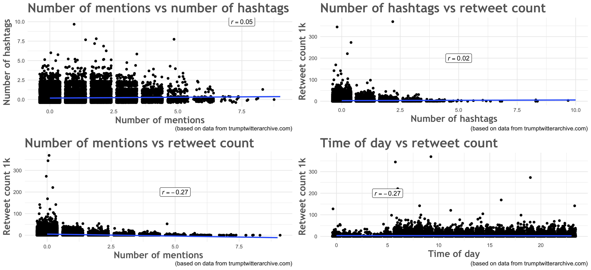

### Bar Charts

Bar charts are nice when you first get the data and are trying to dissect it. When I get a nice thick steak at the restaurant, I enjoy cutting the bone out and cutting a few thin slices of the tender meat before even taking the first bite. This is what bar charts are like. In the end, they don't fill you up at all, but they help in getting to the eating and digestion of the data.

I have found that some of the best information that is available from tweets is the date and time that can be extracted. Therefore, I've used that notion to create the bar charts.

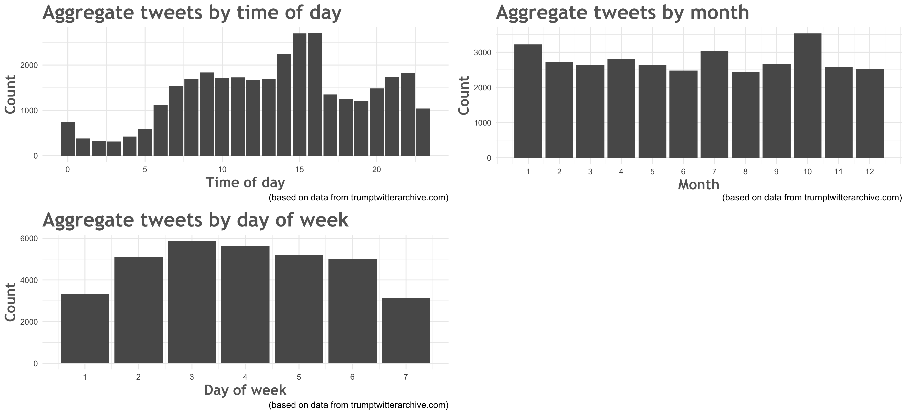

### Patterns in time of day and day of the week

Since my previous exercise did not yield much interesting fruit, I decided that a better way to view it would be to combine the time of day and the day of the week to discern deeper patterns and maybe even extract Trump's schedule from it. At first, I had not separated the graph between the years when Trump was not the president and when he was, and since there was much more data about when he wasn't president than when he was, the more recent patterns were covered up. 

So I split it. 

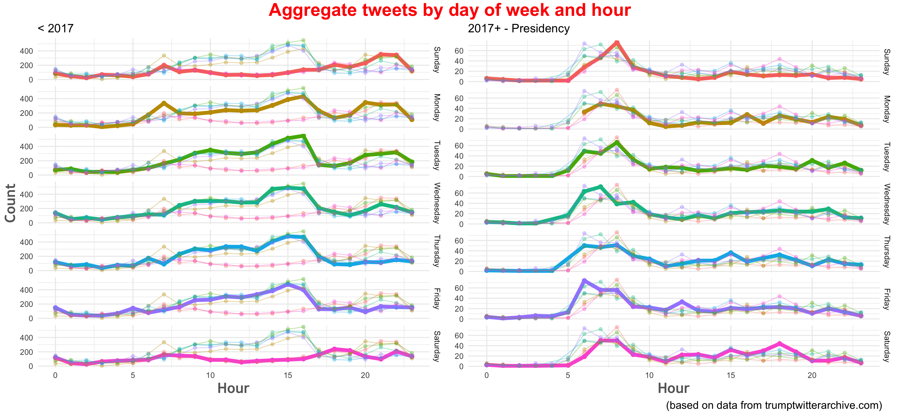

> As you can see, both sides are drastically different from each other. It seems that before he became president, he had a lot of free-time at around 3 pm on weekdays only, which indicates that this is when he had a break from his busy schedule. However, as president, it seems that his free-time is mostly in the mornings. [Some have speculated](https://mashable.com/2017/11/30/trump-fox-and-friends-tweets-graph/#_ZtTtA_7hPqP) that he watches the news in the morning while he tweets, and it is very possible. 

### What Cellphone does Trump Have?

A few years ago Trump had the idea to have dedicated office phones that implemented the video chat features. If you hadn't heard of that it proves the point that they were not a success. These phones had the ability to go on Twitter and Facebook, but I doubt that he used them himself for that purpose. So the question remains: what kind of phones/device does Trump use?

Well, twitter data comes with that information, so I decided to make a plot to find out.

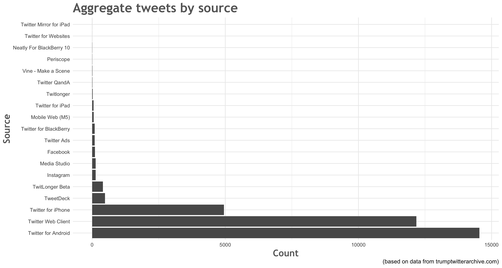

***

This plot, however, does not really answer our question. It shows that throughout his Twitter career, Trump used mostly Android and web browsers. However, it does not tell us when that was and if it is still the case. So I made a different plot that shows us more information.


```r
test <- dat_plus %>% 
  filter(year >= 2017) %>% 
  mutate(test = wday_name) %>% 
  select(-wday_name) %>% 
  group_by(test, hour) %>% 
  summarise(count = max(n()))

plot1 <- dat_plus %>% 
  filter(year >= 2017) %>% 
  group_by(wday_name, hour) %>% 
  summarise(count = max(n())) %>% 
  ggplot(aes(x = hour, y = count, col = wday_name)) +
  geom_point(size = 2) +
  geom_line(size = 2) +
  facet_grid(wday_name ~ .) +
  geom_point(data = test, aes(x = hour, y = count, col = test), alpha = 0.3) +
  geom_line(data = test, aes(x = hour, y = count, col = test), alpha = 0.3) +
  guides(col = FALSE) +
  labs(x = "Hour",
       title = "2017+ - Presidency") +
  theme_minimal() +
  theme(axis.title.y = element_blank(),
        axis.title.x = element_text(family = "Trebuchet MS", 
                                  color = "#666666", 
                                  face = "bold", 
                                  size = 16)) 
  # ggsave("project/point_tweet_wday_hour_2017.png", width = 12)

test <- dat_plus %>% 
  filter(year < 2017) %>% 
  mutate(test = wday_name) %>% 
  select(-wday_name) %>% 
  group_by(test, hour) %>% 
  summarise(count = max(n()))

plot2 <- dat_plus %>% 
  filter(year < 2017) %>% 
  group_by(wday_name, hour) %>% 
  summarise(count = max(n())) %>% 
  ggplot(aes(x = hour, y = count, col = wday_name)) +
  geom_point(size = 2) +
  geom_line(size = 2) +
  facet_grid(wday_name ~ .) +
  geom_point(data = test, aes(x = hour, y = count, col = test), alpha = 0.3) +
  geom_line(data = test, aes(x = hour, y = count, col = test), alpha = 0.3) +
  guides(col = FALSE) +
  labs(x = "Hour",
       y = "Count",
       title = "< 2017") +
  theme_minimal() +
  theme(axis.title = element_text(family = "Trebuchet MS", 
                                    color = "#666666", 
                                    face = "bold", 
                                    size = 16))
  # ggsave("project/point_tweet_wday_hour_before.png", width = 12)

plot <- grid.arrange(plot2, plot1, 
             layout_matrix = rbind(c(1, 2),
                                   c(NA, NA)), 
             top = text_grob("Aggregate tweets by day of week and hour", color = "red", face = "bold", size = 20),
             bottom = text_grob("(based on data from trumptwitterarchive.com)", hjust = -1)) 
ggsave("project/point_tweet_wday_hour_combined.png", plot = plot, width = 14)
```

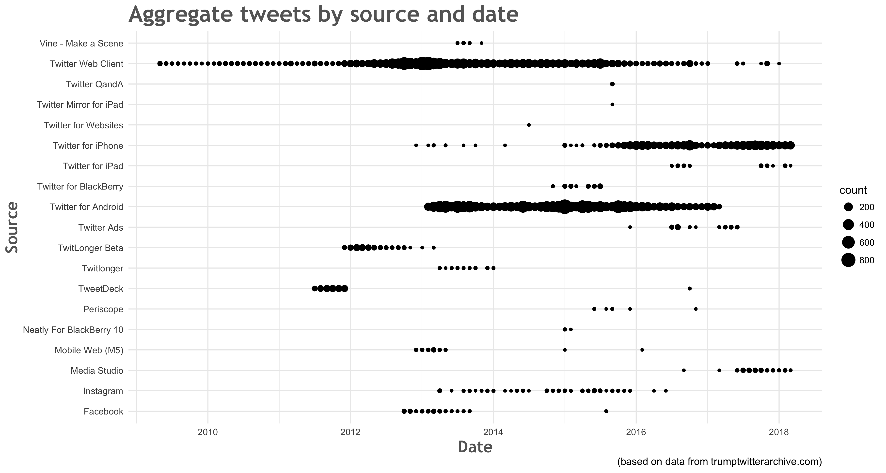

> As you can see, this gives us much more information. Every point represents a month's worth of tweets through that device/service. 

- It looks like Trump stopped using Android when he became president and opted mostly for an iPhone
- It looks like he had both for the space of a year or so, which might indicate that he had people who did some of his tweetings for him, or that he simply rocked two phones 
- His use of a web browser also decreased dramatically as he became president
- He also started using another service when he became president, called "Media Studio". This is [Twitter's response](https://business.twitter.com/en/help/troubleshooting/media-studio-faqs.html) to Youtube and Facebook's video revenue services, which seems to indicate that Trump decided to start making money off of his videos
- He also seems to have an iPad which he uses from time to time for tweeting purposed


### Analyzing the text

#### Prep
- I used the "qdap" package to prepare the text for analysis. It allows for removal/substitution of punctuation, abbreviations, numbers, and more.
- I replaced the "&amp;" that appeared with an empty string
- I found that there was a barackobamas string, so I replaced it with barackobama
- I put everything into low-case
- I removed stop-words such as "and", "I", "if", and more, making sure to keep "again" (make America great again)
- I removed links


```r
# Get the text ready for analysis
tweets_text <- tolower(stripWhitespace(
  removeNumbers(
    removePunctuation(
      replace_contraction(
        replace_abbreviation(
          tolower(
            gsub("barackobamas", 
                 "barackobama", 
                 gsub("&amp;",
                      "", 
                      dat_plus$text)))))))))
tweets_text <- removeWords(tweets_text, gsub("again", "", stopwords("en")))
tweets_text <- removeWords(tweets_text, "realdonaldtrump")
tweets_text <- gsub("http([^ ]+)", "", tweets_text)
```

***

#### Frequency of words

I made a bar chart of the most frequently used words in Trump's tweets. He seems to use "Trump" quite often, although it might just be from retweets. Of course, his second favorite word is "great". This does not give us much insight into his tweets, however, so I dove a little deeper.

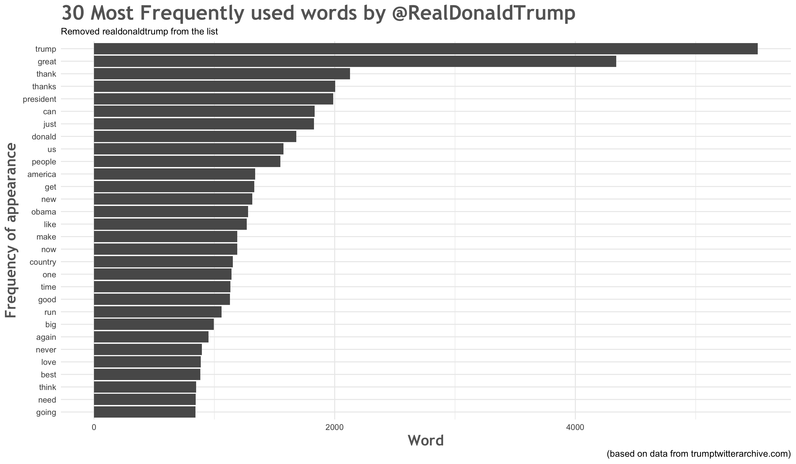

***

#### Sentiment Analysis
The idea behind sentiment analysis is that some words indicate positive sentiments (feelings), while others indicate negative sentiments. Since I had already prepared the data for detailed analysis of each word, conducting a sentiment analysis was fairly straightforward.


```r
# Convert to dfm format
tweets_text.df <- tibble(tweets_text)
d <- quanteda::dfm(tweets_text, verbose = FALSE)
tweets_td <- tidy(d)

# Get some sentiment analysis going
tweets_sentiments <- tweets_td %>% 
  inner_join(get_sentiments("bing"), by = c(term = "word")) %>% 
  filter(term != "trump")
```

Here are some of his most negative tweets:
```
[1] "The Fake News Media has never been so wrong or so dirty. Purposely incorrect stories and phony sources to meet their agenda of hate. Sad!"
[1] "The public is learning (even more so) how dishonest the Fake News is. They totally misrepresent what I say about hate, bigotry etc. Shame!"
[1] "If Graydon Carter's very dumb bosses would fire him for his terrible circulation numbers at failing Vanity Fair-his bad food restaurants die"
[1] "If Graydon Carter's very dumb bosses would fire him for his terrible circulation numbers at failing Vanity Fair-his bad food restaurants die"
[1] "\"@bx_bobby: @realDonaldTrump what was racist about that story?\"  The story wasn't racist, just inaccurate and wrong. Bryant is dumb &amp; racist"
```

And some of his most positive tweets:
```
[1] "Good luck and best wishes to my dear friend, the wonderful and very talented Joan Rivers!  Winner of Celebrity Apprentice, amazing woman."
[1] "Work is fun, deals are fun, life is fun - but love of a great family makes it all come together. Go out there and make your family proud."
[1] "Success is good. Success with significance is even better. Work on what you will be proud to be associated with--make your work count."
[1] "“Fans like winners. They come to watch stars – great, exciting players who do great exciting things.” - The Art of The Deal"
[1] "It was my great honor to welcome Mayor’s from across America to the WH. My Administration will always support local government - and listen to the leaders who know their communities best. Together, we will usher in a bold new era of Peace and Prosperity! https://t.co/dmYECTnk0a https://t.co/RSv7V7r0DT"
```

Here is a plot of the overall sentiments in Trump's tweets. I had to remove "trump" from the list since it counts as a positive sentiment. Most of Trump's tweets have been positive over his Twitter career, but I would have to isolate 2017 and up to see if that holds while he is president.

Some key words that I found interesting are:

- Crooked
- Great
- Fake

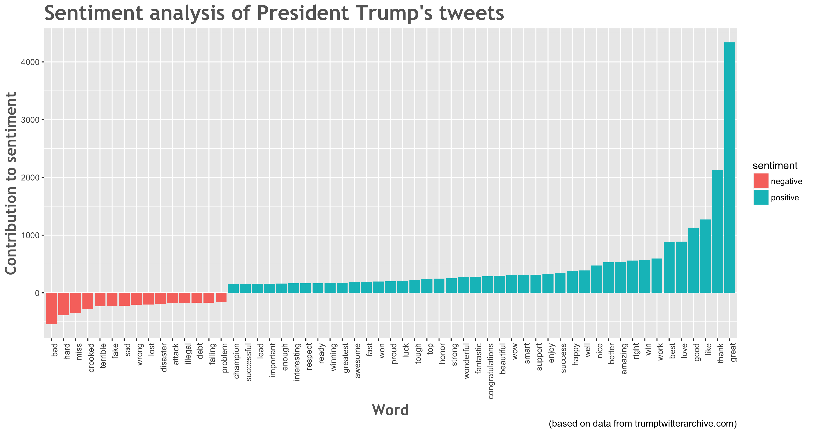

***

#### Changes in word usage over the years

I decided to do some frequency analysis on his tweets to see emerging patterns in his tweets. This could be done over a year to have a better understanding of events that have happened in that year, or over multiple years. Overall, it requires a lot of playing around with, which I did not have much time to do. 


```r
# Clean the text again, but keep the rest of the info
dat_plus <- dat_plus %>% 
  mutate(text = gsub("&amp;", "", text))
dat_plus$text <- dat_plus$text %>%
  replace_abbreviation() %>% 
  replace_contraction() %>% 
  removePunctuation() %>% 
  removeNumbers() %>% 
  stripWhitespace() %>% 
  tolower() %>% 
  removeWords("realdonaldtrump") %>% 
  gsub(pattern = "http([^ ]+)", replacement = "")

# Split by word
trump_words <- dat_plus %>% 
  unnest_tokens(word, text) %>%
  anti_join(stop_words %>% filter(word != "again"))

# Get frequencies over time
trump_freq <- trump_words %>%
  count(year, word) %>%
  ungroup() %>%
  complete(year, word, fill = list(n = 0)) %>%
  group_by(year) %>%
  mutate(year_total = sum(n),
         percent = n / year_total) %>%
  ungroup()

# Logistic regression
models <- trump_freq %>%
  group_by(word) %>%
  filter(sum(n) > 50) %>%
  do(tidy(glm(cbind(n, year_total - n) ~ year, .,
              family = "binomial"))) %>%
  ungroup() %>%
  filter(term == "year")
```

This interesting plot shows the increase or decrease in usage of certain words. 

- Left of 0 we have a decrease of usage for words such as ```obama``` or ```mittromney```
- Right of 0 we have an increase of usage for words such as ```daca``` and ```fake```
- The plot on the right shows the top 6 words, some of which show a decrease while the others show an increase

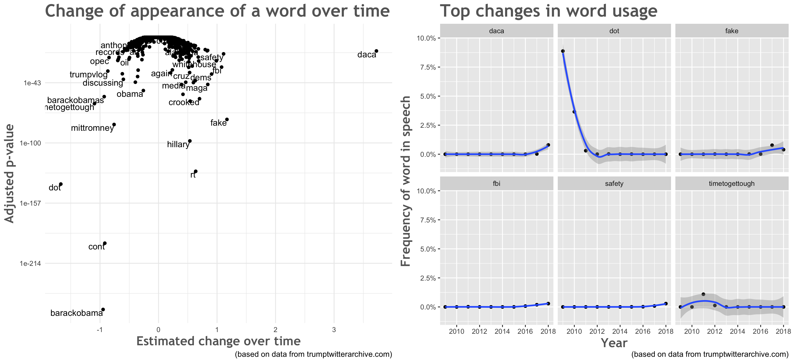

***

#### Finding topics
Another aspect of text analysis is trying to find topics in the text given. This proved very difficult for these tweets since there was no consistent and structured stream of topics. Something that could have possibly helped would have been to limit it to Trump's presidency. 

I could not see any particular patterns in the topics generated.


```r
# Turn df into dtm
myCorpus <- Corpus(VectorSource(tweets_text.df))  
dtm <- DocumentTermMatrix(myCorpus)

# Get the model
tweet_lda <- LDA(dtm, k = 4, control = list(seed = 121293))
tweet_topics <- tidy(tweet_lda, matrix = "beta")

tweet_top_terms <- tweet_topics %>%
  group_by(topic) %>%
  top_n(20, beta) %>%
  ungroup() %>%
  arrange(topic, -beta)
```
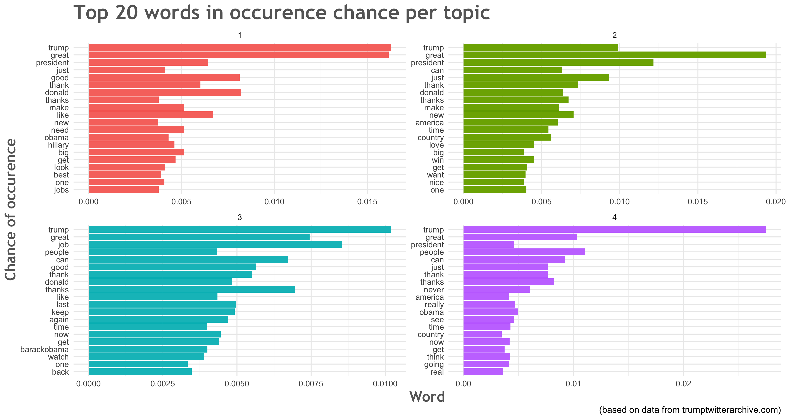

***

#### Some insight into Trump's tweeting career
I thought it would be interesting to see if I could pick out any patterns in his tweeting over the previous 9 years or so.

This is what I came up with:

- It seems like he started tweeting a lot after Obama picked on him on television
- We usually think, now that he is president, that he tweets too much, but this plot shows his tweeting decreasing

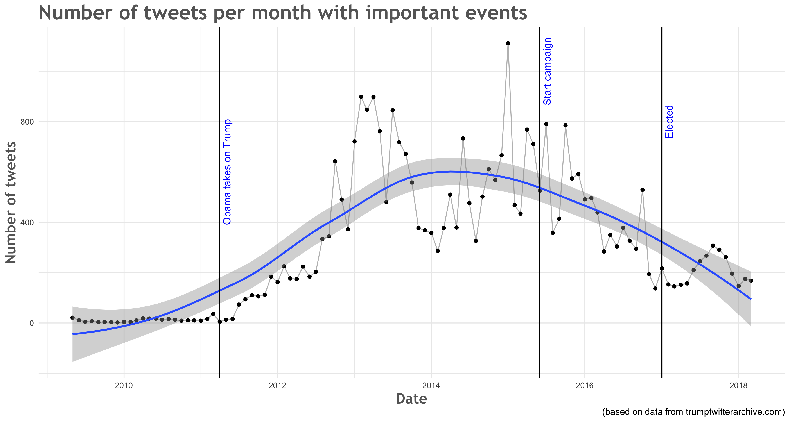

***

#### Tokenizing

The last type of text analysis that I conducted on Trump's tweets was tokenizing, which consists of finding words that frequently appear together.


```r
dat_plus <- dat_plus %>% 
  mutate(text = gsub("&amp;", "", text))
dat_plus$words <- dat_plus$text %>%
  tolower() %>% 
  gsub(pattern = "http([^ ]+)", replacement = "") %>% 
  removeWords(gsub("again", "", stopwords("en"))) %>% # Not sure if I should remove these
  replace_abbreviation() %>% 
  replace_contraction() %>% 
  removePunctuation() %>% 
  removeNumbers() %>% 
  stripWhitespace() %>% 
  tolower() %>% 
  removeWords("realdonaldtrump")
```
In this case, I wanted to see which pair of words appeared most frequently together, which are called bigrams.

- This type of analysis seemed to have worked better than LDA, mostly because it does not try to focus on topics but brings them out anyway
- This year some topics have been `fake news`, `russian meddling`, and `tax cuts`
- Last year, `fake news` was even more pronounced
- While he was running for president, there was `great again` and `crooked hillary`

- The network shows connections and weights between relevant words
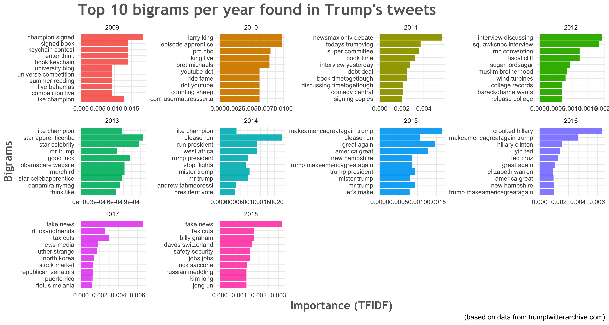
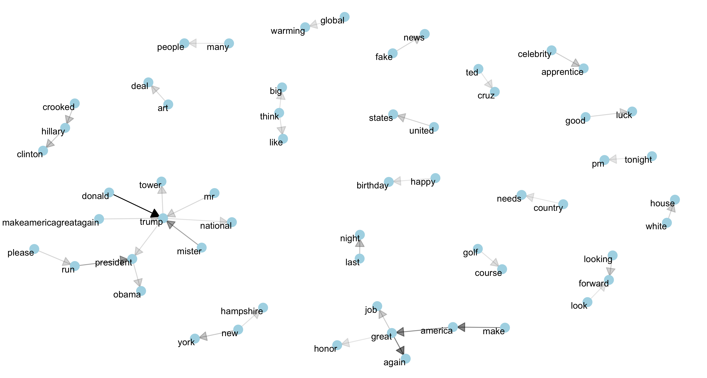

***

##### Trigrams
Here are trigrams, trios of words that frequently appear together. You can see some of the same patterns, but these show deeper topics than bigrams such as `dangerous southern border` and some funny nicknames such as `lyin ted cruz`.

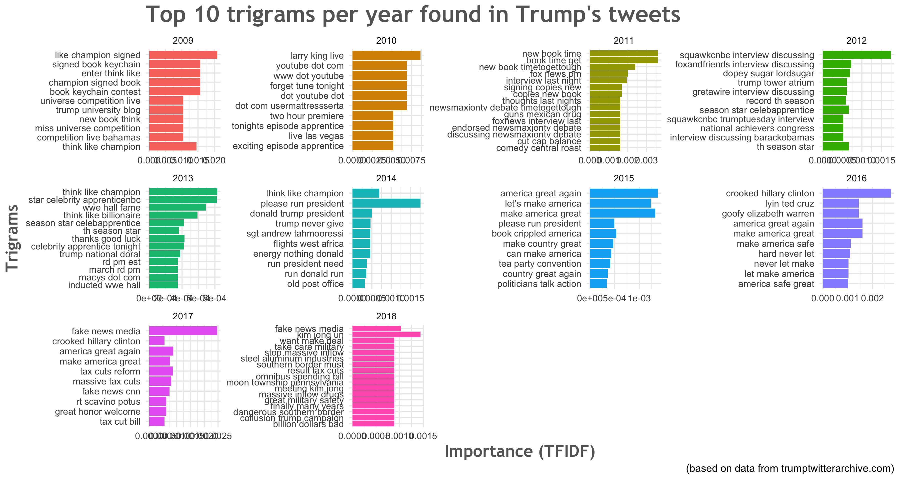
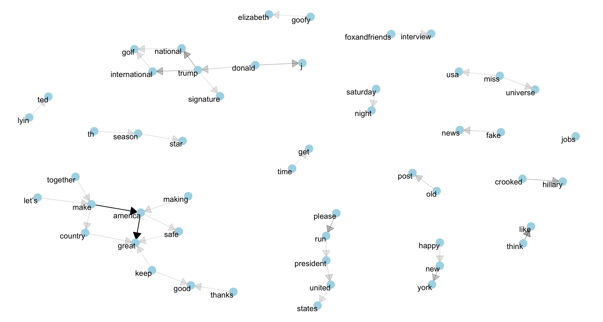

***

##### And some tetragrams, if you are curious
These aren't as good as the trigrams, which seems to indicate that most topics can only be extracted from up to three consecutive words (not including stop-words).

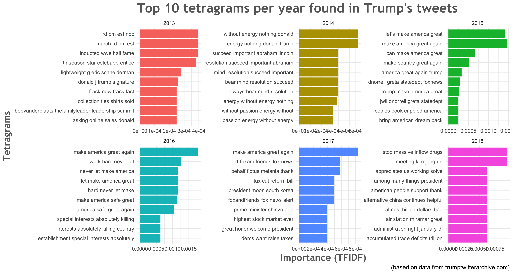
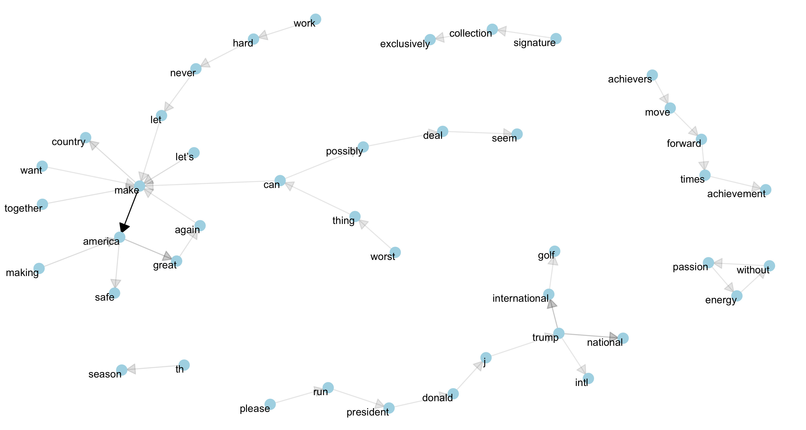

***

## Conclusions
It seems that there is much we can learn from closely analyzing data. The common consensus is that Trump's tweets are idiotic and negative, but according to the sentiment analysis it would seem that most of his tweets are positive. However, if a closer look is what is requested, it would be important to limit the data to the past 2-3 years and do the same analysis.

It also looks like Trump might have chosen to start using twitter and made up his mind about becoming president one day due to the nagging that he incurred from Obama in 2011. However, his usage of twitter seems to be slowing down now that he has achieved his goal.

According to a quick look at his twitter schedule, he seems to have more time in the mornings, possibly due to him supposedly watching the news during that time. 

He uses an iPhone, of that there is no doubt. However, it is intriguing that he started using Media Studio, indicating that he makes money off of videos he posts on Twitter.

It is suprising the amount of information that can be inferred from some simple tweets. Facebook seems to be getting drilled about privacy, but if you are a consistent and regular user of social media this sort of analysis could be done on your data, which would reveal a lot of information about you and your life.

#### --- Etienne Beaulac
##### Links:
##### - [Github](www.github.com/exaudeus)
##### - [LinkedIn](https://www.linkedin.com/in/etiennebeaulac)
