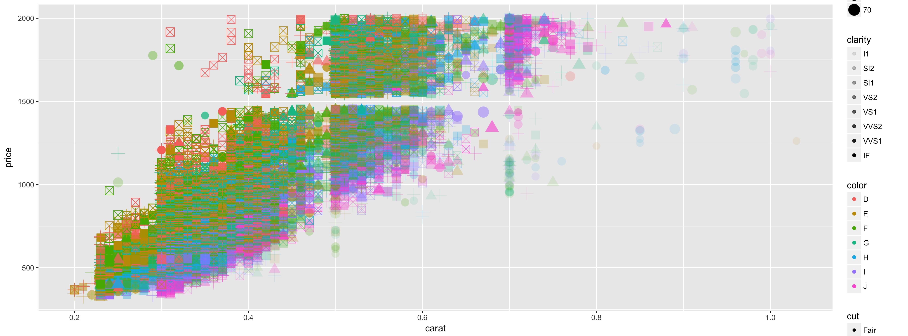
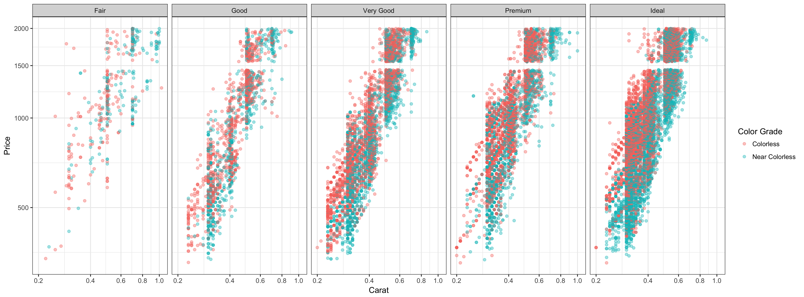

## Rough Plot
For this first plot, I was interested in seeing how many dimensions could be included within the same graph. Of course, not all of these dimesions might be extremely relevant nor acceptable, but it creates quite the view. 

As you can see from the legend, I plotted the graph with the Price on the Y-axis and the Carats on the X-Axis. I did so because the price varies according to the Carats, and not vice versa. 

As other dimensions I added the color-grading as color, the clarity as alpha, the cut as the shape, and the size of the top (called table) as the size.

It creates a mess. It is important to isolate what is needed to portray the data.

## Better Plot
For this better plot, I decided, through observation of the data, that the cut, the color-grading, the carats, and the price were the most important features of diamonds when determining price.

I created multiple facets by cuts, simplified (through much toil) the colors from 7 categories to 2 (taken from the diamonds website), and once again plotted using price and carats, but this time with a log10 scaling to show the correlation between price and carat.

I dropped the alpha to make it easier to see all of the points plotted since there are so many.

Now, we can clearly see that colorless diamonds with higher carats are more expensive than near colorless diamonds with lower carats. The cut also makes a fairly large difference, especially when looking at lower price points.

