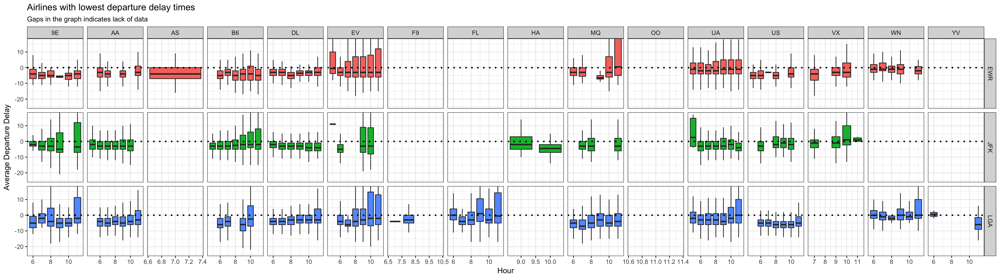
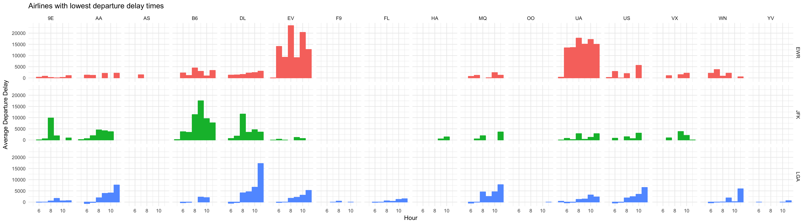
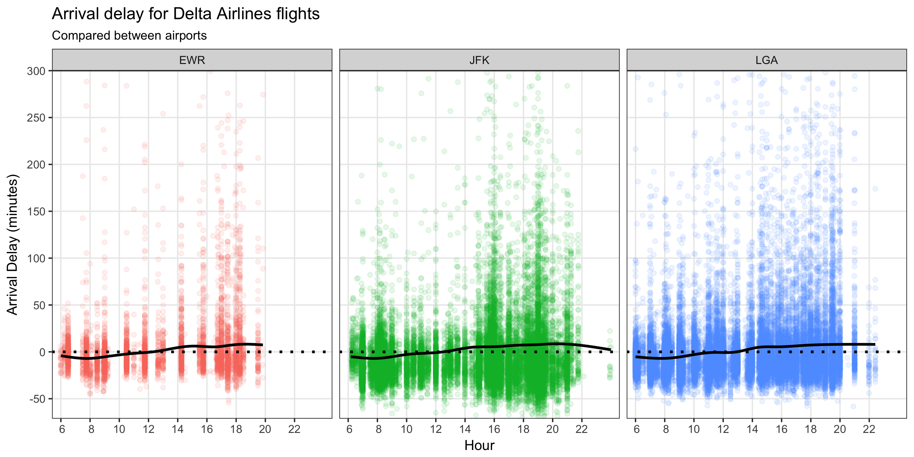

***
## Question 1
### If I am leaving before noon, which two airlines do you recommend at each airport (JFK, LGA, EWR) that will have the lowest delay time at the 75th percentile?

So, I wasn't exactly sure how to answer this question at first, but with some playing around I came up with the following plot.

As you can see, it facets all the airlines against the three airports, showing a mean delay time per hour. Something that is interesting from this plot is that we can clearly see that it is better to take a flight earlier in the morning. 

Doing it like this makes it easy to spot which airlines are better at which airports. For example, I can see that using 9E (Endeavor Air) is a good idea at the EWR (Newark Liberty International Airport), but maybe not such a good idea at the JFK (John F. Kennedy International Airport), and so forth.

Something that I might need to add or change would be to simply have the airline and airport names instead of their abreviations, or have a legend included.

#### EDIT: Here is the new graph as per the recommendation of classmates
I changed it to show boxplots instead, but kept the idea of showing per hour. I also added a dotted horizontal line to show delay vs lead.


```r
flights_delay <- flights[complete.cases(flights$dep_delay),]

flights_delay %>%
  ggplot() +
  geom_boxplot(data = flights_box, aes(x = hour, y = dep_delay, fill = origin, group = hour), outlier.shape = NA) +
  coord_cartesian(ylim = boxplot.stats(flights_delay$dep_delay)$stats[c(1, 5)] * 1.50) +
  geom_hline(yintercept = 0, color = "black", size = 1, linetype = "dotted") +
  labs(title = "Airlines with lowest departure delay times", subtitle = "Gaps in the graph indicates lack of data", x = "Hour", y = "Average Departure Delay") +
  guides(fill = FALSE, color = FALSE) +
  facet_grid(origin ~ carrier, scales = "free") +
  theme_bw() +
  ggsave("Case_Study_03/analysis/flights01_new.png", width = 20)
```


```r
flights_delay <- flights[complete.cases(flights$dep_delay),]

flights_delay %>%
  filter(hour < 12) %>%
  group_by(hour, origin) %>%
  mutate(mean.delay = weighted.mean(dep_delay)) %>%
  ggplot() +
  geom_bar(aes(x = hour, y = mean.delay, color = origin), stat = "identity") +
  labs(title = "Airlines with lowest departure delay times", x = "Hour", y = "Average Departure Delay") +
  guides(color = FALSE) +
  facet_grid(origin ~ carrier) +
  theme_minimal() +
  ggsave("Case_Study_03/analysis/flights01.png", width = 20)
```


***
## Question 2
### Which origin airport is best to minimize my chances of a late arrival when I am using Delta Airlines?

I always have a hard time when I work with large amounts of data since it all overlaps and hides meaningful information. Most of my time was spent on remedying this problem, and here is what I did:

* I dropped the alpha to more easily see high concentrations of points, but that introduced the problem of somewhat hiding individual points and outliers
* To fix the above and add relevancy I added a mean of delay per hour, which helps visualize the whole of the data and show that even though EWR looks like a better airport because it has less data, it is not really the case
* I seperated by airport again for easy comparisons
* I added a horizontal line to show the difference between delays and leads

It seems that the airport itself doesn't really matter, but once again, morning flights seem to be much better.

#### EDIT: I adjusted the smooth line and the horizontal line, as well as the scale of the graph to display more meaningful information.

```r
flights_new <- flights[complete.cases(flights$arr_delay),]

flights_new %>%
  filter(carrier == "DL") %>%
  group_by(carrier, hour) %>%
  mutate(mean.dl.flight = weighted.mean(arr_delay)) %>%
  filter(arr_delay < 400) %>%
  ggplot() +
  geom_point(aes(x = hour + (minute / 60), y = arr_delay, color = origin), alpha = 0.1, position = "jitter") +
  geom_hline(yintercept = 0, color = "black") +
  geom_smooth(aes(x = hour + (minute / 60), y = mean.dl.flight), color = "grey") +
  geom_point(aes(x = hour, y = mean.dl.flight), color = "black", size = 0.5) +
  labs(title = "Arrival delay for Delta Airlines flights", subtitle = "Compared between airports", color = "Delay", x = "Hour", y = "Arrival Delay (minutes)") +
  scale_x_discrete(limits = seq(6, 22, 2)) +
  scale_y_discrete(limits = seq(-50, 400, 50)) +
  guides(color = FALSE) +
  facet_grid(~ origin) +
  theme_bw() +
  ggsave("Case_Study_03/analysis/flights02.png", width = 10, height = 5)
```


***
## Summaries
#### “What do people do with new data”
I think the tweet that I liked the most was this one:

> @treycausey @hmason Test really boring hypotheses. Like num_mobile_comments <= num_comments. -- Dean Eckles (@deaneckles) June 12, 2014

It taught me to not trust the data blindly. Of course, I was aware that there could be missing values and corrupted data, but it had not crossed my mind to extra-verify something that should be a no-brainer.


#### "Effectively Communicating Numbers"
The information contained in those 7 pages are very important if you want to become a good data scientist. It's the information that sets apart experts from amateurs. Every detail is important. I think a big chunk of your time should be used to represent the data correctly, thinking about all the different aspects that can help the viewer understand better, whether it be changing the scale, including a title, changing the legend, or even chosing to use a table instead of a graph.
