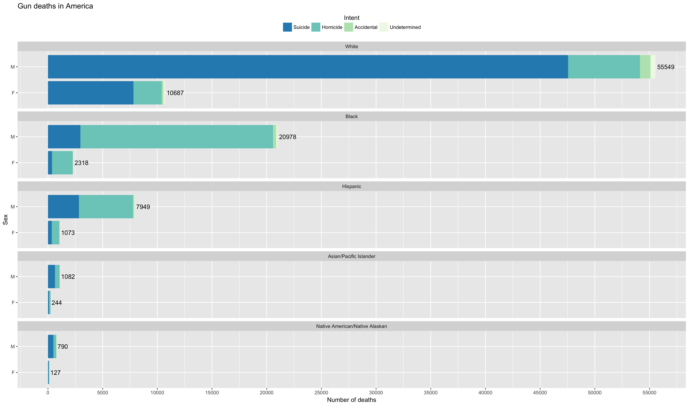
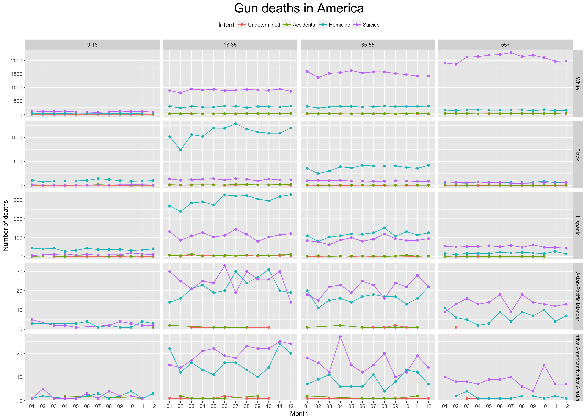
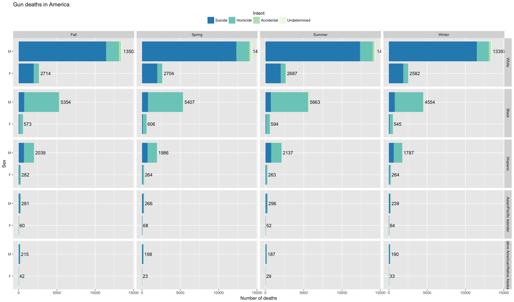
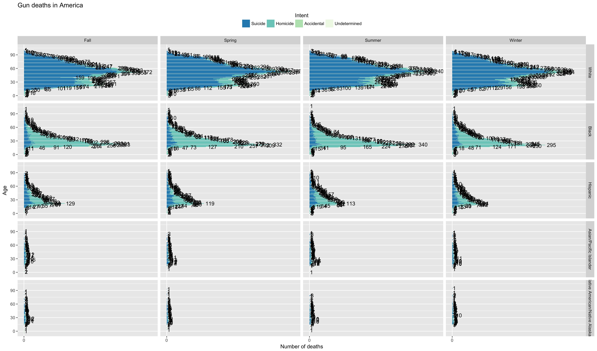
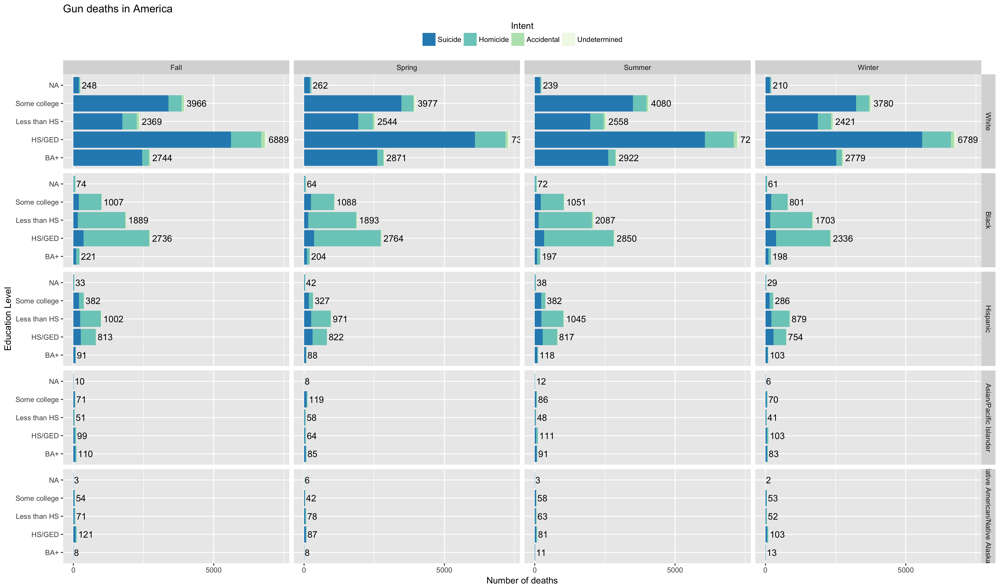
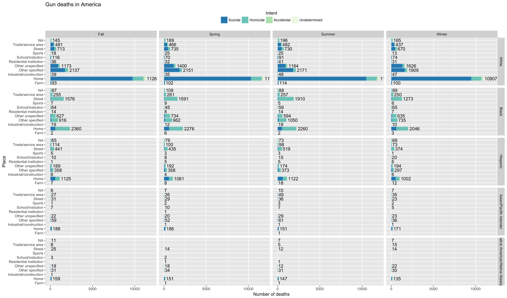
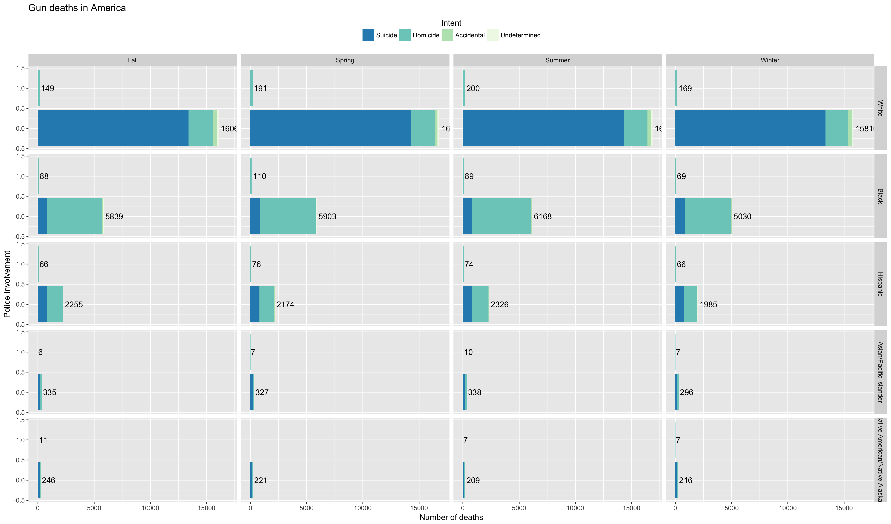
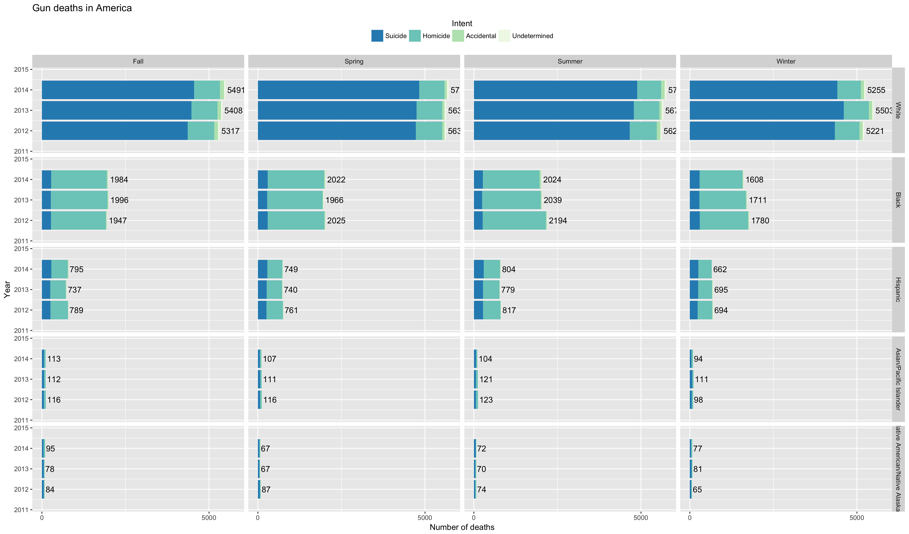

## Effectively Communicating Numbers
I think this whole thing, once learned, can be simplified into a simpler step-by-step process:

1. Message
2. Encoding
3. Format (range, legend, axis, scale, lines, text)
4. Highlight

Once going through this process, you should have something that is capable of properly portraying a message.

## Summary
I think the thing that surprised me the most from the FiveThirtyEight article is that they don't count shootings of non-Americans in their statistics. This is weird to me, because it misrepresents what the United States actually is like. In their defence, however, the number is somewhat low compared to other gun deaths, being only around 50 per year. However, gun deaths are gun deaths no matter where you are from. 

Aside from that, it was interesting that they had to compile their data from around 5-6 datasets to show what they wanted to portray. It's a lot of work to effectively communicate a message.

## Work for client
_Our client wants to create commercials that help reduce the gun deaths in the US. They would like to target the commercials in different seasons of the year (think month variable) to audiences that could have the most impact in reducing gun deaths. Our challenge is to summarize and visualize seasonal trends accros the other variables in these data._

I tried to find the slightest hint of variation from variables throughout the seasons of the year, but I was unable to find anything that looked remotely connected to seasons, except for the fact that there are less gun related deaths during winter than any other season. I am very curious to see if anyone found anything substantial to show, and if so, how they did it.

I created many graphs to show this, and here they are.

## EDIT
Here is the new graph I created, not using bar charts. I've made sure to format everything appropriately. I wasn't sure how to get the scaling right for the different facets, so it's hard to compare from race to race, but it is possible from age group to age group, and intent to intent.

### Here, the graph is seperated by season, race, and sex

### Here, the graph is seperated by season, race, and age

### Here, the graph is seperated by season, race, and education level

### Here, the graph is seperated by season, race, and place of death

### Here, the graph is seperated by season, race, and police involvement

### Here, the graph is seperated by season, race, and year
