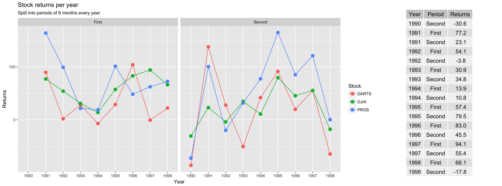

## Stocks...

```{r tidy, eval=FALSE, message=FALSE, warning=FALSE, include=TRUE}
dat <- csv_file %>% 
  separate(contest_period, c("monthyear_start", "monthyear_end")) %>% 
  separate(monthyear_end, c("month_end", "year_end"), sep = -5) %>% 
  na.omit()
  
dat$month_end[dat$month_end == "Dec"] <- "December"
dat$year_end[dat$year_end == "Dec"] <- "1993"
dat$month_end[dat$month_end == "1993"] <- "December"


dat <- dat %>% mutate(period = case_when(month_end == "January" | month_end == "February" | month_end == "March" | month_end == "April" | month_end == "May" | month_end == "June" ~ "First",
                                  month_end == "July" | month_end == "August" | month_end == "September" | month_end == "October" | month_end == "November" | month_end == "December" ~ "Second")) %>% 
  group_by(year_end, variable, period) %>% 
  summarise(half_year_val = sum(value))
```

So, this was interesting to clean because I was also trying to use REGEX to clean up the start date columns when I only needed the end date ones. However, it was good to be able to play around with the different tidy methods such as separate. Of course, I also used some direct changes to weird data to fix some weird bugs, and then used the mutate case_when combination to create my periods. 

I decided to use a line graph with dots to make it obvious that it was a time graph.


