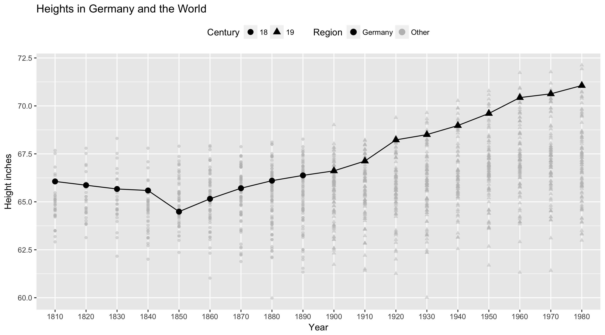
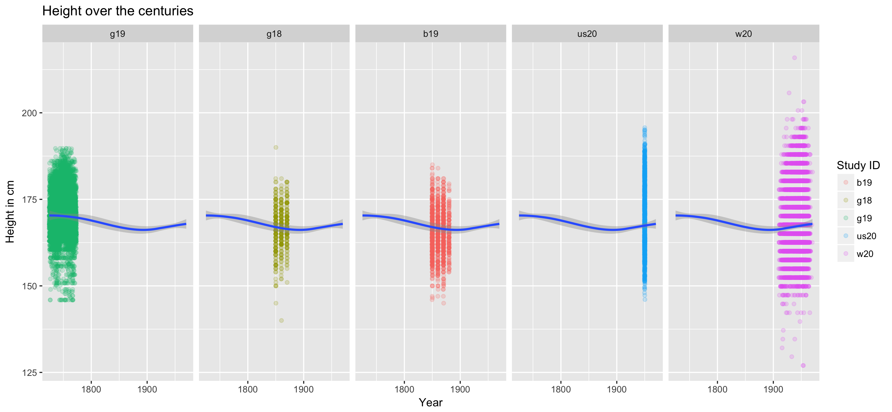

## Cleaning, wrangling, scrubbing...

This case study took me forever to complete. Let's just say that I didn't get much sleep. However, I learned a LOT about wrangling and cleaning data. 

My graph about the world heights vs Germany was really fun to make. Basically, you see the world in the backgroud, in a greyish color, and then you have Germany, split into centuries by shape, in black. This allows for a big distinction, yet quick reference to the rest of the world.

I've edited it so that it shows it as a continuous time-series.


```r
tubingen_dat <- tubingen_height %>%
  select(Code, `Continent,.Region,.Country`, ends_with("0"), -`1800`, -`2010`) %>%
  rename(region = `Continent,.Region,.Country`, code = Code) %>%
  gather(year, height, 3:20) %>%
  filter(!is.na(height)) %>%
  separate(year, c("century", "decade_year"), remove = FALSE, sep = 2) %>%
  rename(year_full = year, height.cm = height) %>%
  separate(decade_year, c("decade", "year"), sep = 1) %>%
  mutate(height.in = conv_unit(height.cm, "cm", "inch"))

tubingen_dat.ger <- tubingen_dat %>%
  filter(region == "Germany")

tubingen_dat %>%
  ggplot(aes(x = decade, y = height.in, shape = century)) +
  geom_point(alpha = 0.5, aes(col = "Other")) +
  geom_point(data = tubingen_dat.ger, aes(col = region), size = 3) +
  geom_line(data = tubingen_dat.ger, aes(group = century)) +
  labs(title = "Heights in Germany and the World", x = "Decade", y = "Height inches", col = "Region", shape = "Century") +
  theme(legend.position = "top") +
  scale_color_manual(values=c('black','grey'))
```


### Heights over the centuries

## EDIT
I recreated the graph, hopefully it makes more sense.

I changed the order of the facets, made them all appear on the same row, showed more data on each, and added a smooth line across each one to show the change.


```r
medians <- complete_dat %>%
  filter(birth_year > 1500 & height.cm < 300 & height.cm > 0 & study_id != "") %>%
  group_by(study_id, birth_year) %>%
  summarise(height.median = median(height.cm))

complete_dat$study_id_f <- factor(complete_dat$study_id, levels = c('g19', 'g18', 'b19', 'us20', 'w20'))

complete_dat %>%
  filter(birth_year > 1500 & height.cm < 220 & height.cm > 0) %>%
  ggplot() +
  geom_jitter(aes(x = birth_year, y = height.cm, col = study_id), alpha = 0.2) +
  geom_smooth(data = medians, aes(x = birth_year, y = height.median)) +
  labs(title = "Height over the centuries", x = "Year", y = "Height in cm", col = "Study ID") +
  facet_grid(~study_id_f) +
  ggsave("Case_Study_05/analysis/height_new.png", width = 12)
```



This one was fun to clean, but I had no idea how to graph the information I got. It just didn't look good for me on a plot. Too much going on. Maybe I should have you geom_hex? Who knows. I just decided to split everything into decades and get the median height for each study, facetted. Hope you enjoy it more than I do!


```r
complete_dat %>% 
  filter(birth_year > 1600) %>% 
  mutate(decades = case_when(birth_year < 1710 ~ 1710, birth_year < 1720 ~ 1720, birth_year < 1730 ~ 1730,
                             birth_year < 1740 ~ 1740, birth_year < 1750 ~ 1750, birth_year < 1760 ~ 1760,
                             birth_year < 1770 ~ 1770, birth_year < 1780 ~ 1780, birth_year < 1790 ~ 1790,
                             birth_year < 1800 ~ 1800, birth_year < 1810 ~ 1810, birth_year < 1820 ~ 1820,
                             birth_year < 1830 ~ 1830, birth_year < 1840 ~ 1840, birth_year < 1850 ~ 1850,
                             birth_year < 1870 ~ 1870, birth_year < 1880 ~ 1880, birth_year < 1890 ~ 1890,
                             birth_year < 1900 ~ 1900, birth_year < 1910 ~ 1910, birth_year < 1920 ~ 1920,
                             birth_year < 1930 ~ 1930, birth_year < 1940 ~ 1940, birth_year < 1950 ~ 1950,
                             birth_year < 1960 ~ 1960, birth_year < 1970 ~ 1970, birth_year < 1980 ~ 1980,
                             birth_year < 1990 ~ 1990)) %>%
  group_by(decades, study_id) %>% 
  summarise(median.height = median(height.cm)) %>% 
  ggplot(aes(x = decades, y = median.height, col = study_id)) +
  geom_point(position = "jitter", size = 3) +
  facet_wrap(~study_id) +
  labs(title = "Median height over the centuries", x = "Year", y = "Median height in cm", col = "Study ID") +
  guides(col = FALSE) +
  ggsave("Case_Study_05/analysis/height.png")
```


