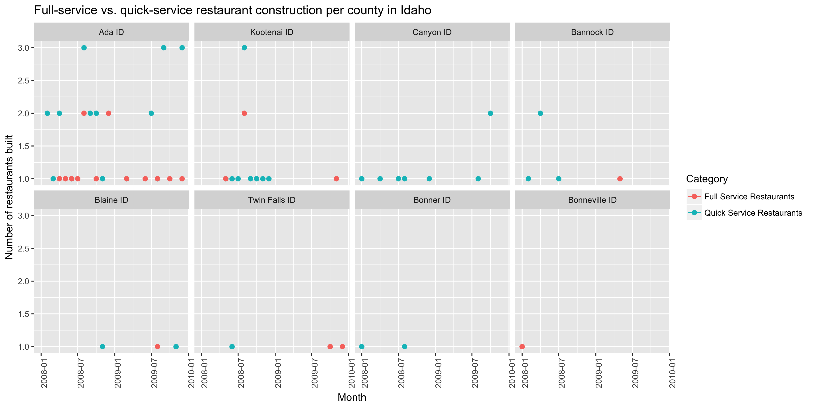
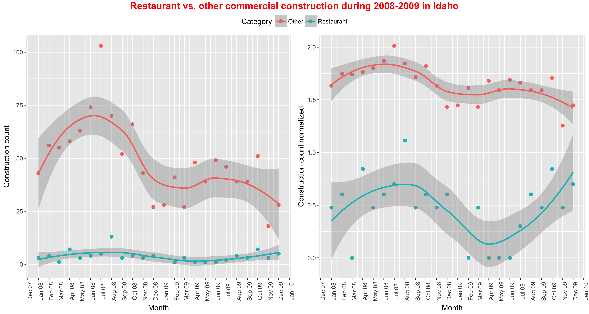
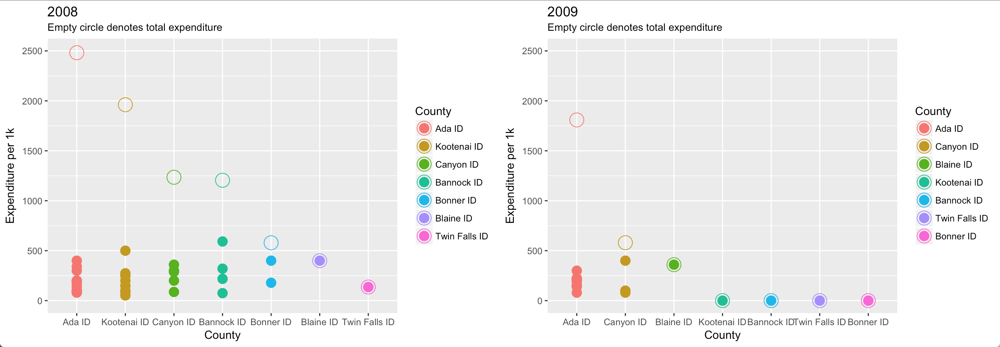
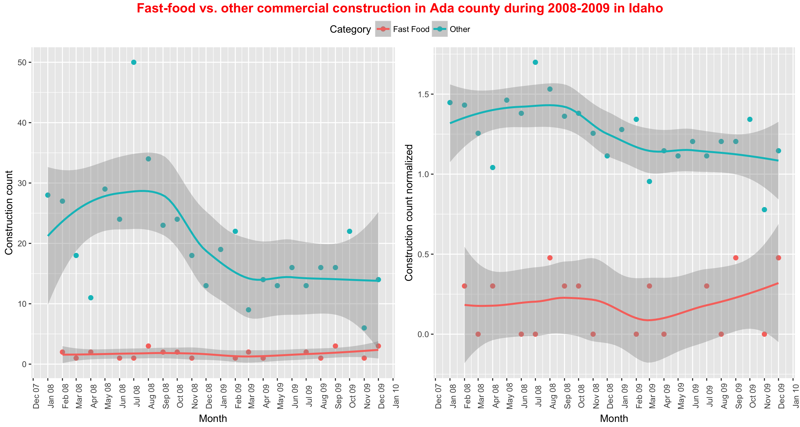

## Regex, joins, and normalizing

This was a really fun case study to play around with. I think I'm getting better at deciding what I want to show, since my plots didn't take me nearly as much time to create as my previous ones.

Edit: I added "in Idaho" to the graph titles.

### Cleaning
```{r cleaning, eval=FALSE, echo=TRUE}
climate_dat <- climate_zone_fips
buildings_dat <- buildings0809
resto_dat <- restaurants

not_restaurants <- c("development","Food preperation center", "Food Services center","bakery","Grocery","conceession","Cafeteria", "lunchroom","school","facility"," hall ","room","deli","alexander")
standalone_retail <- c("Wine","Spirits","Liquor","Convenience","drugstore","Flying J", "Rite Aid ","walgreen ","Love's Travel ", "retail")
full_service_type <- c("Ristorante","mexican","pizza ","steakhouse"," grill ","buffet","tavern"," bar ","waffle","italian","steak house","tuscanos","souper")
quick_service_type <- c("coffee"," java "," Donut ","Doughnut"," burger ","Ice Cream ","custard ","sandwich ","fast food "," bagel ", "drive", "tater")
quick_service_names <- restaurants$Restaurant[restaurants$Type %in% c("coffee","Ice Cream","Fast Food")]
full_service_names <- restaurants$Restaurant[restaurants$Type %in% c("Pizza","Casual Dining","Fast Casual")]

#left_join buildings0809 with cliamte_zone_fips
dat <- left_join(buildings_dat, climate_dat, by = c("FIPS.state", "FIPS.county"))
dat_new <- dat %>%
  filter(Type == "Food_Beverage_Service") %>%
  mutate(date = as.Date(as.yearmon(paste(Month, Year, sep = "-"), "%m-%Y")),
         low_ProjectTitle = str_to_lower(gsub("'", '', ProjectTitle)),
         subgroups = case_when(grepl(paste(str_to_lower(str_trim(gsub("'", '', full_service_names), side = "both")), collapse="|"), low_ProjectTitle) ~ "Full Service Restaurants",
                               grepl(paste(str_to_lower(str_trim(gsub("'", '', quick_service_names), side = "both")), collapse="|"), low_ProjectTitle) ~ "Quick Service Restaurants",
                               grepl(paste(str_to_lower(str_trim(quick_service_type, side = "both")), collapse="|"), low_ProjectTitle) ~ "Quick Service Restaurants",
                               grepl(paste(str_to_lower(str_trim(full_service_type, side = "both")), collapse="|"), low_ProjectTitle) ~ "Full Service Restaurants",
                               grepl(paste(str_to_lower(str_trim(standalone_retail, side = "both")), collapse="|"), low_ProjectTitle) ~ "Standalone Retail",
                               grepl(paste(str_to_lower(str_trim(not_restaurants, side = "both")), collapse="|"), low_ProjectTitle) ~ "Not Restaurants",
                               grepl(".estaurant.*", low_ProjectTitle) & SqFt < 4000 ~ "Quick Service Restaurants",
                               grepl(".estaurant.*", low_ProjectTitle) & SqFt >= 4000 ~ "Full Service Restaurants"))
```

### How did full-service restaurant construction compare to quick service restaurant construction across county and years?

For this graph, according to the question, I decided to put a time-series facetted per county highlighting the construction count for full-service restaurants vs quick-service restaurants.

As you can see, the more popular county for construction of restaurants was Ada, ID. You can also clearly see that quick-service restaurants were consistently more built than full-service restaurants.



```{r q1, eval=FALSE, echo=TRUE}
pd <- position_dodge(0.4)
dat_new$county_f <- factor(dat_new$County.y, levels = c('Ada ID', 'Kootenai ID', 'Canyon ID', 'Bannock ID', 'Blaine ID', 'Twin Falls ID', 'Bonner ID', 'Bonneville ID'))

dat_new %>%
  filter(subgroups == "Full Service Restaurants" | subgroups == "Quick Service Restaurants") %>% 
  group_by(subgroups, date, county_f) %>% 
  summarise(count = n()) %>% 
  ggplot(aes(x = date, y = count, col = subgroups)) +
  geom_point(position = pd, size = 2) +
  geom_line(position = pd) +
  theme(axis.text.x = element_text(angle = 90)) +
  labs(title = "Full-servie vs. quick-service restaurant construction per county", col = "Category", y = "Number of restaurants built", x = "Month") +
  facet_wrap(~ county_f, ncol = 4) +
  ggsave("Case_Study_06/analysis/q1.png", height = 6, width = 12)
```

### How did restaurant construction fare compare to the other commercial construction in Idaho?

This was a fun graph to create. On the left graph I am showing the pure number of constructions for restaurants vs other, but that doesn't really show the change that happened from 2008-2009, so the second graph shows the normalized data over those two years.

It is apparent that there was a big dip in restaurant construction at the beginning of 2009, but it shot back up, wherease the construction of other commercial buildings gradually drops.



```{r q2, echo=TRUE, eval=FALSE}
pd <- position_dodge(0.4)

plot1 <- dat_new %>%
  group_by(subgroups, date) %>%
  summarise(count = n()) %>%
  ggplot(aes(x = date, y = count, col = subgroups)) +
  geom_point(position = pd, size = 2) +
  geom_smooth(position = pd) +
  theme(axis.text.x = element_text(angle = 90)) +
  scale_x_date(date_labels="%b %y",date_breaks  ="1 month") +
  labs(col = "Category", y = "Construction count", x = "Month")

plot2 <- dat_new %>%
  group_by(subgroups, date) %>%
  summarise(count = n()) %>%
  ggplot(aes(x = date, y = log10(count), col = subgroups)) +
  geom_point(position = pd, size = 2) +
  geom_smooth(position = pd) +
  theme(axis.text.x = element_text(angle = 90)) +
  scale_x_date(date_labels="%b %y",date_breaks  ="1 month") +
  labs(col = "Category", y = "Construction count normalized", x = "Month")

ggarrange(plot1, plot2, common.legend = TRUE) %>% 
  annotate_figure(top = text_grob("Restaurant vs. other commercial construction during 2008-2009", color = "red", face = "bold", size = 14)) +
  ggsave("Case_Study_06/analysis/q2.png", width = 12)
```

### Which county in Idaho spent the most on fast food construction each year?

This graph was a nightmare to create, just because I tried to be fancy and order things differently for the two graphs. Aside from that, I couldn't figure out how to use the same legend for both, that would've been nice. 

As you can see from the graph, Ada ID wins both years in a row as the biggest expenses towards Fast-Food. The empty circles are the total expenditures, and the full circles are the individual ones.



```{r q3, echo=TRUE, eval=FALSE}
dat_new <- dat %>%
  filter(Type == "Food_Beverage_Service") %>%
  mutate(date = as.Date(as.yearmon(paste(Month, Year, sep = "-"), "%m-%Y")),
         low_ProjectTitle = str_to_lower(gsub("'", '', ProjectTitle)),
         subgroups = case_when(grepl(paste(str_to_lower(str_trim(gsub("'", '', full_service_names), side = "both")), collapse="|"), low_ProjectTitle) ~ "Other",
                               grepl(paste(str_to_lower(str_trim(gsub("'", '', quick_service_names), side = "both")), collapse="|"), low_ProjectTitle) ~ "Fast Food",
                               grepl(paste(str_to_lower(str_trim(quick_service_type, side = "both")), collapse="|"), low_ProjectTitle) ~ "Fast Food",
                               grepl(paste(str_to_lower(str_trim(full_service_type, side = "both")), collapse="|"), low_ProjectTitle) ~ "Other",
                               grepl(paste(str_to_lower(str_trim(standalone_retail, side = "both")), collapse="|"), low_ProjectTitle) ~ "Other",
                               grepl(paste(str_to_lower(str_trim(not_restaurants, side = "both")), collapse="|"), low_ProjectTitle) ~ "Other",
                               grepl(".estaurant.*", low_ProjectTitle) & SqFt < 4000 ~ "Fast Food",
                               grepl(".estaurant.*", low_ProjectTitle) & SqFt >= 4000 ~ "Other")) %>%
  filter(subgroups == "Fast Food") %>%
  complete(County.y, Year) %>%
  replace_na(list(Value1000 = 0))

myplots <- lapply(split(dat_new, dat_new$Year), function(x){
  if (unique(x$Year) == "2008") {
    x$county_f <- factor(x$County.y, levels = c('Ada ID', 'Kootenai ID', 'Canyon ID', 'Bannock ID', 'Bonner ID', 'Blaine ID', 'Twin Falls ID'))
  } else {
    x$county_f <- factor(x$County.y, levels = c('Ada ID', 'Canyon ID', 'Blaine ID', 'Kootenai ID', 'Bannock ID', 'Twin Falls ID', 'Bonner ID'))
  }

  sum_dat <- x %>%
    group_by(Year, county_f) %>%
    summarise(cost = sum(Value1000)) %>%
    ungroup() %>%
    arrange(desc(cost)) %>%
    mutate(ordered_id = 1:n())

  x %>%
    ggplot(aes(x = county_f, y = Value1000, col = county_f)) +
    geom_point(size = 4) +
    geom_point(data = sum_dat, size = 6, shape = 1, aes(y = cost)) +
    labs(x = "County", y = "Expenditure per 1k", title = unique(x$Year), col = "County", subtitle = "Empty circle denotes total expenditure") +
    ylim(0, 2500)
})
```


### In that county how did other commercial construction compare?

This graph was fairly simple because I re-used most of the code that I had created for question 2. As you can tell from the second graph, fast food construction took a tiny dip at the start of 2009, but quickly went back up and even surpassed 2008. Other commercial construction once again slowly descended, never to be the same again. RIP.



```{r q4, echo=TRUE, eval=FALSE}
plot1 <- dat_new %>%
  group_by(subgroups, date) %>%
  summarise(count = n()) %>%
  ggplot(aes(x = date, y = count, col = subgroups)) +
  geom_point(size = 2) +
  geom_smooth() +
  theme(axis.text.x = element_text(angle = 90)) +
  scale_x_date(date_labels="%b %y",date_breaks  ="1 month") +
  labs(col = "Category", y = "Construction count", x = "Month")

plot2 <- dat_new %>%
  group_by(subgroups, date) %>%
  summarise(count = n()) %>%
  ggplot(aes(x = date, y = log10(count), col = subgroups)) +
  geom_point(size = 2) +
  geom_smooth() +
  theme(axis.text.x = element_text(angle = 90)) +
  scale_x_date(date_labels="%b %y",date_breaks  ="1 month") +
  labs(col = "Category", y = "Construction count normalized", x = "Month")

ggarrange(plot1, plot2, common.legend = TRUE) %>%
  annotate_figure(top = text_grob("Fast-food vs. other commercial construction in Ada county during 2008-2009", color = "red", face = "bold", size = 14)) +
  ggsave("Case_Study_06/analysis/q4.png", width = 12)
```