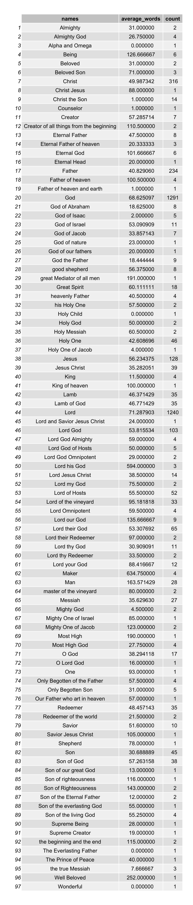
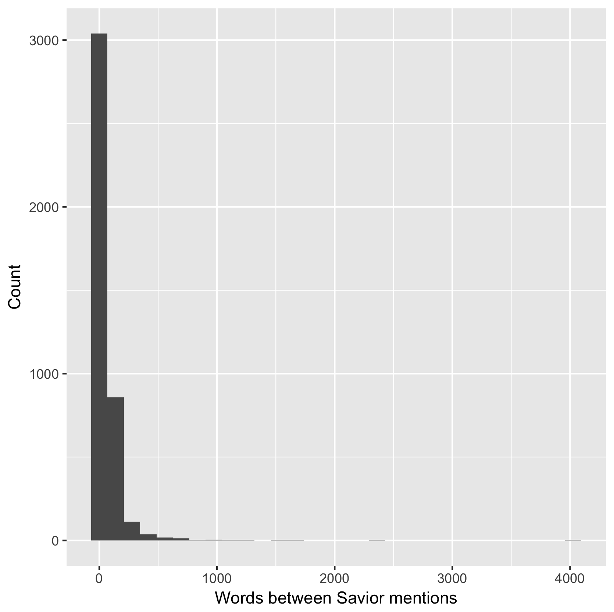
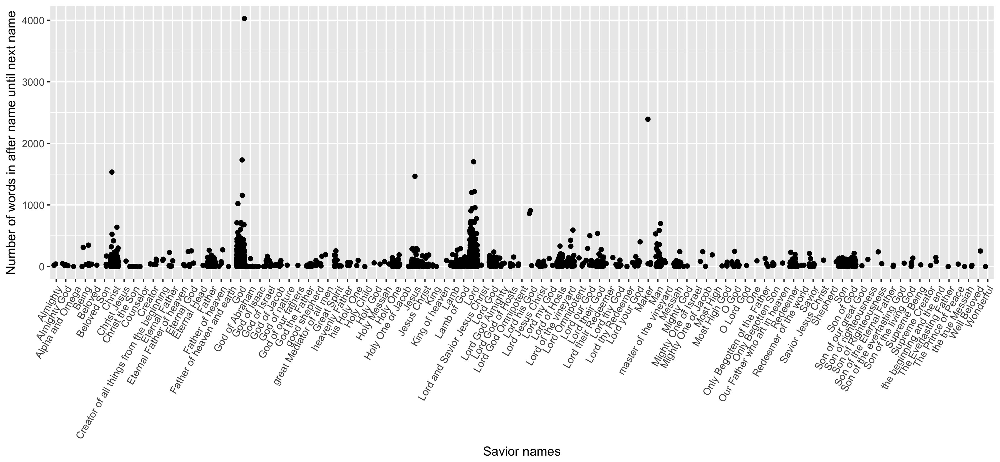

## Scriptures, names, splits

This case study was entertaining. It had been a while since something had challenged me programmatically, and this was a good challenge. Of course, as you can see from the graphs, I spent most of my time programming vs creating them. 

Here is my prep code.

```r
bom <- gsub("[^a-zA-Z ]", "", paste(scriptures$scripture_text, collapse = ' '))
index = 1;
new_names = c()
for (i in bmnames$name) {
  new_names <- c(new_names, paste0("name", index))
  bom <- str_replace_all(bom, i, paste0("name", index))
  index <- index + 1
}

names_vector <- strapply(bom, paste(new_names, collapse = '|'))
bom_splits <- strsplit(bom, split = paste(new_names, collapse = '|'))

bom_df <- data.frame(bom_splits)
colnames(bom_df) <- "words"
name_codes_df <- data.frame(new_names)
colnames(name_codes_df) <- "name_codes"
name_codes_df["names"] <- bmnames$name
bom_df <- bom_df %>%
  mutate(count = str_count(words, "\\w+"))
bom_df <- bom_df[-1,]
bom_df["name_codes"] <- names_vector

bom_df <- left_join(bom_df, name_codes_df)
```

### Then, to answer the pressing question: What is the average number of words between mentions of the Savior?

```r
# Average word count between Savior names
mean(bom_df$count)
```

```
## [1] 63.91842
```

### Followed by a table of the averages by name. (I apologize for the size)
I added a count column that shows how many of a certain name appeared, as suggested by Brother Hathaway. 



### Followed by a few graphs.

This graph shows the number of words between mentions and how many there were in that category.


```r
bom_df %>%
  ggplot(aes(x = count)) +
  geom_histogram() +
  stat_bin(aes(y=..count.., label=..count..), geom="text", vjust=-.5) %>%
  labs(x = "Words between Savior mentions", y = "Count")
```

This one shows the distribution per name. As you can see from this one, we went up to about 4000 words after the mention of "God" until the next name.


```r
bom_df %>%
  ggplot(aes(x = names, y = count)) +
  geom_point(position = "jitter") +
  theme(axis.text.x = element_text(angle = 60, hjust = 1)) +
  labs(x = "Savior names", y = "Number of words in after name until next name")
```
