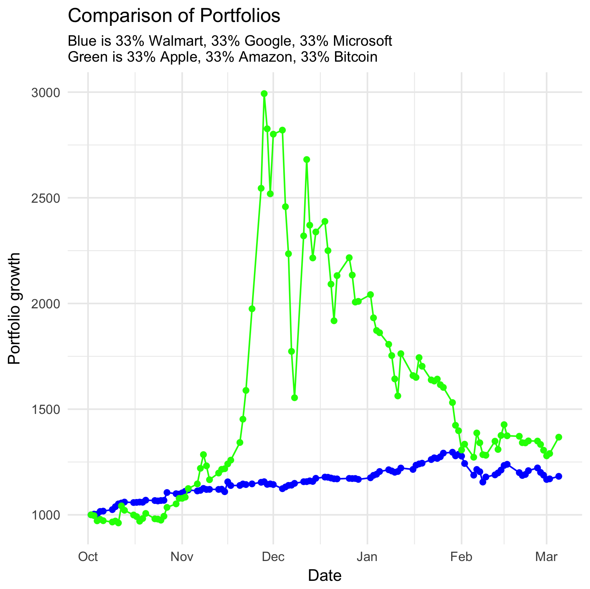
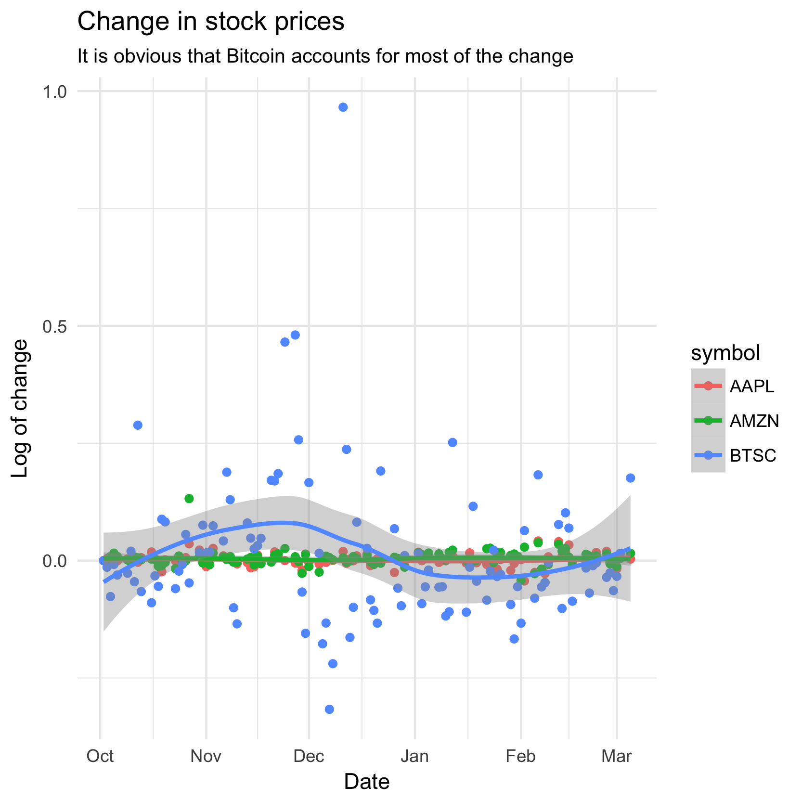
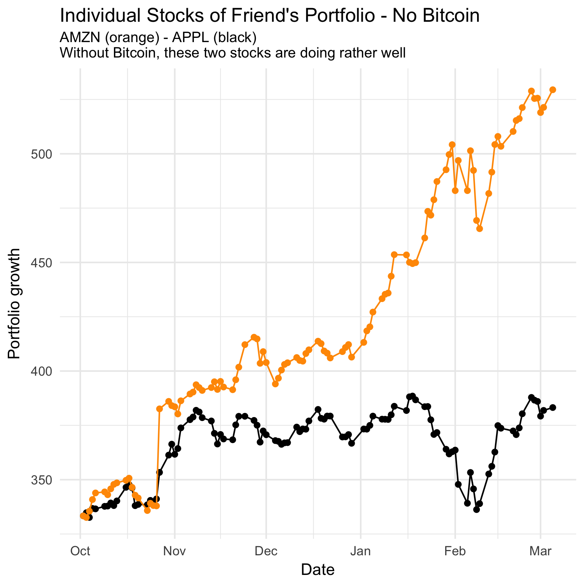
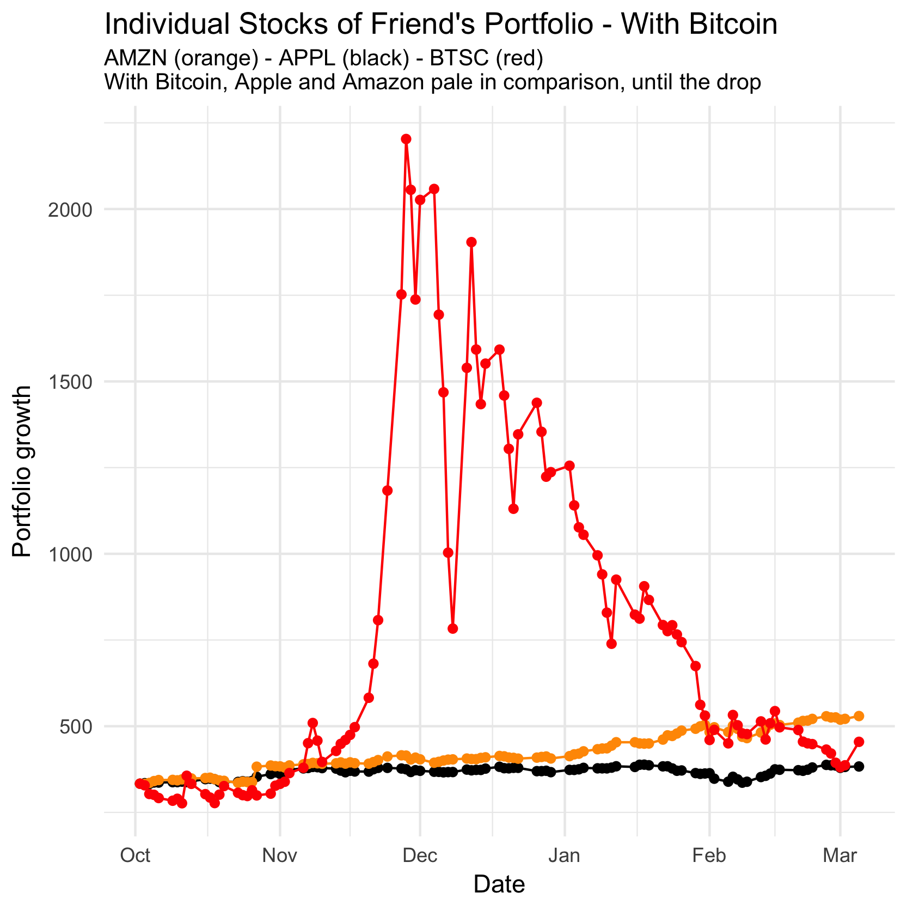

## Investing, never a strong-suit

I've never been very good at investing. I get too stressed and end up making costly mistakes. One time, I lost around $700 in the space of a few hours. So, naturally, this would also happen for this competition against my imaginary friend (because I have no friends).

### First plot - The comparison, AKA the heart-drop

So, this is when I knew that I had lost. It makes it pretty clear that my friend's portfolio exploded for a little bit, and then dropped to a normal level. I wonder what could cause such a shift? \*nudge, nudge\*

### Second plot - The view of the change in my friend's portfolio

Here we see that the biggest changes occured thanks to Bitcoin. Both increases and decreases. The other two did not have much to do with it.

### Third plot - What my friend's portfolio would look like without bitcoin

So, I wanted to make this graph first because I knew that bitcoin would cast a shadow over these two. They look like really good stocks, and they are. Bitcoin just... well, bitcoin.

### Fourth and final plot - Including bitcoin

And here you have it. The culprit. The avenger. The explosive, self-destructive, mountainous Bitcoin. Due to its sheer size, you now see why I created the other graph first. We don't get much information about the other two stocks in this one.

### Conclusions

Well, even though bitcoin had a huge impact towards the middle, it is not the reason why I lost. Amazon eventually overtook the dropping bitcoin, and that is why I lost.