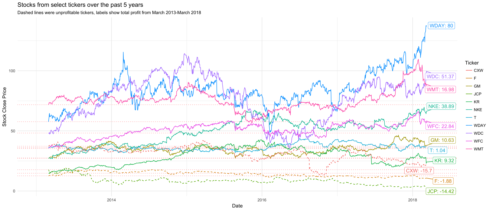

## Time, XTS, Conversion
Here are the graphs that I created with dygraph and ggplot2. I feel like ggplot2 is more customizable, but there is a lot more speed to dygraphs.


### Here is my dygraph, and this is what I did to it

* I added red dashed lines to indicate the starting closing value of each ticker
* I added a zoom feature at the bottom
* I added a rounding feature that starts at 20 (if you want to see what the actual graph looks like, put 1)
* I added a crosshair to the cursor
* I added a fading effect depending on which ticker the mouse is hovering over
* I added a title
<!--html_preserve--><div id="htmlwidget-c4f8a098edb1f6992300" style="width:672px;height:480px;" class="dygraphs html-widget"></div>
<script type="application/json" data-for="htmlwidget-c4f8a098edb1f6992300">{"x":{"attrs":{"title":"Stocks from select tickers over the past 5 years","ylabel":"Close Price","labels":["day","GM.Close","KR.Close","WDC.Close","NKE.Close","T.Close","WDAY.Close","WFC.Close","WMT.Close","JCP.Close","F.Close","CXW.Close"],"legend":"auto","retainDateWindow":false,"axes":{"x":{"pixelsPerLabel":60,"drawAxis":true},"y":{"drawAxis":true}},"stackedGraph":false,"fillGraph":false,"fillAlpha":0.15,"stepPlot":true,"drawPoints":false,"pointSize":1,"drawGapEdgePoints":false,"connectSeparatedPoints":false,"strokeWidth":1,"strokeBorderColor":"white","colorValue":0.5,"colorSaturation":1,"includeZero":false,"drawAxesAtZero":false,"logscale":false,"axisTickSize":3,"axisLineColor":"black","axisLineWidth":0.3,"axisLabelColor":"black","axisLabelFontSize":14,"axisLabelWidth":60,"drawGrid":true,"gridLineWidth":0.3,"rightGap":5,"digitsAfterDecimal":2,"labelsKMB":false,"labelsKMG2":false,"labelsUTC":false,"maxNumberWidth":6,"animatedZooms":false,"mobileDisableYTouch":true,"series":{"JCP.Close":{"axis":"y","strokeWidth":2,"strokePattern":[7,3]},"F.Close":{"axis":"y","strokeWidth":2,"strokePattern":[7,3]},"CXW.Close":{"axis":"y","strokeWidth":2,"strokePattern":[7,3]}},"showRangeSelector":true,"rangeSelectorHeight":40,"rangeSelectorPlotFillColor":" #A7B1C4","rangeSelectorPlotStrokeColor":"#808FAB","interactionModel":"Dygraph.Interaction.defaultModel","showRoller":true,"rollPeriod":20,"highlightCircleSize":5,"highlightSeriesBackgroundAlpha":0.2,"highlightSeriesOpts":[],"hideOverlayOnMouseOut":false},"scale":"daily","annotations":[],"shadings":[],"events":[{"pos":17.95,"labelLoc":"left","color":"red","strokePattern":[7,3],"axis":"y"},{"pos":12.75,"labelLoc":"left","color":"red","strokePattern":[7,3],"axis":"y"},{"pos":38.22,"labelLoc":"left","color":"red","strokePattern":[7,3],"axis":"y"},{"pos":27.49,"labelLoc":"left","color":"red","strokePattern":[7,3],"axis":"y"},{"pos":14.76,"labelLoc":"left","color":"red","strokePattern":[7,3],"axis":"y"},{"pos":48.27,"labelLoc":"left","color":"red","strokePattern":[7,3],"axis":"y"},{"pos":27.42,"labelLoc":"left","color":"red","strokePattern":[7,3],"axis":"y"},{"pos":36.08,"labelLoc":"left","color":"red","strokePattern":[7,3],"axis":"y"},{"pos":57.94,"labelLoc":"left","color":"red","strokePattern":[7,3],"axis":"y"},{"pos":35.56,"labelLoc":"left","color":"red","strokePattern":[7,3],"axis":"y"},{"pos":71.9,"labelLoc":"left","color":"red","strokePattern":[7,3],"axis":"y"}],"format":"date","data":[["2013-03-01T00:00:00.000Z","2013-03-04T00:00:00.000Z","2013-03-05T00:00:00.000Z","2013-03-06T00:00:00.000Z","2013-03-07T00:00:00.000Z","2013-03-08T00:00:00.000Z","2013-03-11T00:00:00.000Z","2013-03-12T00:00:00.000Z","2013-03-13T00:00:00.000Z","2013-03-14T00:00:00.000Z","2013-03-15T00:00:00.000Z","2013-03-18T00:00:00.000Z","2013-03-19T00:00:00.000Z","2013-03-20T00:00:00.000Z","2013-03-21T00:00:00.000Z","2013-03-22T00:00:00.000Z","2013-03-25T00:00:00.000Z","2013-03-26T00:00:00.000Z","2013-03-27T00:00:00.000Z","2013-03-28T00:00:00.000Z","2013-04-01T00:00:00.000Z","2013-04-02T00:00:00.000Z","2013-04-03T00:00:00.000Z","2013-04-04T00:00:00.000Z","2013-04-05T00:00:00.000Z","2013-04-08T00:00:00.000Z","2013-04-09T00:00:00.000Z","2013-04-10T00:00:00.000Z","2013-04-11T00:00:00.000Z","2013-04-12T00:00:00.000Z","2013-04-15T00:00:00.000Z","2013-04-16T00:00:00.000Z","2013-04-17T00:00:00.000Z","2013-04-18T00:00:00.000Z","2013-04-19T00:00:00.000Z","2013-04-22T00:00:00.000Z","2013-04-23T00:00:00.000Z","2013-04-24T00:00:00.000Z","2013-04-25T00:00:00.000Z","2013-04-26T00:00:00.000Z","2013-04-29T00:00:00.000Z","2013-04-30T00:00:00.000Z","2013-05-01T00:00:00.000Z","2013-05-02T00:00:00.000Z","2013-05-03T00:00:00.000Z","2013-05-06T00:00:00.000Z","2013-05-07T00:00:00.000Z","2013-05-08T00:00:00.000Z","2013-05-09T00:00:00.000Z","2013-05-10T00:00:00.000Z","2013-05-13T00:00:00.000Z","2013-05-14T00:00:00.000Z","2013-05-15T00:00:00.000Z","2013-05-16T00:00:00.000Z","2013-05-17T00:00:00.000Z","2013-05-20T00:00:00.000Z","2013-05-21T00:00:00.000Z","2013-05-22T00:00:00.000Z","2013-05-23T00:00:00.000Z","2013-05-24T00:00:00.000Z","2013-05-28T00:00:00.000Z","2013-05-29T00:00:00.000Z","2013-05-30T00:00:00.000Z","2013-05-31T00:00:00.000Z","2013-06-03T00:00:00.000Z","2013-06-04T00:00:00.000Z","2013-06-05T00:00:00.000Z","2013-06-06T00:00:00.000Z","2013-06-07T00:00:00.000Z","2013-06-10T00:00:00.000Z","2013-06-11T00:00:00.000Z","2013-06-12T00:00:00.000Z","2013-06-13T00:00:00.000Z","2013-06-14T00:00:00.000Z","2013-06-17T00:00:00.000Z","2013-06-18T00:00:00.000Z","2013-06-19T00:00:00.000Z","2013-06-20T00:00:00.000Z","2013-06-21T00:00:00.000Z","2013-06-24T00:00:00.000Z","2013-06-25T00:00:00.000Z","2013-06-26T00:00:00.000Z","2013-06-27T00:00:00.000Z","2013-06-28T00:00:00.000Z","2013-07-01T00:00:00.000Z","2013-07-02T00:00:00.000Z","2013-07-03T00:00:00.000Z","2013-07-05T00:00:00.000Z","2013-07-08T00:00:00.000Z","2013-07-09T00:00:00.000Z","2013-07-10T00:00:00.000Z","2013-07-11T00:00:00.000Z","2013-07-12T00:00:00.000Z","2013-07-15T00:00:00.000Z","2013-07-16T00:00:00.000Z","2013-07-17T00:00:00.000Z","2013-07-18T00:00:00.000Z","2013-07-19T00:00:00.000Z","2013-07-22T00:00:00.000Z","2013-07-23T00:00:00.000Z","2013-07-24T00:00:00.000Z","2013-07-25T00:00:00.000Z","2013-07-26T00:00:00.000Z","2013-07-29T00:00:00.000Z","2013-07-30T00:00:00.000Z","2013-07-31T00:00:00.000Z","2013-08-01T00:00:00.000Z","2013-08-02T00:00:00.000Z","2013-08-05T00:00:00.000Z","2013-08-06T00:00:00.000Z","2013-08-07T00:00:00.000Z","2013-08-08T00:00:00.000Z","2013-08-09T00:00:00.000Z","2013-08-12T00:00:00.000Z","2013-08-13T00:00:00.000Z","2013-08-14T00:00:00.000Z","2013-08-15T00:00:00.000Z","2013-08-16T00:00:00.000Z","2013-08-19T00:00:00.000Z","2013-08-20T00:00:00.000Z","2013-08-21T00:00:00.000Z","2013-08-22T00:00:00.000Z","2013-08-23T00:00:00.000Z","2013-08-26T00:00:00.000Z","2013-08-27T00:00:00.000Z","2013-08-28T00:00:00.000Z","2013-08-29T00:00:00.000Z","2013-08-30T00:00:00.000Z","2013-09-03T00:00:00.000Z","2013-09-04T00:00:00.000Z","2013-09-05T00:00:00.000Z","2013-09-06T00:00:00.000Z","2013-09-09T00:00:00.000Z","2013-09-10T00:00:00.000Z","2013-09-11T00:00:00.000Z","2013-09-12T00:00:00.000Z","2013-09-13T00:00:00.000Z","2013-09-16T00:00:00.000Z","2013-09-17T00:00:00.000Z","2013-09-18T00:00:00.000Z","2013-09-19T00:00:00.000Z","2013-09-20T00:00:00.000Z","2013-09-23T00:00:00.000Z","2013-09-24T00:00:00.000Z","2013-09-25T00:00:00.000Z","2013-09-26T00:00:00.000Z","2013-09-27T00:00:00.000Z","2013-09-30T00:00:00.000Z","2013-10-01T00:00:00.000Z","2013-10-02T00:00:00.000Z","2013-10-03T00:00:00.000Z","2013-10-04T00:00:00.000Z","2013-10-07T00:00:00.000Z","2013-10-08T00:00:00.000Z","2013-10-09T00:00:00.000Z","2013-10-10T00:00:00.000Z","2013-10-11T00:00:00.000Z","2013-10-14T00:00:00.000Z","2013-10-15T00:00:00.000Z","2013-10-16T00:00:00.000Z","2013-10-17T00:00:00.000Z","2013-10-18T00:00:00.000Z","2013-10-21T00:00:00.000Z","2013-10-22T00:00:00.000Z","2013-10-23T00:00:00.000Z","2013-10-24T00:00:00.000Z","2013-10-25T00:00:00.000Z","2013-10-28T00:00:00.000Z","2013-10-29T00:00:00.000Z","2013-10-30T00:00:00.000Z","2013-10-31T00:00:00.000Z","2013-11-01T00:00:00.000Z","2013-11-04T00:00:00.000Z","2013-11-05T00:00:00.000Z","2013-11-06T00:00:00.000Z","2013-11-07T00:00:00.000Z","2013-11-08T00:00:00.000Z","2013-11-11T00:00:00.000Z","2013-11-12T00:00:00.000Z","2013-11-13T00:00:00.000Z","2013-11-14T00:00:00.000Z","2013-11-15T00:00:00.000Z","2013-11-18T00:00:00.000Z","2013-11-19T00:00:00.000Z","2013-11-20T00:00:00.000Z","2013-11-21T00:00:00.000Z","2013-11-22T00:00:00.000Z","2013-11-25T00:00:00.000Z","2013-11-26T00:00:00.000Z","2013-11-27T00:00:00.000Z","2013-11-29T00:00:00.000Z","2013-12-02T00:00:00.000Z","2013-12-03T00:00:00.000Z","2013-12-04T00:00:00.000Z","2013-12-05T00:00:00.000Z","2013-12-06T00:00:00.000Z","2013-12-09T00:00:00.000Z","2013-12-10T00:00:00.000Z","2013-12-11T00:00:00.000Z","2013-12-12T00:00:00.000Z","2013-12-13T00:00:00.000Z","2013-12-16T00:00:00.000Z","2013-12-17T00:00:00.000Z","2013-12-18T00:00:00.000Z","2013-12-19T00:00:00.000Z","2013-12-20T00:00:00.000Z","2013-12-23T00:00:00.000Z","2013-12-24T00:00:00.000Z","2013-12-26T00:00:00.000Z","2013-12-27T00:00:00.000Z","2013-12-30T00:00:00.000Z","2013-12-31T00:00:00.000Z","2014-01-02T00:00:00.000Z","2014-01-03T00:00:00.000Z","2014-01-06T00:00:00.000Z","2014-01-07T00:00:00.000Z","2014-01-08T00:00:00.000Z","2014-01-09T00:00:00.000Z","2014-01-10T00:00:00.000Z","2014-01-13T00:00:00.000Z","2014-01-14T00:00:00.000Z","2014-01-15T00:00:00.000Z","2014-01-16T00:00:00.000Z","2014-01-17T00:00:00.000Z","2014-01-21T00:00:00.000Z","2014-01-22T00:00:00.000Z","2014-01-23T00:00:00.000Z","2014-01-24T00:00:00.000Z","2014-01-27T00:00:00.000Z","2014-01-28T00:00:00.000Z","2014-01-29T00:00:00.000Z","2014-01-30T00:00:00.000Z","2014-01-31T00:00:00.000Z","2014-02-03T00:00:00.000Z","2014-02-04T00:00:00.000Z","2014-02-05T00:00:00.000Z","2014-02-06T00:00:00.000Z","2014-02-07T00:00:00.000Z","2014-02-10T00:00:00.000Z","2014-02-11T00:00:00.000Z","2014-02-12T00:00:00.000Z","2014-02-13T00:00:00.000Z","2014-02-14T00:00:00.000Z","2014-02-18T00:00:00.000Z","2014-02-19T00:00:00.000Z","2014-02-20T00:00:00.000Z","2014-02-21T00:00:00.000Z","2014-02-24T00:00:00.000Z","2014-02-25T00:00:00.000Z","2014-02-26T00:00:00.000Z","2014-02-27T00:00:00.000Z","2014-02-28T00:00:00.000Z","2014-03-03T00:00:00.000Z","2014-03-04T00:00:00.000Z","2014-03-05T00:00:00.000Z","2014-03-06T00:00:00.000Z","2014-03-07T00:00:00.000Z","2014-03-10T00:00:00.000Z","2014-03-11T00:00:00.000Z","2014-03-12T00:00:00.000Z","2014-03-13T00:00:00.000Z","2014-03-14T00:00:00.000Z","2014-03-17T00:00:00.000Z","2014-03-18T00:00:00.000Z","2014-03-19T00:00:00.000Z","2014-03-20T00:00:00.000Z","2014-03-21T00:00:00.000Z","2014-03-24T00:00:00.000Z","2014-03-25T00:00:00.000Z","2014-03-26T00:00:00.000Z","2014-03-27T00:00:00.000Z","2014-03-28T00:00:00.000Z","2014-03-31T00:00:00.000Z","2014-04-01T00:00:00.000Z","2014-04-02T00:00:00.000Z","2014-04-03T00:00:00.000Z","2014-04-04T00:00:00.000Z","2014-04-07T00:00:00.000Z","2014-04-08T00:00:00.000Z","2014-04-09T00:00:00.000Z","2014-04-10T00:00:00.000Z","2014-04-11T00:00:00.000Z","2014-04-14T00:00:00.000Z","2014-04-15T00:00:00.000Z","2014-04-16T00:00:00.000Z","2014-04-17T00:00:00.000Z","2014-04-21T00:00:00.000Z","2014-04-22T00:00:00.000Z","2014-04-23T00:00:00.000Z","2014-04-24T00:00:00.000Z","2014-04-25T00:00:00.000Z","2014-04-28T00:00:00.000Z","2014-04-29T00:00:00.000Z","2014-04-30T00:00:00.000Z","2014-05-01T00:00:00.000Z","2014-05-02T00:00:00.000Z","2014-05-05T00:00:00.000Z","2014-05-06T00:00:00.000Z","2014-05-07T00:00:00.000Z","2014-05-08T00:00:00.000Z","2014-05-09T00:00:00.000Z","2014-05-12T00:00:00.000Z","2014-05-13T00:00:00.000Z","2014-05-14T00:00:00.000Z","2014-05-15T00:00:00.000Z","2014-05-16T00:00:00.000Z","2014-05-19T00:00:00.000Z","2014-05-20T00:00:00.000Z","2014-05-21T00:00:00.000Z","2014-05-22T00:00:00.000Z","2014-05-23T00:00:00.000Z","2014-05-27T00:00:00.000Z","2014-05-28T00:00:00.000Z","2014-05-29T00:00:00.000Z","2014-05-30T00:00:00.000Z","2014-06-02T00:00:00.000Z","2014-06-03T00:00:00.000Z","2014-06-04T00:00:00.000Z","2014-06-05T00:00:00.000Z","2014-06-06T00:00:00.000Z","2014-06-09T00:00:00.000Z","2014-06-10T00:00:00.000Z","2014-06-11T00:00:00.000Z","2014-06-12T00:00:00.000Z","2014-06-13T00:00:00.000Z","2014-06-16T00:00:00.000Z","2014-06-17T00:00:00.000Z","2014-06-18T00:00:00.000Z","2014-06-19T00:00:00.000Z","2014-06-20T00:00:00.000Z","2014-06-23T00:00:00.000Z","2014-06-24T00:00:00.000Z","2014-06-25T00:00:00.000Z","2014-06-26T00:00:00.000Z","2014-06-27T00:00:00.000Z","2014-06-30T00:00:00.000Z","2014-07-01T00:00:00.000Z","2014-07-02T00:00:00.000Z","2014-07-03T00:00:00.000Z","2014-07-07T00:00:00.000Z","2014-07-08T00:00:00.000Z","2014-07-09T00:00:00.000Z","2014-07-10T00:00:00.000Z","2014-07-11T00:00:00.000Z","2014-07-14T00:00:00.000Z","2014-07-15T00:00:00.000Z","2014-07-16T00:00:00.000Z","2014-07-17T00:00:00.000Z","2014-07-18T00:00:00.000Z","2014-07-21T00:00:00.000Z","2014-07-22T00:00:00.000Z","2014-07-23T00:00:00.000Z","2014-07-24T00:00:00.000Z","2014-07-25T00:00:00.000Z","2014-07-28T00:00:00.000Z","2014-07-29T00:00:00.000Z","2014-07-30T00:00:00.000Z","2014-07-31T00:00:00.000Z","2014-08-01T00:00:00.000Z","2014-08-04T00:00:00.000Z","2014-08-05T00:00:00.000Z","2014-08-06T00:00:00.000Z","2014-08-07T00:00:00.000Z","2014-08-08T00:00:00.000Z","2014-08-11T00:00:00.000Z","2014-08-12T00:00:00.000Z","2014-08-13T00:00:00.000Z","2014-08-14T00:00:00.000Z","2014-08-15T00:00:00.000Z","2014-08-18T00:00:00.000Z","2014-08-19T00:00:00.000Z","2014-08-20T00:00:00.000Z","2014-08-21T00:00:00.000Z","2014-08-22T00:00:00.000Z","2014-08-25T00:00:00.000Z","2014-08-26T00:00:00.000Z","2014-08-27T00:00:00.000Z","2014-08-28T00:00:00.000Z","2014-08-29T00:00:00.000Z","2014-09-02T00:00:00.000Z","2014-09-03T00:00:00.000Z","2014-09-04T00:00:00.000Z","2014-09-05T00:00:00.000Z","2014-09-08T00:00:00.000Z","2014-09-09T00:00:00.000Z","2014-09-10T00:00:00.000Z","2014-09-11T00:00:00.000Z","2014-09-12T00:00:00.000Z","2014-09-15T00:00:00.000Z","2014-09-16T00:00:00.000Z","2014-09-17T00:00:00.000Z","2014-09-18T00:00:00.000Z","2014-09-19T00:00:00.000Z","2014-09-22T00:00:00.000Z","2014-09-23T00:00:00.000Z","2014-09-24T00:00:00.000Z","2014-09-25T00:00:00.000Z","2014-09-26T00:00:00.000Z","2014-09-29T00:00:00.000Z","2014-09-30T00:00:00.000Z","2014-10-01T00:00:00.000Z","2014-10-02T00:00:00.000Z","2014-10-03T00:00:00.000Z","2014-10-06T00:00:00.000Z","2014-10-07T00:00:00.000Z","2014-10-08T00:00:00.000Z","2014-10-09T00:00:00.000Z","2014-10-10T00:00:00.000Z","2014-10-13T00:00:00.000Z","2014-10-14T00:00:00.000Z","2014-10-15T00:00:00.000Z","2014-10-16T00:00:00.000Z","2014-10-17T00:00:00.000Z","2014-10-20T00:00:00.000Z","2014-10-21T00:00:00.000Z","2014-10-22T00:00:00.000Z","2014-10-23T00:00:00.000Z","2014-10-24T00:00:00.000Z","2014-10-27T00:00:00.000Z","2014-10-28T00:00:00.000Z","2014-10-29T00:00:00.000Z","2014-10-30T00:00:00.000Z","2014-10-31T00:00:00.000Z","2014-11-03T00:00:00.000Z","2014-11-04T00:00:00.000Z","2014-11-05T00:00:00.000Z","2014-11-06T00:00:00.000Z","2014-11-07T00:00:00.000Z","2014-11-10T00:00:00.000Z","2014-11-11T00:00:00.000Z","2014-11-12T00:00:00.000Z","2014-11-13T00:00:00.000Z","2014-11-14T00:00:00.000Z","2014-11-17T00:00:00.000Z","2014-11-18T00:00:00.000Z","2014-11-19T00:00:00.000Z","2014-11-20T00:00:00.000Z","2014-11-21T00:00:00.000Z","2014-11-24T00:00:00.000Z","2014-11-25T00:00:00.000Z","2014-11-26T00:00:00.000Z","2014-11-28T00:00:00.000Z","2014-12-01T00:00:00.000Z","2014-12-02T00:00:00.000Z","2014-12-03T00:00:00.000Z","2014-12-04T00:00:00.000Z","2014-12-05T00:00:00.000Z","2014-12-08T00:00:00.000Z","2014-12-09T00:00:00.000Z","2014-12-10T00:00:00.000Z","2014-12-11T00:00:00.000Z","2014-12-12T00:00:00.000Z","2014-12-15T00:00:00.000Z","2014-12-16T00:00:00.000Z","2014-12-17T00:00:00.000Z","2014-12-18T00:00:00.000Z","2014-12-19T00:00:00.000Z","2014-12-22T00:00:00.000Z","2014-12-23T00:00:00.000Z","2014-12-24T00:00:00.000Z","2014-12-26T00:00:00.000Z","2014-12-29T00:00:00.000Z","2014-12-30T00:00:00.000Z","2014-12-31T00:00:00.000Z","2015-01-02T00:00:00.000Z","2015-01-05T00:00:00.000Z","2015-01-06T00:00:00.000Z","2015-01-07T00:00:00.000Z","2015-01-08T00:00:00.000Z","2015-01-09T00:00:00.000Z","2015-01-12T00:00:00.000Z","2015-01-13T00:00:00.000Z","2015-01-14T00:00:00.000Z","2015-01-15T00:00:00.000Z","2015-01-16T00:00:00.000Z","2015-01-20T00:00:00.000Z","2015-01-21T00:00:00.000Z","2015-01-22T00:00:00.000Z","2015-01-23T00:00:00.000Z","2015-01-26T00:00:00.000Z","2015-01-27T00:00:00.000Z","2015-01-28T00:00:00.000Z","2015-01-29T00:00:00.000Z","2015-01-30T00:00:00.000Z","2015-02-02T00:00:00.000Z","2015-02-03T00:00:00.000Z","2015-02-04T00:00:00.000Z","2015-02-05T00:00:00.000Z","2015-02-06T00:00:00.000Z","2015-02-09T00:00:00.000Z","2015-02-10T00:00:00.000Z","2015-02-11T00:00:00.000Z","2015-02-12T00:00:00.000Z","2015-02-13T00:00:00.000Z","2015-02-17T00:00:00.000Z","2015-02-18T00:00:00.000Z","2015-02-19T00:00:00.000Z","2015-02-20T00:00:00.000Z","2015-02-23T00:00:00.000Z","2015-02-24T00:00:00.000Z","2015-02-25T00:00:00.000Z","2015-02-26T00:00:00.000Z","2015-02-27T00:00:00.000Z","2015-03-02T00:00:00.000Z","2015-03-03T00:00:00.000Z","2015-03-04T00:00:00.000Z","2015-03-05T00:00:00.000Z","2015-03-06T00:00:00.000Z","2015-03-09T00:00:00.000Z","2015-03-10T00:00:00.000Z","2015-03-11T00:00:00.000Z","2015-03-12T00:00:00.000Z","2015-03-13T00:00:00.000Z","2015-03-16T00:00:00.000Z","2015-03-17T00:00:00.000Z","2015-03-18T00:00:00.000Z","2015-03-19T00:00:00.000Z","2015-03-20T00:00:00.000Z","2015-03-23T00:00:00.000Z","2015-03-24T00:00:00.000Z","2015-03-25T00:00:00.000Z","2015-03-26T00:00:00.000Z","2015-03-27T00:00:00.000Z","2015-03-30T00:00:00.000Z","2015-03-31T00:00:00.000Z","2015-04-01T00:00:00.000Z","2015-04-02T00:00:00.000Z","2015-04-06T00:00:00.000Z","2015-04-07T00:00:00.000Z","2015-04-08T00:00:00.000Z","2015-04-09T00:00:00.000Z","2015-04-10T00:00:00.000Z","2015-04-13T00:00:00.000Z","2015-04-14T00:00:00.000Z","2015-04-15T00:00:00.000Z","2015-04-16T00:00:00.000Z","2015-04-17T00:00:00.000Z","2015-04-20T00:00:00.000Z","2015-04-21T00:00:00.000Z","2015-04-22T00:00:00.000Z","2015-04-23T00:00:00.000Z","2015-04-24T00:00:00.000Z","2015-04-27T00:00:00.000Z","2015-04-28T00:00:00.000Z","2015-04-29T00:00:00.000Z","2015-04-30T00:00:00.000Z","2015-05-01T00:00:00.000Z","2015-05-04T00:00:00.000Z","2015-05-05T00:00:00.000Z","2015-05-06T00:00:00.000Z","2015-05-07T00:00:00.000Z","2015-05-08T00:00:00.000Z","2015-05-11T00:00:00.000Z","2015-05-12T00:00:00.000Z","2015-05-13T00:00:00.000Z","2015-05-14T00:00:00.000Z","2015-05-15T00:00:00.000Z","2015-05-18T00:00:00.000Z","2015-05-19T00:00:00.000Z","2015-05-20T00:00:00.000Z","2015-05-21T00:00:00.000Z","2015-05-22T00:00:00.000Z","2015-05-26T00:00:00.000Z","2015-05-27T00:00:00.000Z","2015-05-28T00:00:00.000Z","2015-05-29T00:00:00.000Z","2015-06-01T00:00:00.000Z","2015-06-02T00:00:00.000Z","2015-06-03T00:00:00.000Z","2015-06-04T00:00:00.000Z","2015-06-05T00:00:00.000Z","2015-06-08T00:00:00.000Z","2015-06-09T00:00:00.000Z","2015-06-10T00:00:00.000Z","2015-06-11T00:00:00.000Z","2015-06-12T00:00:00.000Z","2015-06-15T00:00:00.000Z","2015-06-16T00:00:00.000Z","2015-06-17T00:00:00.000Z","2015-06-18T00:00:00.000Z","2015-06-19T00:00:00.000Z","2015-06-22T00:00:00.000Z","2015-06-23T00:00:00.000Z","2015-06-24T00:00:00.000Z","2015-06-25T00:00:00.000Z","2015-06-26T00:00:00.000Z","2015-06-29T00:00:00.000Z","2015-06-30T00:00:00.000Z","2015-07-01T00:00:00.000Z","2015-07-02T00:00:00.000Z","2015-07-06T00:00:00.000Z","2015-07-07T00:00:00.000Z","2015-07-08T00:00:00.000Z","2015-07-09T00:00:00.000Z","2015-07-10T00:00:00.000Z","2015-07-13T00:00:00.000Z","2015-07-14T00:00:00.000Z","2015-07-15T00:00:00.000Z","2015-07-16T00:00:00.000Z","2015-07-17T00:00:00.000Z","2015-07-20T00:00:00.000Z","2015-07-21T00:00:00.000Z","2015-07-22T00:00:00.000Z","2015-07-23T00:00:00.000Z","2015-07-24T00:00:00.000Z","2015-07-27T00:00:00.000Z","2015-07-28T00:00:00.000Z","2015-07-29T00:00:00.000Z","2015-07-30T00:00:00.000Z","2015-07-31T00:00:00.000Z","2015-08-03T00:00:00.000Z","2015-08-04T00:00:00.000Z","2015-08-05T00:00:00.000Z","2015-08-06T00:00:00.000Z","2015-08-07T00:00:00.000Z","2015-08-10T00:00:00.000Z","2015-08-11T00:00:00.000Z","2015-08-12T00:00:00.000Z","2015-08-13T00:00:00.000Z","2015-08-14T00:00:00.000Z","2015-08-17T00:00:00.000Z","2015-08-18T00:00:00.000Z","2015-08-19T00:00:00.000Z","2015-08-20T00:00:00.000Z","2015-08-21T00:00:00.000Z","2015-08-24T00:00:00.000Z","2015-08-25T00:00:00.000Z","2015-08-26T00:00:00.000Z","2015-08-27T00:00:00.000Z","2015-08-28T00:00:00.000Z","2015-08-31T00:00:00.000Z","2015-09-01T00:00:00.000Z","2015-09-02T00:00:00.000Z","2015-09-03T00:00:00.000Z","2015-09-04T00:00:00.000Z","2015-09-08T00:00:00.000Z","2015-09-09T00:00:00.000Z","2015-09-10T00:00:00.000Z","2015-09-11T00:00:00.000Z","2015-09-14T00:00:00.000Z","2015-09-15T00:00:00.000Z","2015-09-16T00:00:00.000Z","2015-09-17T00:00:00.000Z","2015-09-18T00:00:00.000Z","2015-09-21T00:00:00.000Z","2015-09-22T00:00:00.000Z","2015-09-23T00:00:00.000Z","2015-09-24T00:00:00.000Z","2015-09-25T00:00:00.000Z","2015-09-28T00:00:00.000Z","2015-09-29T00:00:00.000Z","2015-09-30T00:00:00.000Z","2015-10-01T00:00:00.000Z","2015-10-02T00:00:00.000Z","2015-10-05T00:00:00.000Z","2015-10-06T00:00:00.000Z","2015-10-07T00:00:00.000Z","2015-10-08T00:00:00.000Z","2015-10-09T00:00:00.000Z","2015-10-12T00:00:00.000Z","2015-10-13T00:00:00.000Z","2015-10-14T00:00:00.000Z","2015-10-15T00:00:00.000Z","2015-10-16T00:00:00.000Z","2015-10-19T00:00:00.000Z","2015-10-20T00:00:00.000Z","2015-10-21T00:00:00.000Z","2015-10-22T00:00:00.000Z","2015-10-23T00:00:00.000Z","2015-10-26T00:00:00.000Z","2015-10-27T00:00:00.000Z","2015-10-28T00:00:00.000Z","2015-10-29T00:00:00.000Z","2015-10-30T00:00:00.000Z","2015-11-02T00:00:00.000Z","2015-11-03T00:00:00.000Z","2015-11-04T00:00:00.000Z","2015-11-05T00:00:00.000Z","2015-11-06T00:00:00.000Z","2015-11-09T00:00:00.000Z","2015-11-10T00:00:00.000Z","2015-11-11T00:00:00.000Z","2015-11-12T00:00:00.000Z","2015-11-13T00:00:00.000Z","2015-11-16T00:00:00.000Z","2015-11-17T00:00:00.000Z","2015-11-18T00:00:00.000Z","2015-11-19T00:00:00.000Z","2015-11-20T00:00:00.000Z","2015-11-23T00:00:00.000Z","2015-11-24T00:00:00.000Z","2015-11-25T00:00:00.000Z","2015-11-27T00:00:00.000Z","2015-11-30T00:00:00.000Z","2015-12-01T00:00:00.000Z","2015-12-02T00:00:00.000Z","2015-12-03T00:00:00.000Z","2015-12-04T00:00:00.000Z","2015-12-07T00:00:00.000Z","2015-12-08T00:00:00.000Z","2015-12-09T00:00:00.000Z","2015-12-10T00:00:00.000Z","2015-12-11T00:00:00.000Z","2015-12-14T00:00:00.000Z","2015-12-15T00:00:00.000Z","2015-12-16T00:00:00.000Z","2015-12-17T00:00:00.000Z","2015-12-18T00:00:00.000Z","2015-12-21T00:00:00.000Z","2015-12-22T00:00:00.000Z","2015-12-23T00:00:00.000Z","2015-12-24T00:00:00.000Z","2015-12-28T00:00:00.000Z","2015-12-29T00:00:00.000Z","2015-12-30T00:00:00.000Z","2015-12-31T00:00:00.000Z","2016-01-04T00:00:00.000Z","2016-01-05T00:00:00.000Z","2016-01-06T00:00:00.000Z","2016-01-07T00:00:00.000Z","2016-01-08T00:00:00.000Z","2016-01-11T00:00:00.000Z","2016-01-12T00:00:00.000Z","2016-01-13T00:00:00.000Z","2016-01-14T00:00:00.000Z","2016-01-15T00:00:00.000Z","2016-01-19T00:00:00.000Z","2016-01-20T00:00:00.000Z","2016-01-21T00:00:00.000Z","2016-01-22T00:00:00.000Z","2016-01-25T00:00:00.000Z","2016-01-26T00:00:00.000Z","2016-01-27T00:00:00.000Z","2016-01-28T00:00:00.000Z","2016-01-29T00:00:00.000Z","2016-02-01T00:00:00.000Z","2016-02-02T00:00:00.000Z","2016-02-03T00:00:00.000Z","2016-02-04T00:00:00.000Z","2016-02-05T00:00:00.000Z","2016-02-08T00:00:00.000Z","2016-02-09T00:00:00.000Z","2016-02-10T00:00:00.000Z","2016-02-11T00:00:00.000Z","2016-02-12T00:00:00.000Z","2016-02-16T00:00:00.000Z","2016-02-17T00:00:00.000Z","2016-02-18T00:00:00.000Z","2016-02-19T00:00:00.000Z","2016-02-22T00:00:00.000Z","2016-02-23T00:00:00.000Z","2016-02-24T00:00:00.000Z","2016-02-25T00:00:00.000Z","2016-02-26T00:00:00.000Z","2016-02-29T00:00:00.000Z","2016-03-01T00:00:00.000Z","2016-03-02T00:00:00.000Z","2016-03-03T00:00:00.000Z","2016-03-04T00:00:00.000Z","2016-03-07T00:00:00.000Z","2016-03-08T00:00:00.000Z","2016-03-09T00:00:00.000Z","2016-03-10T00:00:00.000Z","2016-03-11T00:00:00.000Z","2016-03-14T00:00:00.000Z","2016-03-15T00:00:00.000Z","2016-03-16T00:00:00.000Z","2016-03-17T00:00:00.000Z","2016-03-18T00:00:00.000Z","2016-03-21T00:00:00.000Z","2016-03-22T00:00:00.000Z","2016-03-23T00:00:00.000Z","2016-03-24T00:00:00.000Z","2016-03-28T00:00:00.000Z","2016-03-29T00:00:00.000Z","2016-03-30T00:00:00.000Z","2016-03-31T00:00:00.000Z","2016-04-01T00:00:00.000Z","2016-04-04T00:00:00.000Z","2016-04-05T00:00:00.000Z","2016-04-06T00:00:00.000Z","2016-04-07T00:00:00.000Z","2016-04-08T00:00:00.000Z","2016-04-11T00:00:00.000Z","2016-04-12T00:00:00.000Z","2016-04-13T00:00:00.000Z","2016-04-14T00:00:00.000Z","2016-04-15T00:00:00.000Z","2016-04-18T00:00:00.000Z","2016-04-19T00:00:00.000Z","2016-04-20T00:00:00.000Z","2016-04-21T00:00:00.000Z","2016-04-22T00:00:00.000Z","2016-04-25T00:00:00.000Z","2016-04-26T00:00:00.000Z","2016-04-27T00:00:00.000Z","2016-04-28T00:00:00.000Z","2016-04-29T00:00:00.000Z","2016-05-02T00:00:00.000Z","2016-05-03T00:00:00.000Z","2016-05-04T00:00:00.000Z","2016-05-05T00:00:00.000Z","2016-05-06T00:00:00.000Z","2016-05-09T00:00:00.000Z","2016-05-10T00:00:00.000Z","2016-05-11T00:00:00.000Z","2016-05-12T00:00:00.000Z","2016-05-13T00:00:00.000Z","2016-05-16T00:00:00.000Z","2016-05-17T00:00:00.000Z","2016-05-18T00:00:00.000Z","2016-05-19T00:00:00.000Z","2016-05-20T00:00:00.000Z","2016-05-23T00:00:00.000Z","2016-05-24T00:00:00.000Z","2016-05-25T00:00:00.000Z","2016-05-26T00:00:00.000Z","2016-05-27T00:00:00.000Z","2016-05-31T00:00:00.000Z","2016-06-01T00:00:00.000Z","2016-06-02T00:00:00.000Z","2016-06-03T00:00:00.000Z","2016-06-06T00:00:00.000Z","2016-06-07T00:00:00.000Z","2016-06-08T00:00:00.000Z","2016-06-09T00:00:00.000Z","2016-06-10T00:00:00.000Z","2016-06-13T00:00:00.000Z","2016-06-14T00:00:00.000Z","2016-06-15T00:00:00.000Z","2016-06-16T00:00:00.000Z","2016-06-17T00:00:00.000Z","2016-06-20T00:00:00.000Z","2016-06-21T00:00:00.000Z","2016-06-22T00:00:00.000Z","2016-06-23T00:00:00.000Z","2016-06-24T00:00:00.000Z","2016-06-27T00:00:00.000Z","2016-06-28T00:00:00.000Z","2016-06-29T00:00:00.000Z","2016-06-30T00:00:00.000Z","2016-07-01T00:00:00.000Z","2016-07-05T00:00:00.000Z","2016-07-06T00:00:00.000Z","2016-07-07T00:00:00.000Z","2016-07-08T00:00:00.000Z","2016-07-11T00:00:00.000Z","2016-07-12T00:00:00.000Z","2016-07-13T00:00:00.000Z","2016-07-14T00:00:00.000Z","2016-07-15T00:00:00.000Z","2016-07-18T00:00:00.000Z","2016-07-19T00:00:00.000Z","2016-07-20T00:00:00.000Z","2016-07-21T00:00:00.000Z","2016-07-22T00:00:00.000Z","2016-07-25T00:00:00.000Z","2016-07-26T00:00:00.000Z","2016-07-27T00:00:00.000Z","2016-07-28T00:00:00.000Z","2016-07-29T00:00:00.000Z","2016-08-01T00:00:00.000Z","2016-08-02T00:00:00.000Z","2016-08-03T00:00:00.000Z","2016-08-04T00:00:00.000Z","2016-08-05T00:00:00.000Z","2016-08-08T00:00:00.000Z","2016-08-09T00:00:00.000Z","2016-08-10T00:00:00.000Z","2016-08-11T00:00:00.000Z","2016-08-12T00:00:00.000Z","2016-08-15T00:00:00.000Z","2016-08-16T00:00:00.000Z","2016-08-17T00:00:00.000Z","2016-08-18T00:00:00.000Z","2016-08-19T00:00:00.000Z","2016-08-22T00:00:00.000Z","2016-08-23T00:00:00.000Z","2016-08-24T00:00:00.000Z","2016-08-25T00:00:00.000Z","2016-08-26T00:00:00.000Z","2016-08-29T00:00:00.000Z","2016-08-30T00:00:00.000Z","2016-08-31T00:00:00.000Z","2016-09-01T00:00:00.000Z","2016-09-02T00:00:00.000Z","2016-09-06T00:00:00.000Z","2016-09-07T00:00:00.000Z","2016-09-08T00:00:00.000Z","2016-09-09T00:00:00.000Z","2016-09-12T00:00:00.000Z","2016-09-13T00:00:00.000Z","2016-09-14T00:00:00.000Z","2016-09-15T00:00:00.000Z","2016-09-16T00:00:00.000Z","2016-09-19T00:00:00.000Z","2016-09-20T00:00:00.000Z","2016-09-21T00:00:00.000Z","2016-09-22T00:00:00.000Z","2016-09-23T00:00:00.000Z","2016-09-26T00:00:00.000Z","2016-09-27T00:00:00.000Z","2016-09-28T00:00:00.000Z","2016-09-29T00:00:00.000Z","2016-09-30T00:00:00.000Z","2016-10-03T00:00:00.000Z","2016-10-04T00:00:00.000Z","2016-10-05T00:00:00.000Z","2016-10-06T00:00:00.000Z","2016-10-07T00:00:00.000Z","2016-10-10T00:00:00.000Z","2016-10-11T00:00:00.000Z","2016-10-12T00:00:00.000Z","2016-10-13T00:00:00.000Z","2016-10-14T00:00:00.000Z","2016-10-17T00:00:00.000Z","2016-10-18T00:00:00.000Z","2016-10-19T00:00:00.000Z","2016-10-20T00:00:00.000Z","2016-10-21T00:00:00.000Z","2016-10-24T00:00:00.000Z","2016-10-25T00:00:00.000Z","2016-10-26T00:00:00.000Z","2016-10-27T00:00:00.000Z","2016-10-28T00:00:00.000Z","2016-10-31T00:00:00.000Z","2016-11-01T00:00:00.000Z","2016-11-02T00:00:00.000Z","2016-11-03T00:00:00.000Z","2016-11-04T00:00:00.000Z","2016-11-07T00:00:00.000Z","2016-11-08T00:00:00.000Z","2016-11-09T00:00:00.000Z","2016-11-10T00:00:00.000Z","2016-11-11T00:00:00.000Z","2016-11-14T00:00:00.000Z","2016-11-15T00:00:00.000Z","2016-11-16T00:00:00.000Z","2016-11-17T00:00:00.000Z","2016-11-18T00:00:00.000Z","2016-11-21T00:00:00.000Z","2016-11-22T00:00:00.000Z","2016-11-23T00:00:00.000Z","2016-11-25T00:00:00.000Z","2016-11-28T00:00:00.000Z","2016-11-29T00:00:00.000Z","2016-11-30T00:00:00.000Z","2016-12-01T00:00:00.000Z","2016-12-02T00:00:00.000Z","2016-12-05T00:00:00.000Z","2016-12-06T00:00:00.000Z","2016-12-07T00:00:00.000Z","2016-12-08T00:00:00.000Z","2016-12-09T00:00:00.000Z","2016-12-12T00:00:00.000Z","2016-12-13T00:00:00.000Z","2016-12-14T00:00:00.000Z","2016-12-15T00:00:00.000Z","2016-12-16T00:00:00.000Z","2016-12-19T00:00:00.000Z","2016-12-20T00:00:00.000Z","2016-12-21T00:00:00.000Z","2016-12-22T00:00:00.000Z","2016-12-23T00:00:00.000Z","2016-12-27T00:00:00.000Z","2016-12-28T00:00:00.000Z","2016-12-29T00:00:00.000Z","2016-12-30T00:00:00.000Z","2017-01-03T00:00:00.000Z","2017-01-04T00:00:00.000Z","2017-01-05T00:00:00.000Z","2017-01-06T00:00:00.000Z","2017-01-09T00:00:00.000Z","2017-01-10T00:00:00.000Z","2017-01-11T00:00:00.000Z","2017-01-12T00:00:00.000Z","2017-01-13T00:00:00.000Z","2017-01-17T00:00:00.000Z","2017-01-18T00:00:00.000Z","2017-01-19T00:00:00.000Z","2017-01-20T00:00:00.000Z","2017-01-23T00:00:00.000Z","2017-01-24T00:00:00.000Z","2017-01-25T00:00:00.000Z","2017-01-26T00:00:00.000Z","2017-01-27T00:00:00.000Z","2017-01-30T00:00:00.000Z","2017-01-31T00:00:00.000Z","2017-02-01T00:00:00.000Z","2017-02-02T00:00:00.000Z","2017-02-03T00:00:00.000Z","2017-02-06T00:00:00.000Z","2017-02-07T00:00:00.000Z","2017-02-08T00:00:00.000Z","2017-02-09T00:00:00.000Z","2017-02-10T00:00:00.000Z","2017-02-13T00:00:00.000Z","2017-02-14T00:00:00.000Z","2017-02-15T00:00:00.000Z","2017-02-16T00:00:00.000Z","2017-02-17T00:00:00.000Z","2017-02-21T00:00:00.000Z","2017-02-22T00:00:00.000Z","2017-02-23T00:00:00.000Z","2017-02-24T00:00:00.000Z","2017-02-27T00:00:00.000Z","2017-02-28T00:00:00.000Z","2017-03-01T00:00:00.000Z","2017-03-02T00:00:00.000Z","2017-03-03T00:00:00.000Z","2017-03-06T00:00:00.000Z","2017-03-07T00:00:00.000Z","2017-03-08T00:00:00.000Z","2017-03-09T00:00:00.000Z","2017-03-10T00:00:00.000Z","2017-03-13T00:00:00.000Z","2017-03-14T00:00:00.000Z","2017-03-15T00:00:00.000Z","2017-03-16T00:00:00.000Z","2017-03-17T00:00:00.000Z","2017-03-20T00:00:00.000Z","2017-03-21T00:00:00.000Z","2017-03-22T00:00:00.000Z","2017-03-23T00:00:00.000Z","2017-03-24T00:00:00.000Z","2017-03-27T00:00:00.000Z","2017-03-28T00:00:00.000Z","2017-03-29T00:00:00.000Z","2017-03-30T00:00:00.000Z","2017-03-31T00:00:00.000Z","2017-04-03T00:00:00.000Z","2017-04-04T00:00:00.000Z","2017-04-05T00:00:00.000Z","2017-04-06T00:00:00.000Z","2017-04-07T00:00:00.000Z","2017-04-10T00:00:00.000Z","2017-04-11T00:00:00.000Z","2017-04-12T00:00:00.000Z","2017-04-13T00:00:00.000Z","2017-04-17T00:00:00.000Z","2017-04-18T00:00:00.000Z","2017-04-19T00:00:00.000Z","2017-04-20T00:00:00.000Z","2017-04-21T00:00:00.000Z","2017-04-24T00:00:00.000Z","2017-04-25T00:00:00.000Z","2017-04-26T00:00:00.000Z","2017-04-27T00:00:00.000Z","2017-04-28T00:00:00.000Z","2017-05-01T00:00:00.000Z","2017-05-02T00:00:00.000Z","2017-05-03T00:00:00.000Z","2017-05-04T00:00:00.000Z","2017-05-05T00:00:00.000Z","2017-05-08T00:00:00.000Z","2017-05-09T00:00:00.000Z","2017-05-10T00:00:00.000Z","2017-05-11T00:00:00.000Z","2017-05-12T00:00:00.000Z","2017-05-15T00:00:00.000Z","2017-05-16T00:00:00.000Z","2017-05-17T00:00:00.000Z","2017-05-18T00:00:00.000Z","2017-05-19T00:00:00.000Z","2017-05-22T00:00:00.000Z","2017-05-23T00:00:00.000Z","2017-05-24T00:00:00.000Z","2017-05-25T00:00:00.000Z","2017-05-26T00:00:00.000Z","2017-05-30T00:00:00.000Z","2017-05-31T00:00:00.000Z","2017-06-01T00:00:00.000Z","2017-06-02T00:00:00.000Z","2017-06-05T00:00:00.000Z","2017-06-06T00:00:00.000Z","2017-06-07T00:00:00.000Z","2017-06-08T00:00:00.000Z","2017-06-09T00:00:00.000Z","2017-06-12T00:00:00.000Z","2017-06-13T00:00:00.000Z","2017-06-14T00:00:00.000Z","2017-06-15T00:00:00.000Z","2017-06-16T00:00:00.000Z","2017-06-19T00:00:00.000Z","2017-06-20T00:00:00.000Z","2017-06-21T00:00:00.000Z","2017-06-22T00:00:00.000Z","2017-06-23T00:00:00.000Z","2017-06-26T00:00:00.000Z","2017-06-27T00:00:00.000Z","2017-06-28T00:00:00.000Z","2017-06-29T00:00:00.000Z","2017-06-30T00:00:00.000Z","2017-07-03T00:00:00.000Z","2017-07-05T00:00:00.000Z","2017-07-06T00:00:00.000Z","2017-07-07T00:00:00.000Z","2017-07-10T00:00:00.000Z","2017-07-11T00:00:00.000Z","2017-07-12T00:00:00.000Z","2017-07-13T00:00:00.000Z","2017-07-14T00:00:00.000Z","2017-07-17T00:00:00.000Z","2017-07-18T00:00:00.000Z","2017-07-19T00:00:00.000Z","2017-07-20T00:00:00.000Z","2017-07-21T00:00:00.000Z","2017-07-24T00:00:00.000Z","2017-07-25T00:00:00.000Z","2017-07-26T00:00:00.000Z","2017-07-27T00:00:00.000Z","2017-07-28T00:00:00.000Z","2017-07-31T00:00:00.000Z","2017-08-01T00:00:00.000Z","2017-08-02T00:00:00.000Z","2017-08-03T00:00:00.000Z","2017-08-04T00:00:00.000Z","2017-08-07T00:00:00.000Z","2017-08-08T00:00:00.000Z","2017-08-09T00:00:00.000Z","2017-08-10T00:00:00.000Z","2017-08-11T00:00:00.000Z","2017-08-14T00:00:00.000Z","2017-08-15T00:00:00.000Z","2017-08-16T00:00:00.000Z","2017-08-17T00:00:00.000Z","2017-08-18T00:00:00.000Z","2017-08-21T00:00:00.000Z","2017-08-22T00:00:00.000Z","2017-08-23T00:00:00.000Z","2017-08-24T00:00:00.000Z","2017-08-25T00:00:00.000Z","2017-08-28T00:00:00.000Z","2017-08-29T00:00:00.000Z","2017-08-30T00:00:00.000Z","2017-08-31T00:00:00.000Z","2017-09-01T00:00:00.000Z","2017-09-05T00:00:00.000Z","2017-09-06T00:00:00.000Z","2017-09-07T00:00:00.000Z","2017-09-08T00:00:00.000Z","2017-09-11T00:00:00.000Z","2017-09-12T00:00:00.000Z","2017-09-13T00:00:00.000Z","2017-09-14T00:00:00.000Z","2017-09-15T00:00:00.000Z","2017-09-18T00:00:00.000Z","2017-09-19T00:00:00.000Z","2017-09-20T00:00:00.000Z","2017-09-21T00:00:00.000Z","2017-09-22T00:00:00.000Z","2017-09-25T00:00:00.000Z","2017-09-26T00:00:00.000Z","2017-09-27T00:00:00.000Z","2017-09-28T00:00:00.000Z","2017-09-29T00:00:00.000Z","2017-10-02T00:00:00.000Z","2017-10-03T00:00:00.000Z","2017-10-04T00:00:00.000Z","2017-10-05T00:00:00.000Z","2017-10-06T00:00:00.000Z","2017-10-09T00:00:00.000Z","2017-10-10T00:00:00.000Z","2017-10-11T00:00:00.000Z","2017-10-12T00:00:00.000Z","2017-10-13T00:00:00.000Z","2017-10-16T00:00:00.000Z","2017-10-17T00:00:00.000Z","2017-10-18T00:00:00.000Z","2017-10-19T00:00:00.000Z","2017-10-20T00:00:00.000Z","2017-10-23T00:00:00.000Z","2017-10-24T00:00:00.000Z","2017-10-25T00:00:00.000Z","2017-10-26T00:00:00.000Z","2017-10-27T00:00:00.000Z","2017-10-30T00:00:00.000Z","2017-10-31T00:00:00.000Z","2017-11-01T00:00:00.000Z","2017-11-02T00:00:00.000Z","2017-11-03T00:00:00.000Z","2017-11-06T00:00:00.000Z","2017-11-07T00:00:00.000Z","2017-11-08T00:00:00.000Z","2017-11-09T00:00:00.000Z","2017-11-10T00:00:00.000Z","2017-11-13T00:00:00.000Z","2017-11-14T00:00:00.000Z","2017-11-15T00:00:00.000Z","2017-11-16T00:00:00.000Z","2017-11-17T00:00:00.000Z","2017-11-20T00:00:00.000Z","2017-11-21T00:00:00.000Z","2017-11-22T00:00:00.000Z","2017-11-24T00:00:00.000Z","2017-11-27T00:00:00.000Z","2017-11-28T00:00:00.000Z","2017-11-29T00:00:00.000Z","2017-11-30T00:00:00.000Z","2017-12-01T00:00:00.000Z","2017-12-04T00:00:00.000Z","2017-12-05T00:00:00.000Z","2017-12-06T00:00:00.000Z","2017-12-07T00:00:00.000Z","2017-12-08T00:00:00.000Z","2017-12-11T00:00:00.000Z","2017-12-12T00:00:00.000Z","2017-12-13T00:00:00.000Z","2017-12-14T00:00:00.000Z","2017-12-15T00:00:00.000Z","2017-12-18T00:00:00.000Z","2017-12-19T00:00:00.000Z","2017-12-20T00:00:00.000Z","2017-12-21T00:00:00.000Z","2017-12-22T00:00:00.000Z","2017-12-26T00:00:00.000Z","2017-12-27T00:00:00.000Z","2017-12-28T00:00:00.000Z","2017-12-29T00:00:00.000Z","2018-01-02T00:00:00.000Z","2018-01-03T00:00:00.000Z","2018-01-04T00:00:00.000Z","2018-01-05T00:00:00.000Z","2018-01-08T00:00:00.000Z","2018-01-09T00:00:00.000Z","2018-01-10T00:00:00.000Z","2018-01-11T00:00:00.000Z","2018-01-12T00:00:00.000Z","2018-01-16T00:00:00.000Z","2018-01-17T00:00:00.000Z","2018-01-18T00:00:00.000Z","2018-01-19T00:00:00.000Z","2018-01-22T00:00:00.000Z","2018-01-23T00:00:00.000Z","2018-01-24T00:00:00.000Z","2018-01-25T00:00:00.000Z","2018-01-26T00:00:00.000Z","2018-01-29T00:00:00.000Z","2018-01-30T00:00:00.000Z","2018-01-31T00:00:00.000Z","2018-02-01T00:00:00.000Z","2018-02-02T00:00:00.000Z","2018-02-05T00:00:00.000Z","2018-02-06T00:00:00.000Z","2018-02-07T00:00:00.000Z","2018-02-08T00:00:00.000Z","2018-02-09T00:00:00.000Z","2018-02-12T00:00:00.000Z","2018-02-13T00:00:00.000Z","2018-02-14T00:00:00.000Z","2018-02-15T00:00:00.000Z","2018-02-16T00:00:00.000Z","2018-02-20T00:00:00.000Z","2018-02-21T00:00:00.000Z","2018-02-22T00:00:00.000Z","2018-02-23T00:00:00.000Z","2018-02-26T00:00:00.000Z","2018-02-27T00:00:00.000Z","2018-02-28T00:00:00.000Z","2018-03-01T00:00:00.000Z","2018-03-02T00:00:00.000Z","2018-03-05T00:00:00.000Z","2018-03-06T00:00:00.000Z","2018-03-07T00:00:00.000Z","2018-03-08T00:00:00.000Z","2018-03-09T00:00:00.000Z"],[27.21,27.09,27.58,27.91,27.88,28,28.31,28.37,28.07,28.16,28.21,28.04,28.1,29.2,28.63,28.22,28.16,28.15,28.06,27.82,27.8,27.93,27.8,27.74,27.52,27.59,27.53,28.37,29.72,29.62,28.91,29.47,29.27,28.98,29.15,29.25,29.85,30.45,30.71,30.5,30.79,30.84,30.18,31.16,32.1,31.82,31.65,32.08,31.65,31.42,31,31.55,32.31,32.39,33.42,33.7,33.4,33.23,32.85,32.87,33.96,34.05,34.64,33.89,34.42,34.96,34.02,34.44,35.03,34.74,33.93,33.45,34.5,34.29,33.73,34.01,33.66,32.56,32.21,31.42,31.82,32.55,33.1,33.31,34,34.1,34.14,34.67,34.64,34.92,35.33,36.14,36.4,36.5,36.18,36.36,36.84,36.61,36.76,36.61,37.14,37.08,36.67,36.38,36.5,35.87,36.47,36.95,36.75,35.96,35.48,36.01,36.02,35.98,35.84,35.57,34.55,34.38,34.49,34.79,34.53,34.99,35.06,34.92,33.69,33.92,34.45,34.08,34.14,35.85,36.33,36.15,36.48,37,36.35,36.37,36.06,36.22,36.71,37.58,37.23,36.83,37.13,37.44,37.18,36.95,36.37,35.97,35.91,35.94,35.29,35.7,35.18,34.21,34.16,34.85,35.35,35.33,34.7,35.13,35.66,35.89,35.5,35.41,35.05,35.63,35.59,35.8,36.06,37.23,36.95,37.39,37.47,37.09,36.59,35.92,36.66,36.68,36.66,38.44,38.5,38.77,38.57,38.01,37.69,38.12,37.63,37.55,37.67,38.85,38.73,39.11,38.14,38.71,39.09,40.17,40.9,40.4,40.16,40.05,40.04,41.44,41.53,41.27,40.3,40.99,41.29,40.88,41.52,40.94,40.69,40.87,40.95,39.57,40.4,40.2,40.42,40.49,40.03,39.58,40.02,39.38,39,38.6,38.34,38.8,38.42,36.83,36.76,36.81,36.35,36.84,36.08,35.25,35.82,35.24,35.23,36.11,34.9,35.25,35.56,35.2,35.95,36.31,36.03,36.51,36.69,36.55,36.1,36.83,36.77,36.2,36.21,36.93,37.52,37.54,37.69,37.09,35.18,34.86,34.09,34.09,34.63,35.17,34.91,35.26,35.01,35.14,34.51,34.22,34.51,34.73,34.42,34.34,34.88,35.44,34.81,34.11,34.53,33.62,33.3,31.93,32.55,33.36,33.97,33.98,33.98,34.23,34.39,34.17,33.72,33.76,33.99,34.48,34.9,34.97,34.75,34.75,35.07,34.85,34.23,34.82,35.15,34.94,34.36,34,34.25,33.07,33.46,33.42,33.63,33.94,34.59,34.45,34.58,34.86,35.26,36.52,36.27,36.55,36.5,36.4,36.12,35.52,35.63,36.06,36.36,36.3,36.37,36.22,36.67,36.58,37.09,36.9,36.62,36.3,37.59,37.74,37.74,37.44,37.58,37.97,37.75,37.95,37.7,37.58,37.48,37.1,37.41,37.43,37.76,37.41,35.74,35.07,34.9,34.45,34.31,33.82,33.44,33.61,33.36,33.4,33.11,33.53,33.8,33.7,33.95,33.95,33.84,34.4,34.57,34.53,34.6,34.24,34.67,34.85,34.71,34.68,34.8,34.8,34.47,34.63,34.58,33.24,33.07,33.29,33.61,33.27,33.63,33.71,33.85,34.03,33.94,33.44,33.22,33.65,32.87,33.17,32.22,31.94,32.49,33.18,33.76,33.75,31.77,32.18,31.03,30.29,29.79,30.11,29.69,29.94,30.24,30.34,30.84,31.31,30.93,30.04,30.08,31.17,30.72,30.78,31.4,31.18,30.82,30.73,31.37,31.59,31.12,31.35,31.42,31.65,31.79,32.31,32.27,32.15,32.13,32.13,32.19,32.23,32.07,33.43,32.94,33.26,33.64,33.09,33.93,32.68,32.81,31.97,32.19,31.57,31,30.73,31.15,31.75,32.81,33.23,33.56,33.43,33.73,34.6,35.09,34.91,34.84,34.33,34.85,35.84,36.2,35.59,35.84,35.25,34.3,33.43,33.68,33.93,33.89,33.82,33.75,33.7,33.42,32.84,33.16,32.62,33.11,33.98,35.83,36.25,36,36,37.52,37.67,38.02,37.62,37.24,37.19,37.51,37.65,37.69,37.75,37.86,37.56,37.31,37.61,37.8,37.57,37.61,36.84,37.66,37.55,37.78,38.43,38.05,38.58,38.29,38.5,38.65,38.87,38.59,37.85,37.38,37.35,37.31,37.68,37.5,36.74,36.5,36.66,35.73,36.11,36.29,36.57,36.4,36.48,36.94,37.08,36.64,37.11,37.16,37.16,35.92,35.59,35.78,35.72,35.51,35.06,35.42,35.4,35.01,34.77,34.88,35.32,35.22,34.74,34.8,34.65,34.91,35.05,35.12,35.02,35.58,35.7,35.52,35.81,36.39,35.97,36.18,36.22,35.94,35.54,35.12,34.99,35.26,35.59,35.55,35.71,35.46,35.61,35.81,36.2,36.11,36.19,36.3,35.16,34.7,34.38,33.23,33.33,33.04,33.23,32.65,32.86,31.19,31.01,31.4,31.68,31.77,31.43,30.61,30.65,30.5,30.39,30.3,31.5,31.06,31.05,31.32,31.95,31.91,31.51,31.68,31.52,31.6,31.86,31.74,31.94,30.83,30.87,31.06,31.49,31.61,31.71,31.63,30.84,29.6,27.8,27.28,28.1,28.58,29,29.44,28.64,29.21,29.11,28.88,29.88,29.62,30,30.15,30.72,30.99,31.2,31.31,30.51,30.62,30.03,29.72,29.44,29.41,28.56,29.15,30.02,30.67,31.73,31.76,32.22,33.05,33.43,32.95,33.02,33.13,33.33,33.32,33.15,33.24,33.48,35.42,35.42,35.95,35.67,34.97,35.22,34.75,34.91,35.57,35.78,35.42,35.44,35.75,35.67,35.62,35.55,35.09,34.31,35.17,35.21,36.46,36.14,36.34,36.08,36.22,36.34,36.37,36.2,36.26,35.73,35.47,36.25,36.13,35.48,35.45,35.63,34.55,34.39,34.54,35.14,34.11,33.67,33.83,34.29,34.78,34.6,34.51,34.5,34.33,34.01,33.31,32.43,31.27,29.99,29.53,30.25,30.3,30.49,30.3,29.57,29.4,29.42,29.55,29.28,29.23,29.65,29.21,29.02,29.64,30.11,29.65,28.92,28.64,28.54,28.68,27.87,27.71,26.9,27.71,28.58,29.27,29.03,28.78,29.63,29.38,28.84,29.5,29.63,29.44,30.01,30.15,31.07,31.37,31.59,30.68,30.54,30.82,31.26,31.18,31.05,31.69,31.96,31.96,32.08,31.9,31.31,30.96,31.02,31.19,30.99,31.43,30.47,29.9,29.6,29.94,29.42,29.37,29.53,29.71,30.78,30.72,30.56,31.31,31.97,32.19,32.66,32.18,31.95,32.19,32.16,32.44,31.8,31.75,31.25,30.59,30.54,30.96,30.78,31.35,31.08,31.18,30.52,30.67,30.63,30.75,30.32,30.57,30.59,31.05,31.65,31.29,31.39,31.28,30.22,30.26,29.6,29.99,30.23,29.57,29.36,29.06,29.08,28.83,28.86,29.02,29.23,29.65,29.51,29.32,29.82,28.35,27.51,27.74,28.17,28.3,28.89,28.17,28.4,28.74,29.66,30.13,30.6,30.63,30.76,30.77,30.87,31.25,31.49,32.03,32.16,32.06,32.15,32.02,30.99,31.54,31.3,29.93,30.24,30.34,30.8,30.88,31.07,31.25,31.75,31.57,31.86,31.71,31.85,31.55,31.83,31.87,31.9,31.78,31.54,31.53,31.81,31.67,31.92,31.8,32.16,32.12,31.89,31.71,30.48,31.18,30.94,30.71,31.12,30.97,31.72,31.65,32.11,32.39,32.12,31.8,31.6,31.9,31.48,31.77,32.04,32.17,32.68,32.53,32.34,32.15,31.89,31.68,31.51,31.87,31.56,31.4,31.85,31.75,32.04,32.98,31.6,31.58,31.33,31.32,31.6,31.48,31.45,31.07,31.16,32.02,31.73,30.96,32.73,34.02,33.28,33.43,33.23,33.42,33,33.01,33.81,33.86,34.25,34.05,34.57,34.53,36.43,35.41,34.94,35.07,36.3,36.42,37.66,37.1,37.36,35.95,36.24,36.37,36.4,36.61,36.42,35.69,35.69,35.54,35.15,35.14,34.84,35.15,37.09,36.39,35.99,36.01,37.35,37.95,37.51,37.34,37.31,37.47,37.3,37.01,36.65,37,38.28,37.52,37.01,36.33,36.61,36.14,35.73,36.33,36.83,35.1,35.14,35.08,35.17,35.52,37.24,37.08,37.03,37.22,37.81,37.84,37.25,36.9,37.27,36.84,37.43,37.76,38.23,37.91,37.52,37.27,36.83,36.83,36.87,36.96,37.09,37.08,36.33,35.71,34.55,34.39,34.26,34.56,34.71,35.56,35.54,35.41,35.36,34.17,34.27,34,34.16,33.71,33.97,33.92,33.94,33.39,33.9,33.69,33.79,34.1,33.75,33.91,33.99,34.38,34.54,34.64,34.2,33.2,33.48,33.15,33.77,33.97,34.26,34.23,34.11,33.62,33.82,33.42,32.42,32.47,32.72,32.92,33.22,33.2,32.6,33.07,33.53,33.93,34.43,34.45,34.46,34.43,34.34,34.11,34.34,34.68,34.51,34.61,34.6,34.29,34.35,34.4,34.13,34.19,34.2,34.52,34.21,34.58,34.86,34.93,35.57,35.01,34.87,34.94,35.19,35.4,35.5,35.86,36.35,36.38,36.43,36.47,36.41,36.07,35.82,35.57,35.62,35.94,35.77,35.98,34.76,34.82,34.77,35.27,35.3,35.39,35.28,34.88,34.93,35.47,35.54,35.75,35,34.83,34.91,35.3,35.49,35.52,35.6,35.51,35.52,35.82,36.54,37.36,37.23,37.67,36.91,37,37.35,37.89,38.21,38.79,38.88,38.59,38.7,38.88,39.1,39.42,40.3,40.26,40.58,40.58,40.38,42.15,43.45,43.78,43.85,44.93,45.33,45.21,45.28,44.89,45.88,45.76,45.02,45.12,45.35,45.61,45.15,46.48,45.12,45.25,44.64,43.37,42.98,43.13,42.6,42.34,42.14,41.7,42.11,42.11,42.66,43.57,43,42.86,43.6,43.88,44.88,44.97,44.29,44.46,44.17,44.92,43.81,43.09,42.79,43.05,42.8,42.15,42.02,42.02,41.67,41.53,41.4,40.81,40.95,42.15,42.49,42.52,42.16,42.02,41.8,41.31,41.38,40.99,41.8,42.82,44.14,44.01,44.22,44.05,43,44.19,44.07,44.19,44.03,43.86,43.15,43.29,43.38,44.16,43.16,43.49,43.02,42.7,42.41,42.43,41,39.54,41.86,42.39,40.75,41.46,42,41.4,41.81,41.85,41.09,40.77,40.56,40.91,40.91,41.54,40.17,39.35,37.79,37.43,37.74,37.93,37.74,37.84,37.84],[14.76,14.74,14.8,14.68,15.12,15.58,15.48,15.4,15.66,15.75,15.81,15.83,15.87,15.94,16,16.2,16.32,16.4,16.55,16.57,16.27,16.4,16.02,16.16,16.02,15.94,16.03,16.32,16.58,16.56,16.36,16.65,16.72,16.88,16.86,17.1,17.34,17.3,17.16,17.14,17.22,17.19,17.1,17.31,17.36,17.25,17.5,17.36,17.22,17.24,16.98,17.4,17.61,17.54,17.71,17.36,17.42,17.06,17.1,17.12,17.27,17.21,17.2,16.84,16.92,16.98,16.52,16.56,17.28,17.36,17.29,17.15,17.53,17.4,17.59,17.76,17.56,16.49,16.88,17,17.26,17.24,17.36,17.27,17.34,17.96,17.8,18.04,18.1,18.58,18.67,18.9,18.82,18.88,19.06,19.22,19.24,19.4,19.52,19.46,19.56,19.84,19.82,19.92,19.8,19.64,19.82,19.59,19.58,19.64,19.5,19.8,19.44,19.48,19.57,19.41,19,19.12,18.97,18.89,18.74,18.61,18.76,18.43,18.2,18.2,18.39,18.3,18.41,18.67,18.68,18.7,18.84,18.77,18.84,19.31,19.52,19.84,20.28,20.28,20.5,20.38,20.24,20.42,20.34,20.48,20.34,20.17,20.32,20.29,20.04,20.28,19.95,19.88,20.08,20.34,20.86,20.81,20.5,20.94,21.1,21.19,21.12,21.36,21.46,21.5,21.71,21.58,21.65,21.44,21.42,21.35,21.26,21.32,21.38,20.82,20.98,20.76,20.96,21.06,21.34,21.3,20.68,20.92,20.82,21,21.2,21.28,20.98,20.94,20.88,20.9,21.05,20.76,20.03,20.22,20.21,20.18,20.18,20,19.96,20.03,19.92,20.04,19.84,19.85,19.94,19.94,19.92,19.77,19.82,19.76,19.64,19.55,19.38,19.5,19.48,19.68,19.73,19.3,19.5,19.63,18.68,18.4,18.3,18.22,18.2,18.04,17.89,18.32,18.26,18.21,18.05,17.69,17.74,17.72,18.38,18.14,18.1,18.54,18.46,18.54,18.69,18.8,19.38,19.64,19.8,19.89,19.82,20.02,20.07,20.97,21,21.2,21.84,21.68,21.89,21.88,21.67,21.94,21.74,21.96,22.01,22,21.84,22,21.98,21.8,21.76,21.64,21.82,21.98,21.82,21.81,22.63,22.48,22.34,22.07,22.16,22.36,21.94,22,22.29,22.01,22.16,22.14,22.36,22.6,22.72,22.68,22.58,22.77,22.78,23.02,23.08,23.26,23.22,23.2,23.18,23.02,23.18,23.34,23.3,23.34,23.14,23.5,23.4,23.27,23.5,23.16,23.42,23.5,23.34,23.35,23.87,23.76,23.92,24.02,24.09,24.06,24.23,23.96,24,23.62,23.58,23.54,23.44,23.64,24.83,24.92,24.7,24.58,24.61,24.7,24.96,24.72,24.76,24.72,24.83,24.74,24.48,24.64,24.48,24.41,24.63,24.66,24.68,24.64,24.8,24.74,25.08,25.08,25.5,25.36,25.06,25.13,24.86,24.49,24.62,24.68,24.36,24.61,24.48,24.7,25.12,25.06,24.87,25.28,25.08,25.1,25.2,25.26,25.22,25.15,25.06,25.24,25.43,25.5,25.49,25.66,25.8,25.92,26.2,26.08,25.87,25.94,26.08,25.92,25.78,26.11,26.15,26.24,26.08,26.02,26.02,26.39,25.84,25.86,25.98,26,25.8,25.75,26.44,26.51,26.48,27.04,26.63,26.96,26.46,26.7,26.17,25.61,25.82,26.42,26.84,27.04,27.14,27.1,27.28,27.32,27.28,27.53,27.86,28.22,28.54,28.76,28.88,28.9,29.28,29.14,29.19,29.2,28.86,29.14,29.26,29.24,29.11,29.18,29.26,29.41,29.61,29.92,29.91,29.74,29.33,30.38,30.49,30.68,30.74,30.68,30.94,30.78,30.76,30.75,31.23,31.82,31.78,32.11,32.14,32.02,32.14,32.2,32.26,32.1,31.76,31.54,31.54,32.5,33.1,32.92,33,33,32.88,33.3,33.37,33.2,33.5,33.85,33.98,34.46,34.67,34.44,34.67,34.52,34.84,35.25,35.68,35.78,35.86,35.42,35.84,35.86,36.22,36.43,36.62,36.72,36.22,36.4,36.57,36.46,36.18,36.04,35.58,35.47,34.99,34.82,37.16,37.18,37.54,37,37.36,38.14,38.18,38.52,38,37.9,38.2,38.42,38.47,38.58,37.96,38.04,38.16,38.62,38.33,38.38,38.56,38.48,38.18,38.45,38.4,38.54,38.16,37.61,36.96,36.68,35.92,35.64,35.92,35.2,35.46,35.85,35.28,34.71,34.4,34.46,35.06,35,34.1,34.9,35.32,35.9,35.92,35.67,35.62,36.22,36.55,36.54,36.74,36.88,37.02,37.21,37.12,37.1,36.97,36.4,36.5,36.15,36.3,36.1,35.5,35.34,35.35,35.64,35.89,35.82,35.87,36.18,36.46,36.77,36.98,37.14,36.72,36.47,36.48,36.56,36.34,36.26,36.62,36.56,36.78,37.7,37.58,37.78,38.17,38.48,38.2,38.33,38.59,38.72,39.17,38.96,39.01,38.67,38.36,38.2,38.72,38.8,39,39.24,39.4,38.56,39.08,38.72,37.82,37.54,37.39,37.8,38.21,38.35,38.65,38.6,37.36,36.68,34.93,33.77,33.66,35.08,35.53,34.94,34.5,33.85,34.65,34.57,34.07,35.05,34.4,35.4,37.29,37.42,37.16,37.18,37.5,36.73,36.66,36.41,36.38,35.96,36.11,35.75,35.61,36.07,36.68,37.14,38.07,37.13,37.51,38,38.03,38.2,37.44,36.33,37.07,37.51,37.83,37.72,38.08,38.29,37.82,37.55,36.99,37.7,37.65,37.8,38.2,37.76,37.01,37.07,37.57,37.2,37.27,37.03,36.51,36.05,36.54,37.02,37.54,37.32,37.31,37.25,37.12,37.17,38.01,37.66,38.2,38.11,39.91,40.55,41.43,41.41,41.25,41.13,41.08,41.86,42.31,42.43,41.94,40.64,41.21,42.1,42.31,42.46,42.45,42.64,42.31,41.83,41.16,42.09,42.05,41.07,40.8,41.28,41.24,39.2,39.03,38.49,38.19,37.85,37.15,37.12,36.67,36.78,37.46,37.82,38.81,40.11,40.15,40.18,38.96,37.63,36.82,36.73,36.85,36.43,38.33,38.49,39.42,38.06,37.82,38.27,38.78,38.7,39.46,39.45,39.91,40.62,40.65,37.8,36.84,37.05,37.02,37.81,37.73,38.64,38.39,38.14,38.61,38.09,38.56,38.13,37.95,37.59,37.65,38.06,38.03,38.09,38.25,38.32,38.03,38.22,39.08,38.17,37.99,37.17,37.16,37.86,37.07,36.91,36.68,36.23,36.95,36.47,35.58,36.77,36.4,36.31,35.92,35.39,35.43,35.2,35,34.92,34.55,35.84,35.24,34.71,34.89,34.86,34.76,34.46,34.37,34.83,34.62,34.8,35.52,34.94,35.59,35.71,35.76,36.42,36.44,36.25,36.02,36.29,36.52,36.58,36.81,36.14,35.76,35.71,35.47,35.18,34.71,34.47,34.22,34.67,35.14,36.62,36.05,36.45,36.79,36.55,37.33,37.58,37.32,37.86,37.54,37.39,37.48,37.3,36.71,36.34,36.21,36.4,35.96,35.98,35.79,36.42,35.57,34.4,34.19,34.01,32.61,33.2,32.55,32.62,32.31,32.29,32.5,32.3,32.58,32.73,32.1,31.88,32.46,32.61,32.86,32.25,32.99,32.76,32.68,32.33,32.16,31.99,31.96,32.5,32.67,31.32,31.31,31.51,30.89,30.95,30.71,31.25,31.08,30.79,31.09,30.84,30.75,30.45,30.08,29.9,29.84,29.5,29.68,29.28,29,28.84,29.37,29,29.05,30.11,31.19,31.13,31.27,30.83,30.64,31.01,30.92,30.76,31.18,30.91,30.9,31.02,31.26,30.98,30.79,32.22,31.02,30.92,31.24,30.9,32.29,32.87,33.52,34.64,34.86,33.7,33.52,33.45,33.53,33.47,33.7,33.88,33.66,33.1,32.3,33.36,33.3,32.93,33.07,33.63,34.19,34.78,34.22,34.42,34.72,35.96,35.94,35.88,35.49,35.21,34.98,35.08,35.17,34.68,34.59,34.51,33.72,33.24,33.21,33.11,32.92,33.19,33.07,33.52,34.1,34.84,34.91,34.26,34.09,33.53,33.39,33.47,33.74,33.36,33.6,33.96,33.44,34.1,34.02,33.69,33.08,32.84,33.49,33.48,33.21,33.07,33.51,33.94,34.01,34.22,33.23,32.99,33.29,32.22,31.8,32.06,30.67,29.63,29.37,28.81,29,28.83,28.82,28.69,28.7,28.84,29.32,29.55,29.19,28.93,28.96,29.26,29.1,28.93,29.04,29.34,29.2,29.49,29.4,29.69,29.31,29.51,29.86,30.19,29.57,29.86,29.97,30,29.82,29.95,29.71,29.95,30.14,29.84,29.86,30.15,29.65,29.02,28.82,29.4,29.22,29.35,28.92,29.05,30.04,30.43,29.52,29.14,28.82,28.6,29.09,29.23,29.28,29.12,29.13,29.24,29.45,29.76,29.78,30.25,30.13,30.09,29.81,29.71,30.2,30.78,30.03,30.32,30.28,24.56,22.29,22.64,22.38,22.37,22.56,22.6,22.61,22.77,23.35,23.24,23.32,23.55,23.23,23.13,23.16,22.61,22.63,22.8,22.92,23.01,22.87,22.55,22.94,23.26,23.26,23.23,23.68,23.72,23.95,24.28,24.52,24.6,24.63,24.06,24.13,24.37,24.13,23.94,23.57,23.49,23.58,23.11,23.09,22.86,22.86,22.61,22.94,22.96,21.1,21.74,21.72,21.81,22.2,21.87,22.42,22.43,22.55,22.77,21.06,21.34,21.58,21.73,21.26,21.57,21.44,21.13,20.8,20.22,20.15,19.94,20.19,20.23,20.26,20.06,19.96,20.56,20.53,20.7,20.63,20.29,20.53,21.72,21,21.3,20.44,20.48,20.67,20.89,21.02,21.35,21.47,21.13,20.82,20.57,20.64,20.7,20.9,21.18,21.5,21.33,21.31,21.85,21.95,22.08,22.14,22.02,21.61,22.28,23.41,23.2,22.78,23.14,22.98,23.18,23.56,24.38,25.86,25.67,26.88,26.22,26.41,26.53,26.68,26.58,26.33,26.69,25.9,26.45,27,26.95,27.32,27.55,28.25,27.8,27.71,27.65,27.45,28.3,27.85,26.98,27.32,27.97,27.77,27.99,28.08,28.14,28.25,28.67,29.06,29.72,29.63,29.31,29.48,30.26,30.88,31.34,30.83,30.36,30.21,29.34,28.47,29.07,28.9,27.57,27.66,27.2,28.12,28.4,28.79,28.69,27.49,27.41,27.22,27.42,27.85,27.27,27.12,27.46,27.35,27.99,28.01,26.23,22.98,24.08],[48.18,47.81,48.37,48.83,47.27,47.66,48.01,49.99,50.39,50.72,50.16,49.6,48.86,49.33,48.1,47.93,47.53,48.68,50.14,50.29,50.4,50.07,50.6,50.78,49.8,50.23,51.57,53.21,52.39,52.32,51.16,52.03,50.57,49.25,49.93,50.51,53.24,52.9,52.6,53.29,54.12,55.28,54.8,56.66,57.15,58.13,58.83,59.01,57.68,58.47,57.91,59.21,59.57,59.05,60.46,59.45,60.72,60.4,62.26,62.3,62.86,63.73,63.79,63.32,63.8,63.42,62.81,63.86,64.15,64.61,64.54,63.91,64.26,63.88,64.65,64.67,63.57,61.49,60.19,58.54,60.06,60.71,62.62,62.09,63.06,63.18,63.21,64.51,65.22,66.2,67.23,67.02,67.86,68.24,67.89,68.55,69.65,69.79,70.09,67.83,67.53,63.53,62.63,62.6,65.09,64.38,66.44,65.16,64.8,64.46,63.62,66.72,67.5,68.17,68.41,68.49,66.02,64.6,64.2,65,66.37,67.3,65.43,64.8,61.44,62.46,60.72,62,63.26,64.85,65.1,64.99,65.4,66.09,65.84,64.48,64.36,65.02,65.09,64.28,64.39,63.68,63.27,64.68,65.43,63.32,63.32,63.4,64.04,64.54,64.15,65.03,64.4,63.38,63.12,65.53,66.73,68.9,68.32,69.32,70.46,71.76,72.31,72.23,70.11,70.54,72.63,72.43,72.74,73.21,69.63,69.85,72.07,71.19,71.37,70.23,71.67,71.56,72.13,72.44,75.85,75.55,74.26,73.61,73.94,74.83,75.13,74.8,74.86,76.19,75.04,75.44,75.53,77.57,76.78,78.91,78.8,79.33,77.85,78.86,79.05,81.66,83.4,82.1,82.1,82.68,82.63,82.56,83.08,82.82,83.59,83.9,82.68,83.28,82.89,85.65,86.41,84.92,85.46,84.61,87.89,88.98,88.95,88.82,88.86,88.08,87.05,85,84.59,83.37,84.2,86.94,86.17,83.5,83.5,82.74,83.35,84.68,84.69,84.87,86.07,86.67,86.71,86.34,85.45,86.24,88.01,88.6,87.79,89.28,88.42,86.99,87.9,88.76,88.33,86.72,84.25,85.11,83.21,84.16,84.21,85.02,85.14,86.32,85.87,87.99,88.62,87.98,89.85,89.33,89.7,89.41,91.82,93.54,94.14,93.46,90.5,89.6,90.98,91.25,88.17,88.21,90.35,89.37,90.28,91.05,92.26,92.09,90.44,89.8,87.77,87.53,87.45,88.08,82.28,83.68,83.9,84.41,83.35,83.59,81.95,82.46,82.6,85.33,85.3,85.91,85.31,83.84,83.66,83.64,84.83,87.42,87.2,87.13,87.85,87.66,87.89,89.15,91.95,92.16,91.64,90.78,90.7,89.74,92.12,91.46,92.32,92.99,91.28,91.46,91.59,90.62,91.94,91.89,92.9,92.3,94.46,95.92,96.54,95.73,94.36,94.3,95.41,97.77,98.43,98.71,101.23,98.15,99.46,99.03,100.16,99.6,99.6,99.36,100.81,100.79,101.17,99.89,100.3,102.1,101.65,101.88,101.6,101.3,100.94,99.51,100.4,100.36,100.62,100.84,100.01,100.24,100.7,101,101.91,101.95,102.71,102.07,103.01,102,101.74,100.95,100.92,100.44,99.85,99.89,100.06,99.89,97.55,98.1,97.82,99.58,98.52,98.2,97.02,98.35,96.19,97.29,96.25,97.32,94.58,95.11,95.4,94.7,93.31,95.66,93.39,90.46,86.47,85.87,85.1,85.58,86.84,87.83,90.68,89.27,90.59,91.68,92.95,93.08,95.79,95.19,98.37,100.75,100,101.28,97.86,97.7,97.64,96.95,97.63,97.83,98.41,98.54,100.39,99.9,101.77,101.7,102.76,102.63,103.67,103.27,102.15,102.72,103.14,103.72,105.07,105.05,107.8,107.23,108.04,105.63,105.4,104.49,107.95,112.36,113.88,114.28,113.3,113.11,113.09,113.04,112.31,110.7,110.43,108.97,106.54,108.14,110.38,112.22,110.32,109.38,108.77,104.7,106.37,106.59,106.63,105.29,106.1,100.98,97.63,99.83,101.06,97.23,98.42,100.68,104.04,104.11,103.4,102.6,104.08,106.09,107.19,107.61,106.77,109,109.84,111.31,111.09,108.97,106.15,107.34,106.98,108.78,105.57,105.36,105.38,102.53,102.58,99.39,97.89,98.56,97.19,98.2,96.62,97.88,99.3,100.44,99.64,97.94,94.62,93.64,92.73,92.93,91.01,92.35,93,93.19,94.11,93.91,94.02,95.89,95.5,96.16,99.04,97.83,99.44,101.58,99.68,100.31,100.27,99.75,98.9,97.9,95.83,97.74,99.33,99.5,96.79,94.87,94.84,96.53,96.04,95.96,95.96,98.41,97.67,97.87,95.59,94.83,95.25,95.23,93.2,94.37,99.23,97.36,97.13,96.95,98.14,95.4,94.87,92.6,92.04,93.6,94.46,93.01,91.75,91.05,92.02,92.42,91.02,91.6,88.62,87.73,85.95,84.45,81.96,78.42,79.44,80.87,79.82,79.82,78.31,77.35,77.1,77.71,78.36,78.69,78.89,78.93,78.38,78.69,78.52,77.9,77.26,76.49,77.74,78.75,86.44,86.06,85.85,84.39,84.69,84.19,83.51,84.96,83.19,83.16,81.57,82.5,83.6,83.31,81.71,79.79,79.44,76.92,75.16,78.63,81.41,81.28,81.96,80.45,81.15,81.8,80.02,83.9,82.39,81.24,80.53,80.64,80.74,81.16,80.73,75.87,76.26,72.05,71.44,71.4,70.47,68.25,69.37,79.44,77.89,79.44,82.14,83.02,84.49,85.27,86,85.01,84.37,83.19,81.12,79.52,80.48,74.86,71.44,69.96,69.34,67.16,67.17,67.52,67.82,66.82,67.84,68.53,68.55,67.85,67.89,66.61,63.58,62.6,62.4,60.23,61.65,62.46,64.24,62.01,61.71,61.32,61.83,61.63,61.73,62.41,63.93,62.4,63.62,64.58,63.37,64,62.95,63.35,62.08,59.38,60.88,60.96,59.4,58.86,59.06,59.69,60.32,61.22,60.3,61.06,61.09,60.05,60.4,60.14,58.8,57.83,55.39,52.8,52.36,49.99,49.25,47.24,46.45,45.79,43.94,44.75,42.47,45.34,43.67,45.69,47.98,49.19,46.89,48.04,49.14,45.86,41.91,40.18,40.23,40.1,41.08,42.78,43.29,44.41,44.12,46.1,42.77,43.92,43.99,43.89,43.53,46.1,47.35,48.66,48.86,50.07,46.44,47.44,47.89,49.88,48.19,45.61,46.13,46,49.02,49.29,51.34,48.72,48.12,48.08,48.32,46.14,47.24,46.6,46.27,44.13,44.72,43.25,43.1,44.23,43.97,44.8,41.82,40.49,41.03,41.32,43.28,43.35,43.66,43.34,44.54,46.08,46.06,40.86,40.85,39.36,39.6,38.13,37.27,36.96,38.37,36.74,36.36,35.44,35.57,36.75,38.46,38.37,39.56,40.46,42.28,44.15,44.38,44.99,46.54,47.63,48.38,47.77,48.02,49.74,49.26,48.17,46.85,46.28,46.4,46.26,46.42,46.59,47.61,48.87,48.35,50.81,47.84,42.18,44.11,45.6,47.26,46.47,44.72,45.46,47.66,49.35,49.48,51.84,52.01,51.75,51.66,52.12,51.2,51.87,51.65,52.4,52.07,53.74,53.44,53.7,47.51,46.07,45.05,44.78,44.3,45.42,45.35,45.28,43.17,43.89,44.31,45.84,45.78,44.73,45.81,46.6,46.14,46.5,45.41,46.44,46.93,47.08,47.1,46.67,46.32,46.97,47.55,53.3,53.47,51.59,52.31,52.37,51.99,53.28,54.94,54.63,54.42,56.13,56.07,55.93,57.01,58.86,58.01,58.27,58.47,58.86,58.69,59.24,58.05,58.67,59.26,56.62,56.43,55.28,54.84,53.18,53.99,53.6,53.86,53.07,53.52,53.63,56.52,59.58,59.21,58.44,57.24,55.2,55.14,55.02,57.67,57.26,57.48,56.84,58.89,59.48,59.71,59.53,58.8,60.93,61.17,61.19,61.04,61.59,62.27,62.67,63.66,61.61,63.35,62.09,63.85,69.15,68.25,67.71,66.29,67.9,67.17,67.89,67.18,68.36,68.95,69.22,70.19,70.35,70.17,69.21,68.43,67.95,69.43,70.54,70.55,70.38,71.86,70.84,71.45,70.75,71,71.62,73.24,71.67,72.63,72.65,76.01,80.02,78.47,79.52,79.22,79.73,79.16,79.23,79.13,78.94,79.05,77.08,78.05,77.36,78.47,76.41,76.01,75.95,74.91,74.9,74.47,74.59,74.65,76.1,76.88,78.32,76.28,77.54,76.8,76.8,76.45,74.26,75,75.7,75.7,76.72,77.14,76.87,76.42,73.22,74.93,76.19,78.18,78.57,80.56,81.39,83.75,82.53,82.14,82.99,82.7,84.09,85.17,84.78,86.05,84.21,83.5,84.16,82.87,82.8,84.41,83.11,85.77,86.88,84.61,85.71,89.07,87.7,87.29,89.22,89.17,90.72,89.9,88.88,89.54,89.68,89.65,89.02,88.96,85.22,86.11,86.66,87.98,88.03,89.7,89.27,90.01,91.29,90.06,91.59,91.52,89.42,89.94,89.93,91.02,86.01,86.64,90.05,87.8,87.31,87.12,88.64,88.23,91.03,90.25,93.34,92.66,91.85,93.67,91.65,88.6,85.29,86.41,86.12,86.94,89.27,91.75,94.13,92.8,94.44,94.57,94.27,94.48,95.01,94.82,94.62,93.75,92.96,91.9,84.97,85.12,85.67,84.37,84.51,81.17,80.97,81.34,80.99,79.19,79.9,82.83,83.82,85.85,82.48,83.2,83.86,86.65,88.31,89.45,90.25,90.56,90.07,90.3,88.27,90.41,89.5,89.56,88.42,87,87.38,88.78,85.74,85.79,88.52,89.18,89.92,86.37,85.49,86.48,86.09,86.28,88.72,86.71,86.4,83.39,83,84.35,83.58,83.85,84.27,86.01,85.62,85.76,87.8,86.83,85.78,85.5,85.48,86.41,87.99,87.89,87.29,89.38,87.11,85.79,89.27,89.24,88.6,87.01,87.85,86.09,87.12,87.63,88.92,88.44,91.58,90.36,91.21,91.3,90.88,92.35,92.91,92.78,86.55,86.89,81,78.86,79.36,77.11,78.56,77.86,78.35,81.47,81.2,81.77,83.63,82.64,81.62,83.62,84.24,82.77,80.83,80.68,80,80.96,80.64,79.53,81.38,82.67,82.17,82.69,81.44,80.62,80.91,82.25,83.12,83.88,85.16,86.4,85.6,86.24,87.34,86.97,87.99,89.6,87.45,87.08,88.98,87.65,85.25,81.45,84.25,83.71,80.09,80.59,82.34,82.97,83.33,84.54,84.91,86.46,85.67,85.53,89.14,89.22,87.19,87.04,87.27,88.25,89.95,93.8,95.27,97.22,99.55],[27.41,27.36,27.45,27.65,27.61,27.34,27.26,26.74,27.42,27.34,27.39,27.08,26.92,27.42,26.8,29.76,29.78,29.74,29.22,29.5,29.13,29.45,29.46,29.67,29.48,29.98,29.94,30.14,30.6,30.29,29.84,30.25,30.45,30.09,30.46,30.68,30.84,30.76,31.04,30.94,31.32,31.8,31.68,31.66,32.28,31.98,31.96,31.95,31.87,32.38,32.32,32.96,32.92,32.22,32.66,32.66,32.62,32.22,31.66,31.4,31.64,31.46,31.2,30.83,31.52,31.39,30.88,31.08,31.38,31.52,31.08,30.7,30.88,30.94,30.97,31.08,30.88,30.39,30.28,29.98,30.2,30.92,31.16,31.84,31.16,31.31,31.43,31.82,31.86,31.96,31.8,31.86,31.84,31.68,31.35,31.66,31.66,31.68,31.64,31.6,31.32,31.24,31.26,31.36,31.42,31.46,32.98,33.15,33.2,33.27,32.82,33.02,33.16,33.26,32.9,32.18,31.74,31.82,32.36,32.32,32.06,32.43,32.1,31.96,31.4,31.68,31.74,31.41,32.14,32.56,32.69,32.49,32.7,33.41,33.8,34.04,33.96,34.1,34.16,34.74,34.75,34.68,34.49,34.72,34.46,35.17,36.82,36.32,36.21,35.94,35.82,36.07,35.67,35.14,35.44,36.72,36.73,37.03,36.86,37.26,37.27,37.96,38.04,37.98,37.78,37.76,37.85,37.76,37.96,38.06,37.88,38.03,38.18,38.6,38.38,37.85,38.56,38.58,38.44,38.92,39.32,39.61,39.29,38.9,38.92,39.04,39.44,39.56,39.8,39.66,39.57,39.54,39.56,39.41,39.48,39.93,39.89,39.61,38.42,38.12,38.2,38.22,38.38,39.28,39.13,38.67,38.56,38.83,39.1,39.08,39.37,39.32,39.12,39.02,38.72,38.74,38.54,38.54,38.46,37.59,37.58,37.72,37.4,36.7,36.88,36.75,36.36,35.82,35.95,36.36,35.88,36.97,36.42,35.44,35.26,35.3,35.76,36.34,36.34,36.99,37.06,37.44,37.54,37.6,37.41,37.79,38.24,38.92,39.06,39.21,39.01,39.15,38.7,39.31,38.71,39.11,39.73,39.49,39.4,39.48,39.26,39.16,39.49,39.82,39.58,39.64,37.6,37.43,36.82,36.61,36.66,36.77,36.93,37.2,37.27,37,36.42,35.42,36.46,36.78,36.22,35.62,36.19,36.14,36.55,37.02,36.95,37.18,37.05,36.7,36.35,35.84,36.24,36.48,36.46,36.5,36.64,36.12,36.09,36.52,36.72,37.32,37.3,36.79,36.47,36.97,37.24,36.63,37.1,37.44,37.92,38.3,38.14,38.19,38.46,38.36,37.78,38.06,37.94,38.12,38.34,38.16,37.57,37.38,37.31,37.28,37.54,38.1,37.82,37.55,37.72,37.49,38.24,38.43,38.84,38.78,39,38.9,39.22,39.32,38.84,39.34,38.75,38.64,38.98,39.02,38.46,38.26,38.76,38.41,38.52,38.68,39.3,38.86,39.2,39.05,39.8,38.56,38.39,38.58,38.46,38.57,38.18,38.53,38.53,38.36,38.62,38.65,38.56,39.28,39.26,39.46,39.47,39.64,40,39.74,39.86,39.41,39.28,39.64,39.41,39.96,41.02,41.2,40.92,41.24,40.91,40.92,40.8,40.6,40.76,40.98,40.9,40.36,40.06,40.42,39.88,44.75,44.56,44.6,43.85,44.65,45.14,44.61,44.04,44.42,43.62,43.6,42.7,42.54,42.59,43.52,43.59,44.45,45.32,44.93,45.18,45.45,45.82,46.22,45.98,46.5,46.48,46.72,46.98,47.34,47.3,46.89,47.48,47.44,47.9,48.06,47.75,48.03,48.24,48.48,48.65,48.71,48.98,48.64,48.9,49.64,48.84,49.02,49.25,49.52,49.66,48.86,48.52,48.83,48.46,48.08,47.72,46.6,47.25,48.54,47.42,47.96,47.98,48.14,48.42,48.65,48.44,48.08,47.52,46.75,46.48,47.44,48.53,48,47.93,47.5,46.86,46.4,46.5,46.8,46.76,47.92,48.08,48.18,47.25,46.66,47.44,46.12,45.96,46.68,46.27,46.67,45.9,45.58,46.38,45.66,46,46.02,45.93,46.81,46.85,47.46,47.5,47.71,48.41,48.5,48.56,49.38,48.98,48.76,49.23,48.46,48.72,48.26,47.67,48.52,47.9,48.22,48.27,48.76,49.16,50.99,50.73,50.32,49.5,49.66,49.94,50.44,50.16,49.78,49.83,49.86,49.8,50.42,50.36,49.98,49.64,49.76,49.92,49.95,49.28,50,50.14,50.08,50.56,50.48,50.47,49.93,50.08,49.42,50.39,50.42,50.21,50.11,50.72,51.22,51.4,51.18,51.08,51.72,52.49,52.38,52.32,52.3,52.2,52.22,51.71,51.42,51.15,50.84,50.88,51.06,51.26,50.98,51.02,50.72,50.68,51.67,51.94,51.89,51.68,52.28,52.38,53,53.26,53.4,53.6,53.11,52.61,54.86,53.84,54.01,54.72,54.94,54.92,55.64,54.64,54.72,55.26,56.2,56.17,55.95,56.17,56.4,56.56,56.5,57.04,57,56.5,55.86,56.74,57.46,57.5,57.61,57.42,57.88,58.38,57.56,57.26,57.68,57.23,56.53,56.8,57.18,57.49,57.41,57.48,56.15,53.44,51.94,51.76,54.38,56.31,56.25,55.88,54.32,55.35,55.42,54.84,55.88,54.93,55.19,55.91,55.94,56.92,57.79,57.64,57.52,58.28,57.98,57.72,57.4,62.5,61.07,59.84,61.48,61.92,62.6,62.14,61.6,61.05,62.46,62.47,63.22,62.9,62.92,64.4,65.24,66.6,66.18,66.24,66.2,65.26,65.69,65.41,65.64,65.56,65.52,65.6,65.7,65.18,65.93,65.89,65.24,65,63.71,62.99,60.93,61.73,61.29,62.89,62.89,66.32,66.23,66.26,67.06,67.16,66.14,66.66,66.32,64.56,66.16,65.8,65.85,64.42,64.32,63.14,63.93,64.3,65.46,65.11,64.26,64.9,65.92,64.36,63.18,63.81,64.26,63.25,62.5,61.52,62.38,61.49,59.85,58.87,59.55,59.94,58.78,58.51,57.56,58.32,59.04,60.56,60.88,60.7,61.11,59.58,61.2,62.01,63.16,62.55,62.49,60.17,57.17,55.04,55.68,57.41,56,56.42,57.79,58.17,58.6,59.31,60.17,60.21,60.4,62.38,62.6,61.59,62.92,62.22,61.47,61.26,59.25,59.81,58.33,58.88,60.08,60.81,61.4,61.86,63.18,62.99,64.72,64.9,62.44,61.65,61.34,61.49,62.04,61.47,61.59,59.97,59.67,60.31,60.3,59.42,57.92,58.55,59.58,59.49,59.5,59.57,59.56,59.62,60.08,59.43,59.21,59.54,59.27,58.54,58.94,59.59,59.52,59.11,58.19,58.43,58.72,59.2,57.01,57.99,57.31,57.14,57.1,56.12,57.04,56.48,55.99,56.59,55.99,55.84,56.19,55.22,54.93,54.53,53.45,54.3,53.55,54.12,54.94,55.11,54.91,54.12,54.31,53.47,53.71,54.36,54.77,54.57,54.12,52.59,51.89,53.09,55.13,55.2,55.61,55.2,55.8,55.92,56.72,56.83,58.06,57.99,58.49,57.87,57.74,57.76,57.76,56.99,56.73,57.14,56.37,55.79,55.45,55.5,55.41,54.92,54.75,54.79,55.85,55.98,55.77,55.13,56.73,56.45,56.77,56.88,56.86,57.21,58.9,58.66,59.62,60.22,59.24,59,58.63,58,57.64,58.54,58.02,57.41,57.72,56.17,55.33,56.01,55.37,55.13,55.47,55.18,54.95,54.87,55.34,55.41,55.15,54.4,55.34,53.25,52.16,52.65,52.67,52.14,52.12,52.03,51.79,51.79,51.82,52.44,52.03,51.62,51.03,51.22,51.8,51.89,51.77,51.87,51.05,51.97,51.89,52.02,50.18,49.62,49.72,49.73,49.96,50.91,51.08,51.12,50.39,50.77,50.21,50.13,50.68,51.59,51.1,51.28,51.71,51.34,51.52,51.01,50.63,50.07,50.65,50.46,51.85,50.57,52.1,51.55,51.72,51.54,52.3,51.79,51.29,50.92,50.85,51.79,52.3,52.14,51.91,51.29,51.02,51.06,50.83,51.98,53.07,53.06,53.91,53.38,53.11,52.69,52.4,52.92,53.65,53.27,52.93,53.2,53.24,53.45,53.86,53.65,53.19,53.08,52.9,53.02,52.8,52.36,52.8,52.81,53.88,55.31,56.22,56.09,56.45,56.64,56.29,56.75,57.36,58.24,57.39,57.86,57.69,57.16,57.95,57.8,56.7,56.77,56.55,56.51,56.36,56.43,56.67,57.28,57.66,57.6,57.8,58.68,58.01,53.92,55.37,56.36,55.93,56.62,56.68,56.04,55.73,55.56,55.04,54.98,55.14,55.11,54.9,54.92,55.57,55.34,56.24,56.11,55.86,56.4,55.85,55.47,55.45,55.16,55.47,55.41,54.99,55.07,54.53,54.47,53.95,54.3,54.89,54.56,54.24,54.2,53.77,52.78,51.8,51.68,51.77,51.57,52.2,52.01,52.35,52.59,52.92,52.99,52.3,52.98,53.01,52.48,53.23,53.2,53.46,54.03,54.31,54.66,52.9,51.1,52.02,51.56,52.59,52.4,52.85,53.28,52.95,53.36,53.17,59,58.65,57.56,57.16,57.98,58.73,58.18,58.22,57.94,58,57.79,57.65,57.77,59.1,59.95,58.95,59.39,58.36,58.15,58.67,59.05,59.84,59.79,60.14,59.76,59.79,59.46,59.9,59.07,58.97,59.78,58.56,58.54,57.46,54.95,53.61,54.13,53.61,53.84,53.9,53.73,52.73,52.56,52.81,53.36,53.01,52.76,52.39,52.2,53.03,53.4,53.52,53.73,53.87,53.5,53.33,53.56,53.19,53.24,53.23,53.7,52.67,52.63,51.85,51.87,51.47,52.08,52.18,52.42,51.52,51.53,51.13,50.83,50.98,51.37,52,52.3,52.69,53.06,53.66,53.42,54.94,56.81,55.96,55.27,54.99,55.07,55.12,55.71,56.04,55.15,55.76,56.13,56.09,55.91,55.98,56.63,57.23,59.19,59.25,59.39,59.07,59.32,59.63,59.58,60.36,60.42,59.88,60.1,60.42,59.72,60.6,61.3,61.91,62.17,64.3,64.53,64.79,64.81,64.24,63.59,64.77,63.29,63.65,62.95,62.95,62.55,63.49,63.48,63.44,63.98,64.55,64.09,64.22,64.29,64.67,63.42,63.81,64.11,67.21,66.39,67.14,68,67.71,68.04,67.58,67.33,68.22,67.65,67.22,64.39,65.22,65.63,62.49,65.49,65.98,65.87,67.96,68.29,68.3,67.49,67.05,67.13,68.16,69.65,68.03,67.03,66.32,65.89,65.05,65.24,64.17,65.11,66.3],[36.01,36.23,36.6,36.29,36.39,36.68,36.6,36.72,36.6,36.86,36.43,36.15,36.14,36.19,36.15,36.43,36.39,36.74,36.62,36.69,37.25,37.57,37.28,37.91,38.02,37.62,37.76,38.18,38.54,38.59,37.95,37.94,37.78,37.74,38.28,38.73,39,37.04,37.28,37.04,37.3,37.46,37.56,37.56,37.34,37.09,37.52,37.83,37.33,37.36,37,37.23,37.53,37.38,37.44,37.22,36.94,36.62,36.74,36.75,36.18,35.91,35.5,34.99,35.07,35.67,35.26,35.81,35.45,35.99,35.76,35.62,36.3,35.91,35.76,36.17,35.25,34.35,34.47,34.46,35.03,35.33,35.63,35.4,35.3,35.53,35.62,35.83,35.58,35.6,35.39,35.87,35.81,35.55,35.88,35.96,35.74,35.81,35.58,35.81,35.4,35.46,35.6,35.88,35.42,35.27,35.72,35.77,35.67,35.48,35.59,35.29,34.8,34.92,34.72,34.77,34.35,34.18,33.79,33.87,33.48,33.82,34.29,33.82,33.69,33.58,33.65,33.83,33.32,33.74,33.34,33.41,33.63,33.97,33.97,34.38,34.32,34.57,34.75,34.95,34.81,34.32,34.22,34.09,34.05,34.23,33.98,33.82,34.06,33.94,33.64,33.75,34,33.11,33.75,34.15,34.2,33.92,33.71,34.2,34.44,34.61,35.22,35.23,35.28,34.63,35.19,35.57,36.27,36.26,36.2,36.24,36.45,35.53,35.82,35.11,35.17,35.03,35.17,35.07,35.16,35.43,35.6,35.72,35.4,35.3,35.42,35.37,35.28,35.41,35.21,34.8,34.74,34.6,34.25,34.53,34.69,34.4,33.95,33.89,33.85,34.15,33.85,34.38,34.45,34.3,34.69,34.95,35.16,35.18,35.2,35.16,34.95,34.8,34.96,34.95,34.24,33.54,33.62,33.3,33.48,33.79,33.96,33.7,33.57,33.34,33.8,33.42,33.51,33.7,33.31,33.35,33.32,31.95,32.45,32.08,32,32.3,32.44,32.95,32.94,33.49,33.15,32.82,32.85,33.18,32.8,32.47,32.17,32,32.23,31.93,31.86,32.15,32.13,32.34,32.54,32.51,32.23,32.38,32.35,32.49,32.89,32.98,32.96,34.09,34.3,34.46,34.72,34.61,34.96,35.07,35.07,35.09,35.37,35.63,35.55,35.49,35.27,34.92,35.12,35.2,35.36,35.68,36.1,36.04,36.06,36.29,34.92,34.5,34.49,35.08,35.42,35.7,35.58,35.63,35.76,35.49,35.76,36.4,36.44,36.57,36.2,36.39,36.52,36.74,36.38,35.5,35.27,35.38,35.32,35.21,35.34,35.39,35.47,35.44,35.2,35.05,35.1,35.02,35.01,34.94,34.81,34.83,35.03,34.98,35.02,35.2,35.36,35.39,35.39,35.29,35.26,35.26,35.41,35.36,35.48,35.67,35.84,36.02,35.56,35.65,35.7,35.76,35.86,36.24,36.45,36.03,36.17,35.96,35.94,35.88,35.5,35.54,35.65,36.59,36.36,35.59,35.33,35.46,35.11,34.62,34.21,34.47,34.47,34.64,34.69,34.91,34.74,34.65,34.48,34.53,34.64,34.5,34.51,34.5,34.75,34.74,34.96,34.84,34.97,34.94,35.15,35.01,34.66,34.7,34.85,34.5,34.69,34.95,35.02,35.16,35.47,35.5,35.26,35.4,35.08,35.28,35.23,35.24,34.96,34.97,35.36,35.49,35.33,35.15,34.66,34.25,33.82,33.84,33.87,33.64,34.08,34.28,34.62,34.5,33.66,33.87,34.11,34.33,34.4,34.51,34.84,34.84,34.79,34.92,34.72,34.91,35.12,35.1,35.4,35.61,35.9,35.85,35.72,35.37,35.28,35.28,34.7,34.82,35.13,35.38,35.06,34.29,34,33.91,33.94,33.88,32.89,32.49,32.71,32.16,32.25,32.14,32.67,33.51,33.54,33.85,34.03,33.96,34.17,34.11,34.08,33.59,33.87,33.55,33.6,33.17,33.5,33.4,33.49,33.49,33.33,33.26,33.8,33.95,34,33.79,33.37,33.18,32.81,32.68,32.96,32.92,33.56,34.34,34.41,34.54,34.87,34.64,34.85,34.39,34.61,34.66,34.71,34.49,34.09,34.08,33.85,34.05,34.21,34.5,34.56,34.64,34.41,34,34,33.48,33.35,32.78,32.62,33.13,32.76,33.06,32.9,33.59,33.2,33.23,33.28,33.07,32.62,32.82,32.75,32.97,32.65,32.89,33.13,33.33,33.16,32.65,32.69,32.77,32.88,32.69,32.89,32.75,32.51,32.83,32.66,32.86,34.23,34.01,34.09,34.86,34.76,34.64,34.42,34.53,33.72,33.38,33.37,33.69,33.49,33.66,33.9,34.13,34.33,34.87,34.37,34.62,35.07,34.71,34.67,34.95,34.8,34.54,34.35,34.36,35.03,35.27,34.57,34.59,34.51,34.72,34.88,34.65,34.41,34.67,34.8,35.02,34.99,35.04,35.91,35.78,36.18,36.12,35.77,35.52,35.57,35.73,35.61,35.77,34.79,34.39,34.65,34.88,35.12,34.73,35.16,35.01,34.9,34.57,34.27,33.93,34.29,34.32,34.33,34.69,34.8,34.74,34.66,34.58,34.57,34.24,34.21,34.78,34.65,34.02,33.81,34.05,34.23,34.35,34.36,33.95,33.38,32.37,31.8,32.69,33.44,33.29,33.2,32.32,32.82,33.04,32.56,33.14,32.78,32.75,32.72,32.55,32.86,32.94,32.78,32.55,32.56,32.27,32.2,32.11,32.33,31.9,32.07,32.58,32.53,32.64,33.43,33.31,33.12,33.4,33.14,33.3,33.22,33.27,33.49,33.83,33.63,33.75,33.6,33.96,33.74,33.66,33.21,33.42,33.55,33.51,33.61,33.63,33.48,33.34,33.16,32.84,32.79,32.92,32.69,32.31,33.04,33.26,33.54,33.62,33.66,33.46,33.39,33.45,33.57,33.67,33.77,33.56,33.1,34.11,34.27,33.85,33.57,33.67,33.17,33.6,33.81,34.4,34.03,33.6,34.09,34.41,34.78,34.66,34.76,34.93,34.74,34.41,34.35,34.59,34.06,33.51,33.54,33.95,33.9,33.74,34.3,33.99,34.51,33.9,34.54,35.14,35,35.4,35.48,35.53,36.06,36.18,36.06,36.72,36.53,36.88,37.11,36.65,36.43,36.21,36.47,36.65,36.64,36.99,36.57,36.86,36.74,37.1,37.37,37.13,36.95,37.39,37.69,37.99,37.93,38.13,38.09,37.98,38.31,38.36,38.32,38.52,38.77,39.12,38.56,38.92,38.63,38.54,38.88,39.07,39.45,39.37,39.17,39.05,39.36,39.19,38.64,38.59,38.5,38.39,38.67,38.25,38.42,38.48,38.65,38.92,38.72,37.86,38.07,38.21,38.09,38.72,38.64,38.82,39.1,38.91,38.88,38.74,38.99,38.86,39.31,39.18,39.55,39.15,39.28,39.11,38.45,38.44,38.45,38.32,38.5,38.62,38.84,38.99,39.15,38.73,38.84,39.21,39.34,39.79,39.86,40.09,40.33,40.19,40.38,40.29,40.49,40.73,40.78,41.07,41.3,41.88,41.52,42.03,42.02,42.54,43.21,43.47,43.35,43.1,42.3,42.61,42.51,42.41,42.59,42.77,42.89,42.85,42.77,42.71,42.52,43.11,42.94,42.38,42.76,42.58,43.29,43.18,43.16,43.14,43.08,43.16,42.93,43.08,43.2,43.39,43.28,43.02,41.96,41.86,41.4,41.01,40.91,40.85,40.87,41.07,40.68,41,40.89,40.88,40.96,40.95,41.23,41.27,41.19,39.71,40.71,39.97,39.89,40.45,40.2,40.06,39.96,40.57,41.11,41.28,41.14,41.46,40.85,40.73,40.61,40.77,39.9,39.16,39.11,38.87,39.01,39.1,39.33,39.37,39.22,39.27,39.36,39.38,38.65,37.49,36.86,36.7,36.43,36.52,36.51,36.79,36.56,36.37,36.63,36.5,36.81,36.99,37.44,36.57,36.51,36.13,36.77,37.15,37.41,37.56,37.74,38.55,38.73,39.21,39.54,39.48,38.63,38.88,38.61,38.63,39.35,40.45,40.41,40.38,41.12,41.36,41.1,41.5,41.67,42.12,42.47,42.36,42.72,42.73,42.65,42.52,42.66,42.53,43.02,42.77,42.65,41.32,40.8,40.81,40.61,41.01,40.96,41.11,40.8,41,41.45,42,41.36,41.39,41.77,42.01,41.82,42.16,42.06,41.18,41.25,41.06,41.12,41.21,41.31,41.38,40.65,40.75,41.12,41.25,41.48,41.73,41.59,41.95,42.36,41.82,41.79,42.04,42.07,42.01,41.96,41.88,41.77,41.94,42.35,42.37,42.09,42.59,42.44,42.61,42.42,42.08,41.65,41.65,41.68,41.49,41.56,41.45,41.76,41.55,41.57,41.69,41.51,40.6,40.59,40.38,40.31,40.56,40.28,40.3,40.25,40.25,40.36,39.93,40.02,39.94,40.44,39.91,39.63,39.1,38.95,38.4,38.01,38.56,38.57,38.22,38.45,38.44,38.49,38.59,38.19,37.46,37.95,38.24,38.25,38.31,38.15,38.23,38.12,38.55,38.53,38.87,38.87,38.81,38.73,38.76,38.5,38.79,39.07,38.68,38.72,38.84,38.96,38.91,38.66,38.15,38.1,37.95,38.15,37.7,37.94,37.62,37.73,38.11,38.12,37.18,36.98,36.83,36.6,36.83,36.21,36.3,36.39,35.99,36.13,36.52,36.51,36.23,36.22,38.03,39.41,39,39,38.88,38.27,38.28,38.43,38.52,38.36,38.36,38.19,38.1,38.5,38.16,38.23,37.6,37.37,37.58,37.98,37.92,37.68,37.99,37.94,37.85,37.67,37.46,37.48,37.09,36.57,35.6,35.59,35.74,36.26,36.55,36.32,37.1,37.42,38.21,38.43,38.22,38.59,39.12,38.72,38.77,39.04,39.17,39.11,39.48,39.5,39.51,38.59,38.3,38.5,38.54,35.86,35.7,36.17,36.23,35.71,35.69,35.54,35.25,34.86,33.49,33.68,33.97,33.54,33.65,33.55,33.17,33.3,32.86,33.07,33.44,34,34.22,34.17,33.72,33.81,34.52,34.51,34.64,34.33,34.87,34.81,34.68,35.42,36.48,36.38,36.5,37.27,36.55,36.11,36.17,36.73,36.9,38.1,38.04,37.74,38.24,38.46,38.05,38.55,38.88,38.94,39.06,38.89,39.18,38.88,38.54,37.65,38,38.14,38.25,37.49,36.62,36.48,36.9,36.72,36.85,37.15,37.21,37.87,37.19,37.02,37.45,37.82,37.26,37.44,37.45,39.16,38.07,36.63,36.83,36.93,35.57,36.05,36.37,36.6,36.41,37,37.14,36.77,36.31,36.47,36.72,37.46,36.87,36.3,36,36.35,36.7,36.87,36.91,37.11,37.05],[57.62,61.72,63.93,64.54,61.63,62.5,61.93,62.3,62.78,63.26,63.16,62.49,60.37,60.32,61.11,62.49,62.43,61.25,61.61,61.63,61.27,61.59,59.06,58.59,58.05,59.68,58.55,58.83,60.06,61.3,59.45,60,58.99,57.68,58.71,58.15,59.44,58.83,60.81,61.92,63.34,62.65,61.62,62.31,63.8,65.68,63.15,63.76,64.96,67.41,66.3,68.7,66.8,67.21,67.98,67.92,68.49,65.75,66.17,66.16,65.74,65.07,65.42,64.23,62.21,60.34,62.08,63.5,65.46,65.99,61.69,61.9,61.09,61.09,62.06,61.2,62.75,62.56,62.99,63.05,62.96,64.62,64.33,64.09,64.13,64.07,65.36,65.51,64.71,65.18,65.32,65.05,67.91,67.71,66.89,67.6,67.59,68.3,67.51,66.55,68.22,68.09,68.57,68.43,68.86,68.29,69.65,73.07,72.81,73.14,72.67,72.87,74.37,74.06,74,74.01,74.2,73.67,73.27,73.93,73.84,74.96,75.76,76.01,76.01,74.76,74.71,72.53,73.87,73.59,73.97,76,76.6,77.03,77.93,76.42,76.84,76.99,78.12,81.1,83.13,80.94,80.42,80.58,80.27,82.37,81.65,80.93,82.68,82.63,82.4,82.39,81.27,78.42,77.42,81.82,81.7,81.5,80.18,81.16,80.29,80.1,81.18,79.69,78.75,81.46,79.78,77.06,75.62,75.35,74.87,75.35,77.19,77.6,77.34,75.19,74.08,73.85,74.29,74.2,74.2,75.73,73.67,73.86,72.21,73.88,74.07,73.3,82.6,82.06,82.35,80.5,78.17,79.28,81.82,81.44,80.23,80.33,79.21,79.72,79.98,80,79.9,80.5,80.13,81.85,82.67,82.37,82.51,82.06,82.42,83.16,81.77,82.47,84.59,88.13,89,88.84,89.69,87.88,91.29,90.84,94,92.48,93.15,92.32,91.49,88.99,87.09,87.59,86.2,89.77,89.54,87.94,88.62,88.59,90.7,92.56,92,95.87,94.97,98.32,96.8,97.35,97.54,98.2,100.45,100.36,98.75,100.28,115.47,109.92,106.3,109.08,107.03,104.79,102.08,100.95,100.91,102.63,101.21,100.91,101.57,104.25,102.05,100.15,97.1,95.58,94.42,92.59,90.9,90.76,91.43,95.28,92.17,83.91,80.68,78.14,81.2,83.02,75.62,71.86,73,77.81,77.57,79.8,77.93,81.37,76.64,72.59,67.61,67.31,73.3,73.07,74.83,75.73,76.24,73.26,67.48,67.06,68.21,72.44,72.03,71,70.69,71.76,74.52,75.51,75.37,76.83,78.3,82.13,84.04,80.96,78.37,75.43,75.79,76.8,80.01,81.01,80.28,79.83,81.2,81.52,83.86,85.6,85.83,87.24,86.63,84.86,85.74,86.33,87.06,88.46,88.85,89.86,90.93,90.02,88.96,87.25,81.79,81.93,80.57,80.39,81.52,79.47,79.28,77.47,79.05,79.26,79.87,79.83,81.96,81.42,79.87,80.85,86,83.84,82.65,85.12,83.71,82.11,83.63,83.91,85.87,84.8,86.44,86.56,86.54,88.44,88.66,88.41,87.81,88.42,89,90.78,90.3,85.89,91.07,89.95,88.6,88.24,90.07,93.98,91.35,91.81,92.58,91.29,85.61,86.17,85.72,85.99,89.05,84,83.6,84.6,82.09,82.04,82.77,82.5,80.52,81.64,83.33,82.99,80.06,81.57,81.1,79.28,78.42,78.61,78.55,80.54,82.97,82.7,84.62,82.56,85.73,89.51,89.58,93.86,91.22,92.5,95.48,95.63,95.51,92.65,94.99,94.56,95.16,94.62,94.47,94.2,95.29,93.31,92.87,90.9,91.65,93,92.49,87.37,87.87,87.05,85.01,83.56,82.73,82.29,83.36,81.96,83.65,82.45,82.98,81.58,80.89,78.87,80.62,84.57,85.45,84.14,84.86,84.28,84.96,83.69,83.07,81.61,80.41,80.01,79.42,79.35,82.78,82.6,83.49,83.85,81.01,78.06,78.4,78.32,80.39,81.4,83.2,82.78,80.63,78.66,79.17,79.46,81.39,84.74,84.92,87.63,86.43,86.09,86.14,88.87,91.17,91.84,90.92,91.3,91.87,92.74,91.99,93.03,93.94,88.65,85.5,88.81,88.12,82.64,84.21,82.61,83.03,81.29,82.33,83.17,82.56,83.87,83.4,84.89,85.35,84.91,85.22,86.49,83.26,83.98,85.06,86.14,84.41,83.41,86.23,88.5,87.48,88,87.69,88.7,87.27,86.38,88.18,89.72,84.37,86.11,86.02,87.59,87.9,88.53,87.77,86.64,90.22,91.21,89.5,90.74,90.07,90.48,89.68,89.51,90.26,88.41,89.19,90.85,90.08,91.9,90.65,90.43,91.82,92.18,92.49,82,80.14,78.92,79.09,79.8,80.65,78.21,79.38,78.04,78.13,79.6,80.06,79.63,79.57,78.99,79.1,80.47,79.97,80.35,81.46,79.2,79.54,78.6,76.31,76.39,75.9,75.79,76.68,77.65,76.83,77.96,79.52,79.27,82.18,83.21,84.45,84.7,84.6,84.77,83.99,83.02,82.59,81.08,83.15,83.39,83.75,84.33,84,82.8,83.4,81.92,82.51,83.25,83.06,82.96,82.26,84.18,84.8,82.58,82.38,77.02,71.84,69.34,70.02,72.4,75.37,72.76,70.26,69.59,71.11,71.69,70.09,71.77,70.27,70.16,71.36,69.87,70.67,71.96,72.02,73.49,73.18,72.89,72.63,72.49,72.57,70.55,70.7,68.86,72.2,74.09,75.5,74.85,76.36,75.86,77.57,77.51,76.5,74.93,77.29,78.69,78.53,79.88,78.23,79.89,79.85,78.95,77.2,78.8,78.45,78.97,81.35,80.21,80.25,78.57,82.18,81.54,81.52,82,81.92,78.91,80.59,80.93,83.68,84.3,83.11,80.48,82.7,83.35,83.22,83.71,84.48,84.08,83.61,84.58,82.98,83.61,83.39,83.81,78.98,79,78.97,81.29,80.52,78.55,78.55,79.24,79.84,79.68,79.61,79.75,80.28,79.68,77.76,77.24,74.4,71.75,71.07,70.25,71.9,71.26,70.5,67.87,66.1,67.49,68.6,69.47,67.37,66.65,64.5,62.03,63.01,64.84,61.79,63.06,64.84,54.24,48.97,48.9,49.96,50.33,49.25,50.53,54.78,54.04,57.12,57.32,56.53,57.56,59.38,59.52,60.45,71.74,71.91,74.3,73.11,72.55,71.23,72.88,71.69,71.19,72.55,70.27,71.39,70.16,72,73.03,72,71.26,72.05,72.2,74.34,76.14,76.84,78.6,78.92,78.13,79.01,77.98,78.29,77.03,76.41,78.87,77.67,76.8,77.66,75.38,76.26,77.44,76.95,76.23,76.26,75.93,75.17,74.98,75.45,72.4,71.27,71.52,70.97,70.23,72.61,71.61,71.05,70.65,72.41,71.83,72.72,73.58,75.26,75.19,76.94,77.82,78,76.03,75.84,77.38,78.18,80.14,81.84,81.32,80.46,79.89,77.63,78.89,80.85,80.23,79.3,78.6,79.33,79.41,78.21,80.33,74.03,69.46,70.72,73.89,74.67,74.34,72.65,72.6,73.79,75.71,77.57,80.48,79.73,79.94,78.85,78.41,78.96,79.82,78.18,79.97,80.03,80.1,81.24,83.09,83.34,82.74,80.39,82.03,82.34,83.09,82.62,83.05,82.51,83.65,83.49,83.65,82.25,80.7,81.37,82.08,79.24,79.95,79.65,85.33,83.08,83.36,84.97,84.79,87.89,88.98,90.1,89.28,88.73,87.22,87.51,86.67,86.73,88.5,88.93,88.65,88.69,90.52,90.28,89.51,88.32,89.79,90.88,90.36,91.69,91.18,90.49,92.05,91.56,91.04,91.78,88.29,87.62,87.15,87.01,86.08,86.54,87.3,88.07,88.48,88.54,87.71,86.68,85.76,86.2,86.68,84.96,83.1,83,82.77,85.59,85.7,84.97,82.08,82.74,80.52,81.41,80.92,83.14,82.75,83.85,83.15,83.13,83.64,83.18,84.05,84.32,81.6,71.4,73.68,73.5,72.7,71.81,70.65,70.02,70.56,68.92,69.41,69,69.13,68.66,67.9,66.55,67.47,68.1,66.93,67.04,66.09,68.38,71.36,72.28,73.85,74.76,74.35,81.7,80.12,80.89,80.99,82.11,82.04,81.78,82.08,82.63,84.73,84.1,84.77,82.71,83.09,82.38,82.67,84.4,85.37,86.05,85.8,86,85.52,85.41,86.24,87.06,85.5,88.43,88.64,88.22,88.19,89.66,90.19,82.93,84.95,84,83.94,82.67,82.8,82.89,82.23,82.65,84.49,83.96,83.58,85.04,84.96,85.5,81.82,81.45,81.47,82.95,82.92,83.73,84.58,83.7,83.28,82.32,82.29,82.4,82.97,82.52,81.86,81.31,83.45,83.6,83.76,83.58,84.35,85.71,85,86.88,86.87,86.62,86.83,87.4,88.65,89.35,89.27,90.65,91.86,90.26,89.78,90.17,89.07,90.89,95.72,96.53,93.75,95.44,97.82,99.49,98.44,99.42,100.5,99.99,99.31,99.98,101.5,104.41,102.87,102.66,102.5,102.84,97.97,97.35,98.67,98.58,98.27,98.39,100.21,98.94,102.24,102.83,103.33,102.23,98.36,98.94,96.45,97,95.53,96.95,95.64,97.1,98.41,99.38,102.95,102.22,103.78,102.89,102.54,102.7,103.13,102.64,103.65,103.83,105.2,102.68,103.25,102.11,103.51,100.08,100.91,101.17,100.8,101.11,101.16,98.14,99.38,102.37,101.9,106.2,102.9,101.4,101.32,104.89,103.79,104.37,103.57,103.5,104.41,107.54,109.69,108.84,108.16,108.5,109.82,107.9,108.27,106.98,107.02,105.55,105.04,106.56,106.28,105,103.83,103.89,100.27,99.8,100.72,101.85,105.39,103.29,104.52,105.26,107.03,110.23,108.69,108.31,108.51,108.64,109.36,107.23,107.62,107.18,106.77,108.56,107.75,107.18,105.8,107.12,108.51,108.42,110.99,110.27,110.6,109.76,108.42,108.53,110.88,106.15,107.31,106.17,107.47,106.61,109.34,111.68,113.8,115.29,115.15,116.14,114.94,114.76,106.54,103,100.52,96.58,99.2,102.35,104.2,104.85,104.81,102.49,101.47,103.35,103.47,103.65,102.93,102,102.89,102.32,102.93,103.06,102.2,101.74,103.4,105.17,109.25,109.32,109.94,109.7,114.14,114.24,112.9,110.09,112.26,113.28,114.11,115.3,117.21,115.87,115.32,118.81,116.52,120.26,119.89,119.03,117.49,114.75,116.07,117.77,110.97,112.96,115.63,116.63,120.71,124.31,124.01,126.02,125.67,124.36,127.33,127.8,128.21,126.67,123.95,131.28,132.92,135.95,137.58,136.94,137.62],[35.39,35.85,35.88,36.05,36.42,36.5,37.13,36.66,36.77,36.97,38.2,37.76,37.49,37.44,37.14,37.2,37.21,37.3,36.98,36.99,36.93,36.88,36.67,37.42,37.15,37.02,37.45,37.57,37.51,37.21,36.57,37.06,36.56,36.27,36.69,36.73,37.13,37.34,37.64,37.88,37.88,37.98,37.46,37.41,37.74,37.9,38.4,38.45,37.89,38.03,38.2,38.76,39.3,39.26,39.88,40.2,40.68,40.1,40.01,40.24,40.52,40.75,41.25,40.55,40.73,40.44,39.82,40.72,41.25,41.27,40.66,40.27,40.94,40.16,40.61,40.84,40.66,40.09,40.96,39.8,40.3,41.02,41.56,41.27,41.36,41.22,41.22,42.07,42.83,42.7,42.07,41.89,42.63,43.35,43.02,43.51,44.41,44.45,44.63,44.57,44.31,43.65,43.51,43.25,43.26,43.5,44.26,44.49,44.34,44.03,43.27,43.22,43.23,43.2,43.32,43.1,42.99,42.75,42.49,42.59,42.36,42.48,42.76,42.39,41.11,41.25,41.25,41.08,41.39,41.5,41.82,41.43,41.72,42.45,42.5,42.26,42.19,42.89,42.85,43.31,42.96,42.85,42.31,41.73,41.81,41.61,41.59,41.32,41.49,41.26,41,41.3,40.62,40.24,40.36,41.44,41.43,41.75,41.54,42.21,42.68,42.68,42.62,42.94,42.76,42.69,42.86,42.83,42.96,43.1,42.69,42.67,42.7,42.63,42.44,41.71,42.71,42.75,42.28,42.76,43.09,43.54,43.41,43.56,43.62,44.08,44.36,44.48,44.31,44.27,44.02,44.18,43.73,43.75,43.25,44.11,44.32,44.11,43.52,43.5,43.73,43.98,43.59,44.93,45.02,44.96,45.21,45.39,45.54,45.5,45.5,45.4,45.02,45.34,45.42,45.4,45.92,46.16,45.94,45.56,45.59,46.4,46.39,46.39,46.5,46.67,46.35,45.48,45.53,45.96,45.59,46.05,45.34,44.43,44.77,44.23,44.78,45.37,45.52,45.97,45.99,45.98,46.13,46.13,45.53,45.63,45.6,46.08,46.08,46.05,46.05,46.42,46.15,46.74,47.09,47.34,47.95,48.15,47.81,48.12,47.84,47.4,48.13,48.4,47.81,49.03,49.12,48.98,48.96,48.5,49.1,49.29,49.74,49.77,49.76,49.83,49.56,48.66,48.83,49.1,47.71,48.08,48.11,48.78,49.09,48.93,49.12,49.23,49.59,49.32,49.05,48.94,49.47,49.64,49.64,49.58,49.56,49.09,49.39,49.33,49.08,49.76,49.81,49.29,49.03,49.08,49.49,48.96,49.67,49.99,50.16,50.55,50.44,50.27,50.78,51.09,51.09,51.04,51.63,51.98,52.51,52.59,52.24,51.71,51.9,51.09,51.66,52.04,52.02,52.89,52.98,52.49,52.6,52.37,52.9,52.56,52.72,52.66,53,52.5,52.25,52.19,51.81,51.49,51.31,51.35,51.17,50.68,51.28,51.05,51.35,51.33,51.59,51.6,51.6,51.54,52.1,50.9,50.35,50.99,50.4,50.06,49.7,50,49.89,49.78,49.99,50.38,50.21,50.69,50.86,50.85,51.29,51.18,51.45,51.56,51.34,51.15,51.44,51.57,51.55,51.57,51.65,51.47,51.07,51.52,51.59,51.7,51.94,52.31,52.51,53.24,53.36,52.9,52.1,52.13,51.41,51.87,51.69,51.87,51.26,51.4,52.1,52.03,51.08,52.15,51.12,50.64,50.2,48.83,47.85,48.13,48.69,49.18,50.45,50.17,50.6,51.2,51.31,51.78,52.17,52.46,53.09,53.37,53.27,53.53,54.06,53.84,53.83,53.58,53.54,53.39,53.35,53.44,53.27,53.36,53.48,53.81,54.1,53.88,54.28,54.48,53.82,54.22,54.39,54.5,55.03,54.77,54.83,54.26,54.43,53.7,53.19,52.77,53.79,55.21,54.45,54.97,55.47,55.34,55.28,55.71,55.42,54.82,54.7,53.2,52.09,52.4,53.56,52.68,52.05,51.85,51.25,50.72,51.64,52,52.1,53.77,53.26,53.58,52.97,52.16,52.76,51.92,52.81,53.45,53.03,53.67,54.45,54.21,54.57,53.9,54.86,55.33,55.37,54.52,54.56,54.83,55.1,55.37,55.33,55.15,54.79,55.55,55.45,54.82,54.84,54.59,54.67,53.29,53.7,55.59,55.34,55.73,55.91,56.17,55.51,56.01,55.78,55.35,54.54,54.5,54.12,54.77,54.4,53.94,54.37,54.08,54.02,54,54.19,54.32,54.59,54.19,54.81,54.81,54.05,54.36,54.28,54.67,54.86,54.7,54.97,55.41,55.46,55.1,55.19,55.73,55.72,54.92,54.81,56.05,55.51,55.47,55.6,56.04,55.52,55.75,56.4,56.08,56.01,56,55.66,56.07,56.21,55.96,56.04,56.18,56.91,56.14,56.61,56.12,56.7,57.21,57.26,57.09,56.98,57.22,57.17,57.7,57.05,57.91,57.89,57.54,57.17,57.44,56.06,56.24,56.91,56.74,56.44,56.25,55.25,55.5,56.08,56.74,57.25,57.78,58.17,57.94,58.05,57.95,58.52,58.21,57.78,57.59,57.4,57.96,58.15,57.87,57.91,57.82,57.65,57.53,57.47,57.94,57.21,56.72,56.89,57.33,57.35,57.54,57.06,56.12,53.97,51.25,50.02,52.3,54.03,53.54,53.33,50.99,51.99,52.43,51.29,52.93,52.19,52.56,52.62,52.77,53.47,53.72,52.21,51.04,51.55,50.69,50.78,50.55,51.48,50.37,50.89,51.35,51.44,51.26,52.41,52.03,52.19,52.54,52.14,52.18,51.86,51.5,52.69,52.88,52.56,53.08,53.12,54.06,54.75,54.29,54.12,55.45,55.09,54.14,54.85,54.93,54.58,54.86,55.85,55.47,55.91,55.8,55.17,54.57,55.27,54.96,55.67,55.97,55.82,55.6,55.28,55.22,55.39,55.1,55.71,55.08,54.2,55.67,55.42,54.4,54.12,54.34,53.31,53.2,54.91,55.85,55.47,53.79,54.02,54.34,55.04,54.82,54.68,55.29,54.89,54.36,52.91,52.89,51.88,50.4,49.56,50.09,51.36,49.73,50.64,48.82,48.21,47.87,48.01,49.02,47.66,48.26,48.57,48.92,50.23,49.94,48.83,47.6,48.25,47.86,46.5,46.45,46.17,45.16,47.31,48.24,48.13,47.73,48.09,49.19,48.1,47.61,47.75,48.07,46.92,48.72,49.57,49.77,50.11,50.07,49.05,48.79,48.51,50.07,49.88,49.98,49.54,49.73,50.54,50.67,50.37,49.76,48.9,48.7,48.05,48.65,48.36,48.45,48.5,47.51,48.08,46.93,47.07,47.03,47.77,49.03,48.79,48.25,48.84,49.88,50.45,50.05,50.62,50.51,50.92,50.93,50.41,49.98,50.59,50,48.94,48.96,49.02,48.88,49.4,49.08,49.2,48.24,48.27,47.62,48.65,48.38,48.75,48.7,49.2,50.5,50.55,50.85,50.72,51,51.11,50.19,50.49,50.27,50,49.14,48.34,47.97,46.88,46.78,46.85,46.6,46.93,47.23,46.97,47.91,45.71,45.01,46.1,46.97,47.33,47.03,46.21,46.65,46.8,47.79,48.08,48.35,48.27,48.94,47.71,48.28,48.37,48.61,48.3,48.32,48.12,47.97,48,48.13,47.97,47.81,47.7,47.57,47.84,48.68,48.91,48.93,48.18,48.24,47.9,48.27,48.44,48.61,48.53,48.65,48.63,48.41,48.63,48.38,48.51,49.56,50.62,50.8,50.43,50.55,49.99,49.77,49.9,48.72,48.54,46.96,46.52,46.15,45.43,46.01,46.56,45.83,45.72,45.74,44.88,45.09,45.31,44.37,44.28,43.83,43.75,44.99,45.18,45.33,45.65,45.45,45.32,44.75,44.71,44.5,44.95,45.26,44.93,45.09,45.52,45.72,46.15,46.41,46.23,46.01,45.99,45.24,45.34,44.6,45.4,45.54,47.99,51.63,51.73,53.22,52.59,51.68,52.49,52.82,52.12,52.22,52.16,52.62,51.58,51.86,52.92,54.34,53.58,54.35,55.55,57.28,57.29,57.14,55.78,55.84,54.7,55.19,55.34,55.22,56.1,55.71,55.75,55.96,55.95,55.32,54.84,55.11,56,56.05,55.18,55.04,54.24,54.62,54.8,54.5,55.31,53.78,54.27,54.58,55.07,54.25,54.7,56.62,57.18,56.59,56.08,56.33,55.91,55.75,57.27,56.55,56.34,55.63,56.73,56.86,57.08,57.98,58.55,58.12,58.09,58.25,58.36,58.49,57.81,58.06,57.88,59.73,58.71,58.89,58.61,58.3,58.21,58.7,58.85,58.7,58.76,58.71,59.32,58.67,57.63,55.85,55.33,55.25,55.83,55.39,55.96,55.67,56.24,55.66,55.49,55.2,54.98,55.37,54.84,54.54,54.16,53.12,51.35,52.72,52.45,52.15,53.5,53,53.65,54.56,54.54,54.44,53.84,54.46,54.54,54.85,55.18,55.11,55.04,54.68,54.72,53.74,53.02,53.32,53.26,52.24,52.38,53.06,53.01,53.39,53.09,52.78,52.41,52.16,51.14,52.08,51.81,51.72,51.81,52.09,52.56,53.8,54.09,54.45,54.53,53.9,53.89,54.24,53.46,52.98,52.49,52.45,52.9,53.16,54.33,55.78,55.41,55.78,55.78,55.56,55.74,55.59,55.04,55.17,55.6,54.99,54.71,54.8,54.94,54.88,54.17,54.27,55.06,54.91,54.71,53.3,53.94,54.08,53.62,53.4,52.84,52.54,52.71,52.79,51.95,51.94,52.84,52.85,52.69,51.8,51.68,51.82,52.22,52.03,52.16,51.77,51.63,51.42,51.36,51.07,50.97,50.1,49.88,49.68,49.58,50.66,51.57,51.46,51.29,51.66,52.71,53.36,53.75,54.06,54.25,54.03,53.8,54.21,54.25,55.15,55.47,55.58,54.96,55.39,55.58,55.14,55.61,55.41,55.21,53.69,53.8,53.19,53.41,53.75,54.92,54.91,55.42,55.25,55.62,55.87,55.85,56.14,56.21,56.48,56.35,56.18,55.05,54.26,54,53.81,53.72,54.04,53.75,54.6,54.15,54.05,54.52,54.06,54.09,53.95,55.57,56.68,56.47,56.2,57.39,58.55,58.57,59.36,59.31,58.87,60.33,59.4,59.22,59.87,60.92,60.36,60.14,61.61,61.55,61.13,60.95,61.3,60.67,61.09,61.56,62.33,62.75,62.04,62.26,63.12,63.01,62.55,62.5,63.88,63.95,64.22,64.73,64.49,65.48,65.65,65.93,65.82,65.28,65.78,65.51,64.07,58.16,57.28,57.54,55.4,56.13,56.5,58,59.55,60.02,59.95,59.95,59.73,58.81,59.17,59.97,59.21,58.41,57.31,57.41,57.59,57.07,56.6,56.72,58.23],[71.74,73.26,73.72,73.38,73.32,73.03,72.98,73.6,73.65,73.22,72.5,72.25,72.45,72.99,73.13,74.28,74.85,74.77,74.78,74.83,75.43,76.02,76,76.2,76.39,77.29,78.12,77.37,77.79,78.56,78.47,78.68,78.51,77.16,78.29,77.97,79.09,78.03,78.65,79.04,78.39,77.72,78.06,78.46,79.25,78.83,78.83,78.25,78.4,78.89,78.5,78.78,79.86,78.5,77.87,77.4,77.39,77.03,76.33,77.31,77.32,76.23,75.63,74.84,75.69,75.94,75.25,75.63,76.33,75.75,75.25,74.84,75,74.87,74.95,75.73,74.46,73.03,73.51,74.2,74.37,75.01,75.26,74.49,74.59,74.71,74.76,75.21,76.71,77.03,76.77,77.63,77.63,77.03,77.37,77.2,77.34,78.08,77.87,78.55,78.23,78.01,78,77.99,77.89,77.94,78.22,78.75,78.77,77.87,77.37,77.25,76.9,77.08,76.86,76.4,74.41,74.11,73.58,73.23,73.55,73.46,73.44,73.03,72.86,72.38,72.43,72.98,72.68,72.91,72.67,72.59,73.51,73.96,74.05,73.91,74.36,74.78,75.15,76.42,76.21,75.83,76.42,75.75,74.65,74.62,74.36,73.96,73.59,73.72,73.16,72.8,71.87,72.9,73,74.79,74.82,74.68,74.37,75.6,75.78,75.71,75.15,76.32,75.9,76.42,76.08,77.14,77.06,76.91,76.75,77.07,77.33,77.42,78.16,77.51,77.96,79.01,78.71,78.9,79.08,79.22,79.22,79.25,78.9,78.86,79.81,80.43,80.68,80.93,81.01,81.11,81.21,80.22,79.44,79.94,79.95,79.08,79.09,78.5,78.08,77.74,77.25,77.94,77.24,77.43,77.87,78.01,78.39,78.47,78.63,78.69,78.91,78.65,78.21,78.45,77.83,78.09,78.04,77.49,77.96,77.66,76.76,76.19,75.84,75.35,74.96,74.42,74.15,74.67,74.1,74.75,74.68,72.66,72.73,72.87,72.82,73.75,73.76,74.8,74.96,75.36,75.79,75.33,74.85,73.52,73.12,73.35,73.35,74.78,74.56,74.7,74.12,75.13,74.8,74.88,74.58,74.43,74.92,75.53,74.93,74.28,74.68,74.77,74.38,75.38,76.1,76.76,76.87,76.23,76.14,76.01,76.43,76.77,77.18,77.46,77.31,77.31,78.18,77.97,76.89,76.5,77.38,76.88,77.22,77.66,77.6,77.56,78.04,78.31,78.62,79.76,79.67,79.71,79.7,79.12,78.62,78.01,77.96,78.69,79.2,79.15,79.14,78.74,76.83,77.01,76.61,75.69,75.66,75.39,75.61,75.59,75.53,75.98,76.77,76.76,76.71,77.13,77.32,77.21,77.01,76.62,76.16,75.73,75.28,75.34,74.99,75.7,75.87,75.68,75.79,75.97,75.62,74.91,75.34,75.07,75.28,75.62,75.75,76.07,76.65,77.21,77.06,76.82,76.55,76.84,76.86,76.61,77.09,76.77,76.64,76.99,76.35,75.97,75.71,75.44,74.78,73.58,73.54,73.54,73.34,74.2,73.95,74.67,74.36,74.22,74.03,74.39,73.9,74.49,74.88,74.96,75.55,75.73,75.69,75.52,75.85,75.9,75.5,75.75,76.01,76.56,77.51,76.53,76.74,76.51,76.1,75.77,75.81,76.32,76.24,76.22,76.84,76.31,75.6,77.08,76.12,76.49,76.08,76.47,76.12,76.23,77.32,77.35,77.3,78.24,77.86,78.29,77.56,77.98,75.2,73.82,74.1,75.14,76.02,76.03,76.25,76.38,76.59,76.35,76.39,76.45,76.27,76.28,77.26,77.7,77.81,78.77,79.44,79.01,79.2,82.94,82.96,83.57,83.79,84.99,84.58,84.65,85.4,84.95,84.98,87.54,86.22,86.4,84.94,84.76,84.12,84.23,83.56,82.98,83.83,83.81,83.94,82.96,84.23,85.94,85.16,86.38,86.66,86.43,86.91,86.64,86.79,85.88,85.9,85.65,86.31,88.6,90.47,89.35,90.02,89.31,86.61,87.38,86.77,86.69,86.64,88.3,88.51,88.63,87.53,86.82,87.72,84.98,85.71,86.19,86.65,87.28,87.33,85.91,87.29,86.34,85.89,85.81,85.96,86.29,83.52,84.3,84.6,84.57,83.57,83.8,83.93,83.96,83.37,82.58,83.57,82.59,82.88,82.07,80.69,81.9,81.9,83.29,82.62,82.53,81.52,83.24,83.31,83.05,81.32,81.89,81.35,82.53,82.25,80.71,80.73,80.99,80.5,81.03,80.84,80.65,80.29,80.15,79.74,79.24,77.88,78.14,78.03,78.43,79.18,79.84,79.37,79.1,77.88,78.05,78.6,79.18,78.13,77.65,78.03,78.53,78.1,78.96,78.16,78.72,79.24,79.92,76.43,75.9,76.11,75.86,74.9,75.19,74.84,74.27,74.73,74.53,74.89,74.15,73.06,72.61,72.47,72.93,72.94,72.43,71.93,72.35,72.73,72.98,72.74,72.79,72.57,72.38,71.86,72.12,71.42,70.93,71.88,71.86,72.53,73.79,73.06,72.78,73.12,73.88,73.79,73.65,73.83,73.39,73.1,72.74,73.16,72.51,71.58,71.38,72.1,72.23,72.16,71.98,72.18,72.25,73.51,72.79,71.25,71.48,71.93,72.58,72.11,72.38,71.91,69.48,68.57,68.43,66.54,63.95,63.1,64.83,66.08,64.94,64.73,63.82,64.44,64.86,63.89,66.38,65.12,64.12,64.65,64.28,64.32,64.69,64.47,63.34,63.72,63.59,63.72,63.83,63.78,63.66,63.78,64.84,64.27,64.98,65.87,65.68,66.36,66.88,66.69,66.93,66.73,60.03,59.33,58.89,58.85,58.75,58.64,58.9,58.3,58.02,57.48,57.64,57.96,57.24,57.61,58.11,58.37,58.61,58.78,58.49,58.68,57.58,56.95,56.42,57.87,59.92,60.93,60.7,60.07,60.26,59.92,60.24,59.89,58.84,58.99,58.35,59.04,59.66,60.5,59.61,59.13,59.56,59.36,60.39,59.64,60.3,58.98,58.85,59.55,60.54,61.09,60.83,60.75,61.61,61.68,61.3,61.46,62.92,63.55,65.03,63.54,64.22,63.62,61.92,63.06,61.93,62.56,60.84,61.88,62.69,63.45,64,63.95,64.22,66.36,67.5,66.86,66.27,66.42,67,66.9,65.81,65.79,65.32,66.18,65.9,66.11,64.12,64.66,65.63,66.48,67.12,68.04,66.51,66.34,66.46,66.21,66.14,66.78,67.89,68.04,67.53,67.41,67.17,67.36,68.09,67.99,67.45,66.95,67.97,67.87,67.46,68,68.12,68.03,68.8,68.49,69.06,69.1,68.64,69.04,68.22,68.06,67.4,68.8,69.15,68.8,69.06,69.86,69.77,69.21,68.47,68.72,69.47,69.3,69.42,68.91,66.87,67.59,67,67.19,67.21,68.25,68.95,68.79,66.41,66.85,64.94,66.02,65.1,63.15,69.2,69.86,69.5,70.24,70.48,70.85,70.75,70.78,70.5,70.95,70.87,71.05,71.03,71.28,71.09,71.14,70.53,70.95,71.12,71.3,70.95,71.1,71.46,71.75,72.1,71.96,71.5,71.51,72.46,73.02,72.81,73.14,73.82,73.53,73.84,74.06,73.27,73.62,73.7,73.67,73.84,73.66,73.79,73.52,73.55,73.75,73.73,73.32,73.24,72.97,73.78,73.13,72.94,73.3,73.76,73.34,73.54,73.95,73.8,73.89,73.32,72.89,72.93,74.3,72.81,72.7,71.97,72.23,71.22,71.14,71.4,71.31,71.44,72.84,72.5,73,72.06,71.83,70.3,71.94,71.46,71.52,72.4,72.87,72.09,71.97,72.19,72.27,72.35,71.62,72.33,71.79,70.73,72.12,72.01,71.75,71.67,69.36,68.7,67.98,67.39,67.46,68.23,68.45,68.22,68.87,68.89,68.73,68.34,69.19,69.36,69.59,69.83,69.99,70.02,69.3,69.45,69.63,69.16,69.78,69.79,71.1,71.39,71.23,70.49,71.42,71.39,69.19,68.54,69.37,70.12,70.83,71.23,71.19,71.37,70.43,70.67,70.88,69.94,70.36,70.6,70.34,70.08,71.67,71.8,71.34,71.08,70.98,71.58,71.82,71.24,69.59,69.54,69.7,69.31,69.26,69.12,68.66,69.06,69.21,68.26,68.71,68.23,68.53,67.97,67.13,68.42,68.11,67.62,67.18,66.65,67.4,66.89,66.73,65.66,66.42,66.74,66.23,66.7,66.5,66.4,66.89,67.81,69.08,68.02,67.77,68.66,68.69,68.87,69.37,71.45,71.71,71.31,72.39,71.74,70.93,70.45,70.76,70.03,69.88,69.87,69.8,69.86,70.1,69.95,70.72,70.58,70.44,69.89,69.98,69.9,70.25,69.86,69.61,69.66,70.32,70.74,71.59,72.08,71.83,72.01,71.65,71.43,72.9,73.06,73.43,73.44,73.15,73.49,73.89,74.07,74.8,74.94,74.78,75.05,75.43,75.44,75.18,75.23,75.52,75.76,76.34,76.5,76.12,76.72,76.7,76.13,75.71,76.29,75.11,75.12,77.54,78.77,78.55,78.49,78.15,78.31,78.13,78.15,78.6,79.81,79.62,80.26,78.93,79.15,78.93,79.42,79.24,79.52,79.9,78.91,75.24,75.5,75.54,76.24,75.52,74.84,75.5,76.01,76.51,75.93,75.68,75.36,75.32,75.47,75.33,73.23,73.47,73.94,75.05,76.34,76.37,76.2,75.87,76.02,76.15,76.89,78.52,78.9,79.78,79.81,79.99,80.5,80.53,80.87,80.48,81.28,81.59,81.61,80.66,80.4,80.7,80.77,80.98,79.7,79.31,79.71,80.02,79.96,78.34,78.63,78.03,78.77,78.54,78.07,78.37,79.8,80.08,80.12,78.88,79.08,79.61,79.86,79.68,80.38,80,80.05,80.5,80.01,79.53,79.15,79.39,79.29,78.95,78.14,78.45,79.22,79.09,79.41,79,80.53,84.13,84.63,86.1,86.62,85.74,85.98,86.22,86.4,87.44,88.65,87.98,88.48,88.62,88.17,86.95,87.31,87.94,88.8,89.68,88.7,88.95,90.26,90.3,90.92,90.99,91.09,89.83,99.62,97.47,97.48,96.52,96.41,96.62,96.62,96.77,97.56,97.23,97.35,97.01,97.83,97.28,96.78,96.55,96.93,96.7,97.76,97.13,97.11,97.9,98.8,98.75,98.06,98.21,99.16,99.26,99.4,98.75,98.59,99.45,99.54,100.13,101.61,100.39,99.67,100.02,100.87,100.69,102.7,104.3,104.59,105.45,105.9,105.79,106.6,108.39,109.55,107.73,106.6,105.52,104.48,100.09,100.9,102.85,100.02,99.37,99.55,100.98,101.7,103.23,104.78,94.11,91.52,92.77,92.89,93.12,91.52,90.01,89.08,88.77,89.98,89.06,87.74,87.92,88.72],[17.69,16.74,14.96,14.43,14.82,15.11,15.05,15.65,15.65,15.39,15.48,16.44,16.28,16.17,15.53,15.43,15.18,15,14.89,15.11,14.8,14.55,14.43,15.08,15.45,15.87,13.93,14.09,14.86,14.62,14.39,15.19,14.77,15.16,15.26,15.54,15.45,15.19,15.24,17,17.19,16.42,16.2,16.8,17.26,16.92,16.4,17.61,17.36,17.72,18.24,18.62,18.97,18.79,18.01,18.81,18.98,18.72,19.39,18.98,18.72,17.92,17.77,17.58,17.76,17.96,18.16,18.15,18.73,18.69,18.12,17.8,18.15,17.38,17.6,17.53,17.11,16.27,15.91,15.42,15.98,16.15,16.99,17.08,16.72,16.55,16.6,16.75,16.95,17.05,17.08,17.67,17.57,17.62,17.13,16.56,16.5,16.35,16.13,16.1,15.92,16.12,16.49,16.52,16.26,14.6,14.58,14.28,13.82,13.28,12.8,13.66,12.87,13.17,12.68,13.11,13.83,13.4,13.22,14.01,13.33,13.2,13.5,13.35,13.17,12.76,12.4,12.48,12.72,13.5,14.22,14.27,14.47,14.24,13.94,13.91,13.82,13.64,13.74,13.45,13.14,12.96,12.36,11.9,10.12,10.42,9.05,8.8,8.75,8.72,8.41,7.86,7.71,7.77,7.89,7.97,8,7.87,7.17,7.47,7.35,7,6.42,6.55,7.04,6.75,6.79,7.39,7.38,7.6,7.5,8.14,8.36,8.31,7.7,8.13,8.23,8.56,8.37,8.67,8.69,9.03,8.71,8.71,9.44,9.17,8.87,9.19,9.36,10.08,10.19,10.01,10.11,9.66,8.85,8.08,8.43,8.73,8.48,8.55,8.57,8.48,8.2,8.26,7.96,8.32,8.78,8.75,8.97,9.01,9,9.15,8.88,8.74,8.67,8.19,7.37,7.64,7.34,6.72,6.93,7.01,6.9,6.52,6.49,6.75,6.84,6.7,6.51,6.42,6.29,5.77,5.92,5.68,5.08,5.22,5.66,5.51,5.71,5.99,5.96,5.99,6.14,6.11,6,5.65,5.64,5.23,5.63,5.96,7.47,7.28,7.96,8.29,8.3,8.64,8.68,8.42,8.67,8.93,8.77,8.71,8.69,8.39,8.27,8.36,8.49,8.6,8.64,8.77,8.97,8.83,8.62,8.84,8.96,8.83,8.88,8.88,8.92,8.82,8.52,7.7,7.61,7.25,7.26,7.5,8.19,8.09,8.15,8.15,7.98,8.7,8.82,8.52,8.44,8.58,8.5,8.09,8.72,8.55,8.8,9.18,9.09,8.61,8.37,9.73,9.36,8.93,8.6,8.88,9.01,8.85,8.78,9.03,8.99,8.68,8.59,8.46,8.53,8.63,8.66,8.87,8.69,8.46,8.61,8.64,8.88,9.03,9.03,9,8.69,8.55,8.55,8.74,8.95,9.05,9.07,9.36,9.25,9.07,8.76,8.94,8.74,8.75,8.61,8.55,8.7,8.56,8.58,8.66,8.65,8.77,9.06,9.19,9.22,9.23,9.38,9.38,9.63,9.24,9.08,8.98,9.2,9.37,9.59,9.46,9.35,9.74,9.5,9.87,10.25,10.33,10.17,10.19,10.69,10.8,11.2,10.85,10.8,10.54,10.62,11.18,11.08,10.94,10.83,10.77,11.14,11.06,10.85,10.9,10.98,10.77,10.23,10.17,10.21,10.45,10.14,9.86,9.87,10.04,9.31,9.63,10,9.44,9.19,8.19,7.64,7.12,7.09,7.16,7.09,7.3,7.25,7.68,7.63,7.49,7.73,7.59,7.65,7.43,7.59,7.63,7.61,7.56,7.32,7.23,7.48,7.82,7.22,7.2,7.76,7.1,7.38,7.26,7.32,7.21,7.26,7.3,7.79,7.86,7.75,8.01,7.53,7.39,7.19,6.73,6.64,6.2,6.36,6.06,6.09,6.38,6.41,6.32,6.63,6.8,6.59,6.42,6.74,6.5,6.5,6.48,6.46,6.48,6.29,6.44,6.56,7.89,7.95,7.91,8.14,7.97,8.14,7.72,7.44,7.24,7.25,7.49,7.52,7.63,7.62,7.46,7.46,7.27,7.43,7.56,7.83,7.77,7.8,7.95,8.05,7.88,7.91,8.05,8.13,8.27,8.16,8.22,8.47,8.89,8.99,9.12,8.5,7.85,7.88,7.88,7.72,7.65,7.33,7.37,7.31,7.49,7.73,7.8,7.88,7.65,7.77,7.7,8.02,8.04,7.98,7.65,7.63,7.83,8.41,8.9,9.13,9.29,8.88,9.08,9.2,9.22,9.4,9.15,8.93,8.69,8.71,8.65,8.58,8.56,8.48,8.41,8.32,8.6,8.39,8.3,8.43,8.37,8.15,8.19,8.25,8.5,8.75,8.88,8.71,8.04,8.56,8.55,8.55,8.66,8.84,8.83,8.73,8.6,8.63,8.59,8.5,8.75,8.84,8.64,8.53,8.57,8.46,8.56,8.35,8.22,8.38,8.13,8.24,8.31,8.5,8.57,8.83,8.78,8.79,8.83,8.51,8.47,8.65,8.55,8.73,9.16,9.02,8.86,8.95,9.14,9.01,9.1,8.94,8.78,8.51,8.5,8.73,8.52,8.44,8.24,8.2,8.29,8.26,8.24,8.17,8.16,8.38,8.53,8.24,8.38,8.33,8.27,8.07,8.52,8.92,8.69,8.49,8.2,8.08,7.91,7.92,7.93,8.47,8.94,9.11,9.26,9.32,9.64,9.68,9.98,9.64,9.57,9.74,9.74,9.73,9.91,9.78,9.5,9.51,9.38,9.37,9.33,9.43,9.29,9.1,9.29,9.27,9.92,9.79,9.79,9.38,9.62,9.79,9.71,9.65,9.43,9.5,9.62,9.77,9.88,9.81,9.98,9.09,9.15,8.99,9.27,9.08,9.17,8.99,9.16,8.86,8.68,8.74,8.53,8.68,8.52,8.79,7.44,7.63,7.43,7.69,7.66,7.79,8.11,8.3,8.27,8.21,7.97,7.97,7.81,7.89,8.06,7.88,7.72,7.47,7.48,7.34,7.03,7.16,7.02,6.61,6.63,6.68,6.84,7.1,6.96,6.91,6.84,6.77,6.66,6.97,7.17,7,7.26,7.17,7.3,7.31,7.36,7.3,7.01,6.57,6.31,6.56,6.75,6.66,6.79,6.93,6.82,7.26,7.46,7.46,7.73,7.36,7.4,7.37,7.39,7.49,6.99,6.99,7.42,7.83,7.63,7.32,7.4,7.55,7.7,8.36,9.59,10.2,10.18,10.58,10.84,11.21,11.68,11.86,11.51,11.55,11.22,11.48,11.19,11.23,11.52,11.57,11.53,11.26,10.96,10.91,11.22,11.43,11.22,11.06,10.63,10.54,10.43,10.58,10.16,10.02,9.79,9.75,10.06,9.66,9.85,9.9,9.74,9.81,9.55,9.53,9.47,9.49,9.63,9.66,9.28,9.62,9.32,9.03,8.93,8.26,8.43,8.09,7.89,7.8,7.58,7.39,7.26,7.3,7.6,7.74,7.68,7.83,7.91,7.66,7.86,7.79,7.78,8.36,8.45,8.46,8.64,8.58,8.42,8.2,8.08,8.02,8.35,8.26,8.48,8.46,8.58,8.42,8.55,8.46,8.43,8.69,8.88,8.88,8.93,8.66,8.54,8.47,8.49,8.68,8.56,8.49,8.57,8.46,8.7,8.55,8.87,9.09,9.15,9.47,9.65,9.4,9.49,9.66,9.71,9.28,9.13,9.2,9.39,9.5,9.34,9.15,9.94,10.55,11.29,11.15,10.75,10.28,10.25,10.1,10.13,9.83,9.97,9.89,9.81,9.67,9.43,9.44,9.49,9.44,9.99,9.81,9.9,9.91,9.63,9.58,10.1,10.1,10.09,9.8,10,9.76,9.78,9.57,9.55,9.55,9.25,9.22,9.01,8.99,9.01,9.37,9.44,9.06,9.01,8.93,8.73,8.67,8.52,8.48,8.85,8.66,8.84,8.56,8.37,8.41,8.31,8.48,8.59,8.48,8.41,8.24,8.2,8.3,8.11,8.36,8.81,9.16,9.52,9.12,9.18,9.43,9.47,9.36,9.72,9.82,9.68,9.2,9.54,9.47,9.53,9.81,9.86,10.02,10.44,10.56,10.21,9.8,9.87,9.55,9.27,8.62,8.69,9.03,9.05,8.56,8.46,8.53,8.47,8.42,8.31,8.33,8.47,7.86,7.57,7.19,7,7.05,6.94,6.76,6.94,6.81,6.69,6.85,6.85,6.95,6.94,6.77,6.45,6.55,6.65,6.53,6.72,6.69,6.63,6.64,6.98,7.07,7.14,7.02,7.27,7.31,7.03,7.03,7.06,7.05,6.86,6.46,6.64,6.34,6.24,6.36,6.26,5.96,6.02,6.24,6.3,6.36,5.99,6.01,6.06,6.16,5.99,5.85,5.63,5.59,5.5,5.57,5.59,5.79,6.1,6.15,6.16,6.02,5.61,5.68,5.95,5.82,6.03,6.11,6.02,5.91,5.69,5.72,5.57,5.73,5.58,5.62,5.47,5.52,5.45,5.38,5.35,5.44,5.49,5.38,5.49,5.47,5.56,5.71,5.29,4.55,4.34,4.6,4.67,4.49,4.56,4.64,4.62,4.65,4.66,4.71,4.71,4.7,4.83,4.89,4.92,4.72,4.79,4.56,4.87,4.86,4.77,4.92,4.84,5.02,4.84,4.59,4.33,4.38,4.56,4.67,4.82,4.64,4.64,4.65,4.76,4.7,4.53,4.55,4.48,4.56,4.62,4.98,4.94,5.1,4.92,5.04,5,5.08,5.09,5.28,5.38,5.52,5.56,5.41,5.54,5.41,5.43,5.44,5.39,5.39,5.16,4.71,3.93,3.77,3.68,3.6,3.58,3.6,3.57,3.67,3.74,3.77,3.85,3.85,3.84,3.83,3.87,3.99,3.87,4.1,4.12,4.02,4.06,4.2,4.28,4.23,4.21,4.15,3.97,3.93,3.91,4.01,3.93,3.98,3.99,3.91,3.81,3.59,3.59,3.54,3.59,3.71,3.55,3.54,3.48,3.35,3.41,3.39,3.44,3.53,3.49,3.61,3.75,3.66,3.69,3.66,3.12,2.87,2.8,2.66,2.55,2.37,2.53,2.37,2.51,2.75,3.17,2.95,2.98,3.06,3.16,3.29,3.33,3.22,3.24,3.26,3.35,3.5,3.54,3.31,3.36,3.4,3.3,3.34,3.27,3.22,3.2,2.87,3.02,2.91,3.09,3.19,3.04,3.05,3.03,3.14,3.31,3.24,3.29,3.16,3.5,3.7,3.69,3.61,3.71,3.74,3.97,4.09,4.05,3.86,3.89,3.93,3.99,3.99,3.99,3.87,3.81,3.88,3.87,3.74,3.71,3.61,3.54,3.35,3.58,3.6,3.37,3.43,3.47,3.54,3.69,3.79,3.88,3.87,3.85,3.94,4.06,4.16,4.21,4.33,3.92,3.71,3.78,3.76,3.59,3.32,3.27],[12.61,12.75,12.87,12.89,12.83,12.98,13.34,13.39,13.4,13.43,13.45,13.26,13.16,13.36,13.26,13.26,13.29,13.31,13.22,13.15,12.9,13.01,12.68,12.65,12.44,12.78,12.8,13.12,13.55,13.53,12.95,13.12,12.92,12.75,12.93,13.06,13.36,13.33,13.47,13.67,13.66,13.71,13.38,13.41,13.83,14.09,14.19,14.21,14.2,14.11,14.01,14.27,14.67,14.64,15.08,15.05,14.95,14.97,14.81,14.79,15.28,15.63,15.9,15.68,15.89,15.78,15.25,15.44,15.73,15.71,15.51,15.37,15.58,15.37,15.55,15.65,15.32,14.82,15,14.67,14.97,15.29,15.65,15.47,15.74,16.18,16.43,16.7,16.81,16.84,16.72,16.98,17.11,17.12,16.6,16.78,16.93,16.76,17.04,16.94,17.37,16.96,17.02,17.08,17.08,16.88,17.19,17.5,17.19,17.03,16.77,16.98,17.02,17.07,17.06,16.89,16.43,16.3,16.12,16.31,16.25,16.41,16.45,16.41,15.88,16.02,16.5,16.19,16.34,16.91,17.3,17,17.31,17.55,17.54,17.39,17.35,17.35,17.44,17.62,17.66,17.39,17.2,17.26,17.19,17.27,17.05,16.87,17.19,17.21,16.95,17.09,16.81,16.5,16.62,16.93,17.11,17.18,16.97,17.29,17.46,17.53,17.5,17.6,17.52,17.76,17.6,17.57,17.61,17.34,17.11,16.89,17,17.09,16.91,16.55,16.85,16.89,16.72,17.1,17.09,17.07,16.98,16.87,16.92,17.09,17.01,16.94,16.87,17.03,17.08,17.06,16.56,16.62,16.74,16.7,16.56,16.53,16.41,16.39,16.59,16.86,16.7,15.65,15.3,15.42,15.15,15.19,15.33,15.3,15.28,15.43,15.44,15.51,15.58,15.38,15.54,15.84,16.07,16.11,16.4,16.7,16.73,16.52,16.41,16.55,16.43,15.83,15.71,15.72,15.26,15.25,14.96,14.55,14.87,14.73,14.85,14.97,14.84,14.96,15,15.08,15.24,15.39,15.25,15.27,15.16,15.18,15.15,15.26,15.39,15.39,15.2,15.37,15.63,15.67,15.62,15.51,15.3,15.4,15.18,15.08,15.28,15.49,15.48,15.55,15.47,15.39,15.33,15.25,15.25,15.45,15.6,16.32,16.46,16.39,16.13,15.94,16.1,15.84,15.63,15.63,15.7,15.84,16.07,16,15.98,16.1,16.23,16.32,15.78,15.97,16.12,16.15,15.91,15.9,15.74,15.56,15.46,15.81,15.77,15.84,15.86,15.75,15.69,15.76,15.92,15.77,15.91,15.91,16.02,16.16,16.31,16.54,16.44,16.44,16.55,16.79,16.68,17.08,17,17.01,16.9,16.52,16.56,16.63,16.79,16.83,16.78,16.67,16.88,16.97,17.2,17.2,17.28,17.24,17.21,17.22,17.32,17.32,17.11,17.43,17.3,17.47,17.55,17.54,17.8,17.74,17.72,17.7,17.82,17.78,17.84,17.62,17.64,17.57,17.46,17.02,16.81,17.02,16.87,16.98,16.82,17.09,17.17,17.21,17.42,17.43,17.31,17.43,17.36,17.41,17.4,17.17,17.23,17.19,17.36,17.42,17.41,17.6,17.47,17.27,17.14,16.8,16.63,16.63,16.66,16.59,16.47,16.52,16.53,16.58,16.65,16.36,16.17,16.41,16.2,16.33,15.11,14.79,14.59,14.56,14.59,14.52,14.1,14.21,13.84,13.79,13.54,13.78,13.62,13.98,14.02,14.17,14.26,14.13,14.4,13.78,13.82,14.16,13.91,13.95,14.09,13.99,13.95,13.94,14.19,14.17,14,14.37,14.58,14.93,15.14,15.54,15.5,15.44,15.46,15.43,15.67,15.68,15.61,15.73,15.77,15.9,16.01,15.81,15.7,15.43,15.43,15.16,15.28,14.99,14.28,14.09,14.45,14.81,15.03,15.22,15.33,15.3,15.45,15.52,15.5,15.5,15.36,14.76,14.62,15.04,15.42,15.21,15.22,15.21,15.11,14.86,15.02,15.01,14.97,15.03,14.91,15.08,14.85,14.46,14.85,14.71,15.27,15.65,15.87,15.85,15.86,15.92,16.09,16.25,16.36,16.3,16.11,16.21,16.43,16.4,16.38,16.36,16.51,16.38,16.34,16.57,16.17,16.03,16.11,15.93,16.03,15.72,15.75,16.17,16.2,16.49,16.39,16.46,16.34,16.48,16.57,16.56,16.18,16.01,15.98,16.16,16.14,15.91,16.03,16,15.9,15.98,15.95,16.03,15.87,15.97,16.07,15.94,15.76,15.91,15.82,15.91,15.76,15.77,15.9,16.06,16.02,15.8,15.81,15.78,15.53,15.48,15.51,15.67,15.65,15.56,15.41,15.27,15.48,15.58,15.5,15.3,15.51,15.27,15.19,15.32,15.29,15.17,15.36,15.26,15.2,15.05,14.78,14.9,14.88,15.03,15.28,15.23,15.05,15,15.02,15.14,15.11,15.13,15.29,15.5,15.44,15.4,15.02,15.01,14.99,14.87,14.79,14.85,14.37,14.33,14.48,14.64,14.81,14.75,14.57,14.69,14.57,14.51,14.42,14.61,14.39,14.55,14.83,15.21,15.1,14.83,14.94,14.91,14.8,14.83,14.8,14.99,14.7,14.68,14.71,14.78,14.68,14.83,14.77,14.43,13.86,13.19,12.9,13.21,13.56,13.74,13.87,13.72,13.87,13.84,13.56,13.67,13.53,13.73,13.71,13.78,14.31,14.64,14.6,14.28,14.32,13.92,13.68,13.65,13.53,13.12,13.15,13.57,13.67,13.99,14.19,14.31,14.75,14.99,14.97,14.98,14.94,15.01,15.22,15.28,15.36,15.38,15.41,15.58,15.67,15.68,14.89,14.97,14.73,14.81,14.75,14.81,14.65,14.57,14.52,14.33,14.28,14.31,14.04,13.92,14.04,14.15,14.46,14.57,14.6,14.55,14.55,14.55,14.53,14.33,14.56,14.26,13.98,14.2,14.12,13.97,13.89,13.96,13.64,13.62,13.87,14.36,13.98,13.8,13.73,14.2,14.36,14.31,14.18,14.23,14.17,14.09,13.97,13.72,13.11,12.7,12.54,12.77,12.85,12.2,12.19,11.97,11.95,11.9,12.01,12.14,11.98,12.26,11.85,11.71,11.94,12.07,11.51,11.46,11.53,11.45,11.59,11.35,11.34,11.17,11.55,11.87,12.27,12.26,12.1,12.56,12.42,12.08,12.39,12.47,12.51,13.09,13.22,13.54,13.59,13.62,13.23,13.19,13.15,13.29,13.27,13.23,13.5,13.47,13.64,13.66,13.59,13.26,13.06,13.09,13.2,13.35,13.5,13.1,12.8,12.77,12.82,12.52,12.55,12.66,12.81,13.06,13.09,12.94,13.25,13.44,13.64,13.65,13.61,13.58,13.75,13.66,14.09,13.56,13.62,13.43,13.31,13.32,13.44,13.32,13.49,13.32,13.35,13.22,13.32,13.14,13.16,13.09,13.19,13.13,13.29,13.52,13.46,13.45,13.49,13.11,13.21,13.04,13.18,13.38,13.36,13.26,13.1,12.98,12.84,13.01,13.12,13.26,13.42,13.22,13.18,13.4,12.52,12.16,12.39,12.55,12.57,12.72,12.4,12.57,12.75,13.09,13.27,13.45,13.48,13.59,13.57,13.65,13.65,13.74,13.92,13.84,13.83,13.86,13.84,12.71,12.66,12.48,11.94,12.13,12.08,12.19,12.18,12.31,12.25,12.31,12.33,12.43,12.34,12.39,12.33,12.39,12.36,12.42,12.3,12.47,12.38,12.47,12.55,12.6,12.44,12.5,12.67,12.7,12.73,12.38,12.7,12.38,12.14,12.11,12.11,12.11,12,12.09,12.18,12.17,12.01,11.98,12.09,11.97,12.07,12.1,12.2,12.48,12.39,12.29,12.12,11.99,11.96,11.91,11.91,11.88,11.89,12.01,11.97,12.02,12.19,11.85,11.88,11.74,11.72,11.74,11.61,11.4,11.35,11.34,11.58,11.48,11.58,11.94,12.28,12.06,12.04,12,11.87,11.76,11.79,11.89,11.9,12.04,11.92,11.92,11.96,12.43,12.24,12.44,12.56,13.06,13.03,13.17,12.82,12.77,12.53,12.58,12.63,12.66,12.78,12.64,12.4,12.46,12.39,12.25,12.23,12.13,12.59,13.17,12.77,12.76,12.63,12.85,12.67,12.59,12.63,12.61,12.41,12.43,12.36,12.31,12.61,12.79,12.37,12.49,12.37,12.36,12.32,12.28,12.56,12.52,12.34,12.38,12.38,12.51,12.56,12.65,12.63,12.54,12.58,12.69,12.67,12.56,12.47,12.66,12.53,12.69,12.66,12.65,12.52,12.46,12.53,12.5,12.53,12.54,12.55,12.65,12.7,12.48,12.28,11.72,11.77,11.67,11.62,11.46,11.65,11.68,11.68,11.64,11.44,11.37,11.26,11.27,11.23,11.25,11.28,11.23,11.11,11.28,11.14,11.19,11.47,11.34,11.43,11.48,11.6,11.47,11.47,11.42,10.92,11.07,11,11.14,11.13,11.16,11.04,11.01,10.92,10.94,10.94,10.76,10.79,10.87,11.1,11.05,10.96,10.86,10.93,11.08,11.12,11.41,11.35,11.25,11.12,11.07,11.1,11.13,11.28,11.27,11.22,11.24,11.22,11.24,11.12,11.04,11.13,11.04,11.18,11.08,11.09,11.17,11.19,11.56,11.3,11.18,11.26,11.34,11.38,11.47,11.6,11.68,11.74,11.75,11.83,11.7,11.53,11.29,11.27,11.06,11.18,11.17,11.22,10.95,11,10.93,10.95,10.92,10.89,10.92,10.77,10.77,10.91,10.84,10.8,10.64,10.56,10.57,10.65,10.71,10.71,10.82,10.79,10.84,10.94,11.03,11.35,11.36,11.5,11.4,11.36,11.41,11.59,11.62,11.56,11.62,11.63,11.72,11.71,11.72,11.84,11.94,11.93,11.95,11.96,11.97,12.09,12.34,12.3,12.25,12.31,12.34,12.39,12.35,12.12,12.05,12.12,12.27,12.19,12.23,12.1,12.04,12.19,12.04,12.27,12.06,12.1,12.27,12.35,12.42,12.36,12.33,12.16,12.06,12.04,12.01,12.16,12.02,12,12.04,12.01,12.13,12.12,12.07,12.1,12.11,12.21,12.56,12.52,12.58,12.63,12.43,12.38,12.53,12.61,12.58,12.6,12.63,12.46,12.58,12.66,12.69,12.72,12.63,12.58,12.6,12.5,12.58,12.49,12.66,12.76,12.98,13.2,13.15,13.08,13.03,13.16,13.23,13.1,12.18,12.07,12,12.02,11.96,12.05,11.57,11.65,11.12,11.06,10.97,10.92,10.71,10.24,10.76,10.76,10.43,10.53,10.7,10.59,10.74,10.76,10.61,10.63,10.6,10.63,10.7,10.89,10.61,10.61,10.29,10.4,10.58,10.63,10.63,10.61,10.73],[37.22,37.63,37.94,37.93,37.76,37.7,37.76,37.9,38.16,38.26,38.3,38.13,38,38.68,38.3,38.31,38,38.34,38.43,39.07,38.41,38.18,37.52,37.56,37.82,37.97,39.03,40.39,40.53,40.78,40.63,40.75,33.44,34.23,34.85,35.78,36.13,36.01,35.87,35.75,35.97,36.2,36.19,36.46,37.07,37.06,37.55,38.02,38.17,38.9,38.56,39.24,39.43,38.8,39.48,39.13,38.91,37.58,36.95,37.04,36.92,35.75,35.98,35.15,34.88,34.83,34.62,35.93,35.85,35.42,34.92,33.76,34.07,34.15,34.42,34.42,33.74,33.07,33.04,32.77,33.65,33.89,34.19,33.87,32.66,31.71,32.49,32.06,31.6,32.21,32.72,33.47,33.68,33.21,32.89,33,32.92,33.18,33.14,33.51,33.09,33.47,33.43,33.27,33.46,33.05,33.1,33.19,33.16,32.66,32.91,34.01,34.66,34.83,34.22,33.9,33.44,33.37,33.25,34.45,34.7,33.44,34.08,34.03,33.32,33.31,33.64,32.94,32.46,32.36,32.29,32.32,32.65,33.07,33.72,34.15,34.04,33.85,34,35.04,35.01,34.52,34.98,35,35.39,35.46,35.23,34.55,35.38,35.34,34.97,35.02,34.4,33.99,33.82,34.81,35.05,35.28,35.68,36.96,37.42,37.5,37.46,37.08,37.4,37.65,37.85,37.89,37.54,36.99,37,36.93,36.88,36.05,36.04,35.31,35.33,35.38,35.49,35.28,35.8,36.15,35.93,35.47,35.1,34.5,33.69,33.57,33.46,33.6,33.35,33.42,33.49,33.36,33.76,34.19,34.45,34.34,33.12,33.11,32.96,32.19,32.39,32.88,32.29,32.4,32.5,32.37,32.76,32.79,32.38,32.07,32.26,32.19,32.36,32.86,33.22,32.93,33.38,33.47,34.15,34.02,34.06,34.12,34.19,34.38,34.62,33.73,33.3,33.14,33.07,33.82,33.57,32.64,33.16,32.69,32.84,32.89,31.67,31.64,31.85,31.5,32.55,32.67,32.39,32.58,32.89,32.89,33.31,33.27,33.23,33.35,33.48,33.77,33.88,33.46,33.32,33.32,33.42,33.76,33.22,32.78,32.76,33.01,32.37,32.27,32.38,32.2,32.09,31.86,31.58,31.61,31.32,31.13,31.83,31.56,31.53,31.65,31.88,32.27,31.91,31.51,31.73,32.08,32.29,32.55,32.68,32.95,32.88,32.62,32.4,32.2,32.69,32.8,32.95,32.91,33.04,32.99,33.5,33.18,33.26,33.03,32.63,32.45,32.15,32.3,32.19,31.55,31.68,31.81,32.38,32.5,32.62,32.71,32.53,32.78,32.54,33,33.61,33.36,33.02,33.01,33.01,33.17,33.45,33.27,32.7,32.96,33.07,33.55,33.26,33.44,33.45,33.54,33.67,32.85,33.33,33.12,33.06,32.98,33.27,33.47,33.44,33.38,33.39,33.16,33.16,33.11,33.26,32.94,33.09,33.38,33.18,32.98,33.01,33.04,32.83,32.22,32.19,32.48,32.6,33.09,34.31,35.1,35.33,35.11,35.39,35.37,35.48,35.64,35.6,35.81,35.66,35.71,35.79,35.76,35.72,35.59,35.64,35.66,35.8,35.73,35.82,35.62,35.62,35.56,35.63,35.05,34.97,35.74,35.77,35,35.11,34.51,34.47,34.62,34.61,35.04,35.15,34.36,34.12,34.01,34.08,34.03,33.88,34.54,34,33.93,33.69,33.84,33.34,33.59,34.26,34.97,35.09,35.15,35.54,35.6,35.81,36.24,36.24,36.49,36.78,36.9,37.23,36.6,36.35,36.3,36.74,36.45,36.09,36.15,36,35.74,35.52,35.41,35.72,36.02,36.27,36.09,36.3,36.25,36.56,36.79,36.89,37.17,37.09,36.95,37.03,36.44,36.97,36.69,35.83,36.14,36.72,37.29,37.17,38.06,37.89,37.94,37.9,38.33,36.7,36.34,36.77,37.13,36.92,37.46,37.72,37.31,37.77,37.67,37.52,37.74,38.12,38.06,38.28,39.34,38.9,39.45,39.41,39.26,39.77,39.32,39.25,39.75,39.4,39.65,39.23,38.19,38.59,38.52,39.2,39.92,40.11,40.85,40.24,40.55,40.77,40.45,40.07,39.71,39.89,40.54,40.28,39.96,40.14,38.59,38.85,38.45,38.82,39.61,39.23,39.68,40.06,40.54,40.92,42.1,41.72,41.21,40.53,40.61,41.09,41.55,40.26,40.35,40.36,40.61,40.5,40.34,39.68,40.08,39.96,40.08,39.62,39.26,39.11,39.09,39.34,39.36,39.63,39.42,39.16,39.11,38.17,36.79,36.64,36.61,35.61,35.93,34.77,34.76,34.4,34.4,34.28,35.04,35.24,35.37,35.48,35.59,35.01,35.24,34.91,35.43,35.46,35.16,35.52,35.44,35.19,34.98,34.57,34.36,34.12,34.19,34.28,34.1,34.05,34.27,34.42,34.8,34.25,33.78,33.64,33.66,33.73,34,33.59,33.08,33.19,33.29,33.58,33.84,33.75,33.49,34,34.08,34.48,34.44,34.75,34.59,35.08,34.59,34.81,34.61,34.48,34.53,34.45,35.11,34.84,35.17,35.39,34.74,34.31,33.75,33.33,32.84,32.8,32.55,32.09,31.73,31.8,31.68,31.38,31,30.07,28.58,28.13,29.11,30.06,30.17,29.38,28.77,29.33,29.26,29,29.36,29.5,29.55,29.76,30.08,30.45,30.85,31.23,31.77,31.47,31.09,31.03,30.38,30.7,29.94,29.88,29.54,28.89,29.25,29.99,29.81,30.29,30.44,30.24,30.18,29.77,29.7,29.77,29.97,29.89,30,29.81,29.71,29.89,29.64,28.99,29.57,29.27,28.5,29.7,29.94,29.14,28.66,27.86,26.97,27.26,26.33,25.1,24.67,24.91,24.75,25.18,25.12,26.05,26.14,25.96,25.91,26.04,25.78,25.77,25.49,25.49,25.08,25.45,24.81,24.62,24.69,25.11,24.82,24.89,25.59,25.47,26.11,26.08,26.19,26.91,27.02,27.26,27.46,26.55,26.49,27.17,27.68,27.59,26.93,26.62,26.99,26.74,25.96,26.77,26.7,27.39,26.79,26.99,27.68,27.12,28.16,27.6,27.68,28.81,28.96,28.58,29.26,29.84,29.27,29.17,28.56,28.5,27.57,27.29,29.42,29.51,29.58,28.86,28.85,28.7,28.75,29.38,29.01,28.93,29.63,29.73,30.54,30.18,30.94,30.24,30.55,30.1,30.58,31.22,31,31.58,31.96,31.78,31.39,31.73,31.4,31.42,32.14,32.9,32.04,32.05,32.12,31.53,30.99,31.54,30.98,31.06,31.46,31.67,31.89,31.71,31.66,31.9,31.8,31.24,30.45,30.59,30.72,31.04,31.18,31.17,30.42,31.01,31.09,31.54,33.4,33.37,33.39,33.67,33.24,33.25,33.27,33.44,32.65,32.12,31.91,32.42,32.36,32.91,33.07,33.5,33.66,33.6,33.5,33.95,34.3,34.32,34.48,34.38,34.45,34.35,34.15,33.62,33.65,33.84,33.9,34.16,34.37,34.31,34.7,34.39,34.41,34.85,34.72,35.02,33.74,33.52,33.52,32.5,32.42,32.55,33.01,33.53,33,33.07,33.02,32.72,32.46,32.04,32.22,32.44,32.11,31.86,31.66,32.05,32.54,31.86,31.03,29.11,28.66,28.54,28,27.56,27.39,27.2,26.99,26.75,27.22,17.57,19.08,19.36,18.4,18,18.14,17.51,16.79,16.02,15.93,15.64,16.05,16.05,16.01,16.07,15.49,15.53,15.36,16.02,16.2,16.12,16.6,15.8,15.7,16.34,15.9,15.96,14.78,14.6,13.82,13.87,14.08,14,13.76,13.67,13.45,13.45,13.4,14.36,14.23,14.22,14.35,14.55,14.06,13.7,13.99,13.72,13.76,13.63,13.35,13.18,14.45,14.06,13.88,14.15,14.56,14.36,14.19,20.31,19.81,19.44,20.8,20.42,20.65,19.87,20.23,21.27,22.1,22.49,22,22.3,22.27,22.71,23.81,23.32,23.2,23.83,24.27,25.02,24.78,24.92,25.38,24.79,24.53,24,24.13,24.25,23.59,23.49,23.85,24.16,24.16,24.41,24.46,24.9,24.86,24.36,24.74,25.29,26.48,26.86,26.69,27.22,27.72,27.83,27.51,28.06,28.34,29.65,29.2,29.5,29.13,29.06,29.04,29.4,29.27,29.49,29.43,29.1,29.47,30.99,30.79,31.71,32.58,32.74,32.69,32.77,34.06,34.5,34,35.03,34.46,33.7,34.35,33.92,34.42,32.57,31.88,31.66,31.96,31.83,31.91,31.88,32.34,32.65,33.05,32.72,31.72,32.34,32.54,31.75,31.55,31.37,31.6,31.45,31.42,31.03,31.18,31.33,31.9,31.93,32.05,33.38,33.07,33.18,33.69,33.38,33.36,33.55,34.01,34.14,34.45,34.75,34.94,34.45,34.23,33.68,32.86,32.61,33.47,34.01,33.76,33.68,32.81,33.27,33.84,34.19,30.74,30.72,31.34,30.41,29.34,29.37,30.37,30.09,29.52,28.75,29.23,29.86,29.59,29.53,28.96,29.87,31.62,30.64,30.25,29.45,29.04,28.03,28.3,27.67,27.71,28.29,28.37,28.64,27.77,28.14,27.45,27.58,27.57,27.97,27.36,27.5,27.03,26.9,27.98,27.8,28.38,28.66,28.4,28.93,29.03,28.87,28.5,28.69,27.87,27.67,27.23,27.7,27.53,26.43,27,27.2,25.96,26.33,25.52,25.4,25.99,25.96,25.96,25.29,24.59,24.42,24.4,24.99,24.93,24.78,24.85,25.29,26.09,26.48,26.8,26.75,26.37,26.8,26.42,26.88,26.26,26.04,25.94,25.81,26.09,26.3,25.59,25.85,25.44,25.53,25.79,25.48,26.09,26.25,26.77,26.16,25.95,25.94,26.19,25.67,25.88,25.95,26.03,25.96,25.94,25.72,26.6,26.33,25.99,26.12,25.72,24.74,24.57,24.75,24.95,24.45,24.66,24.51,24.62,24.53,24.86,24.99,26.01,25.82,24.61,24.37,22.92,23.17,23.41,23.21,23.21,23.05,23.2,23,23.11,23.44,23.35,23.51,23.21,23.15,22.48,22.39,22.56,22.55,22.08,21.82,21.78,21.77,22.08,22.53,22.2,21.95,22.14,22.36,22.4,22.36,22.36,22.5,22.55,22.86,22.59,22.73,23.55,22.44,21.7,22.61,22.32,22.54,22.22,21.98,22.34,22.43,22.24,22.57,22.78,24.03,23.06,22.8,23.21,22.87,22.31,21.38,20.72,20.37,19.92,20.14,20.22,21.26,21.66,21.47,21.31,21.27,21.63,21.67,22.11,21.86,20.79,20.79,21.32,21.31,21.29,21.71,21.76,21.21,21.52]],"fixedtz":false,"tzone":"UTC","plugins":{"Unzoom":"{}","Crosshair":{"direction":"vertical"}}},"evals":["attrs.interactionModel","plugins.Unzoom"],"jsHooks":[]}</script><!--/html_preserve-->

```r
dygraph(tickers,
        main = "Stocks from select tickers over the past 5 years",
        ylab = "Close Price") %>%
  dyOptions(stepPlot = TRUE) %>%
  dyLimit(as.numeric(JCP[1,2]), color = "red") %>%  dyLimit(as.numeric(F[1,2]), color = "red") %>%
  dyLimit(as.numeric(CXW[1,2]), color = "red") %>%  dyLimit(as.numeric(GM[1,2]), color = "red") %>%
  dyLimit(as.numeric(KR[1,2]), color = "red") %>%   dyLimit(as.numeric(WDC[1,2]), color = "red") %>%
  dyLimit(as.numeric(NKE[1,2]), color = "red") %>%  dyLimit(as.numeric(T[1,2]), color = "red") %>%
  dyLimit(as.numeric(WDAY[1,2]), color = "red") %>% dyLimit(as.numeric(WFC[1,2]), color = "red") %>%
  dyLimit(as.numeric(WMT[1,2]), color = "red") %>%
  dySeries("JCP.Close", strokeWidth = 2, strokePattern = "dashed") %>%
  dySeries("F.Close", strokeWidth = 2, strokePattern = "dashed") %>%
  dySeries("CXW.Close", strokeWidth = 2, strokePattern = "dashed") %>%
  dyRangeSelector() %>%
  dyRoller(rollPeriod = 20) %>%
  dyUnzoom() %>%
  dyCrosshair(direction = "vertical") %>%
  dyHighlight(highlightCircleSize = 5,
              highlightSeriesBackgroundAlpha = 0.2,
              hideOnMouseOut = FALSE)
```
### My ggplot - A solid alternative

This plot is a pretty good source of pride for me. At first, I was thinking about simply reproducing my dygraph, but then I decided to add a little more, since some features are not available (dynamics).

* I tiddied the data
* I added a title & subtitle
* I changed unprofitable tickers to dashed lines
* I added horizontal pointed lines at the start of each ticker
* I added the title and total profit of each ticker at the far right



```r
df <- data.frame(date=index(tickers), coredata(tickers)) %>%
  gather("ticker", "close", 2:12) %>% 
  mutate(ticker = gsub('.Close', '', ticker))

df <- df %>%
  group_by(ticker) %>%
  filter(date == "2018-03-09" | date == "2013-03-01") %>%
  summarize(profit = diff(close)) %>%
  ungroup() %>%
  mutate(status = case_when(profit >= 0 ~ 'good', profit < 0 ~ 'bad')) %>%
  right_join(df)

df %>% 
  ggplot(aes(x = date, y = close, col = ticker)) +
  geom_hline(yintercept = as.vector((df %>%
                                       group_by(ticker) %>%
                                       slice(1) %>%
                                       ungroup() %>%
                                       select(close))$close), 
             col = 'red', 
             linetype = 'dotted', 
             alpha = 0.5) +
  geom_line(data = df %>% filter(status == 'good')) + 
  geom_line(data = df %>% filter(status == 'bad'), linetype = 'dashed') + 
  geom_label_repel(data = df %>% filter(date == "2018-03-09"), show.legend = FALSE, aes(label = paste(ticker, profit, sep = ': ')), nudge_x = 30) +
  theme_minimal() +
  labs(y = 'Stock Close Price', 
       x = 'Date', 
       title = 'Stocks from select tickers over the past 5 years', 
       col = 'Ticker',
       subtitle = 'Dashed lines were unprofitable tickers, labels show total profit from March 2013-March 2018') +
  scale_x_date(expand = c(0, 150)) +
  ggsave('Case_Study_09/analysis/plot.png', width = 15)
```
