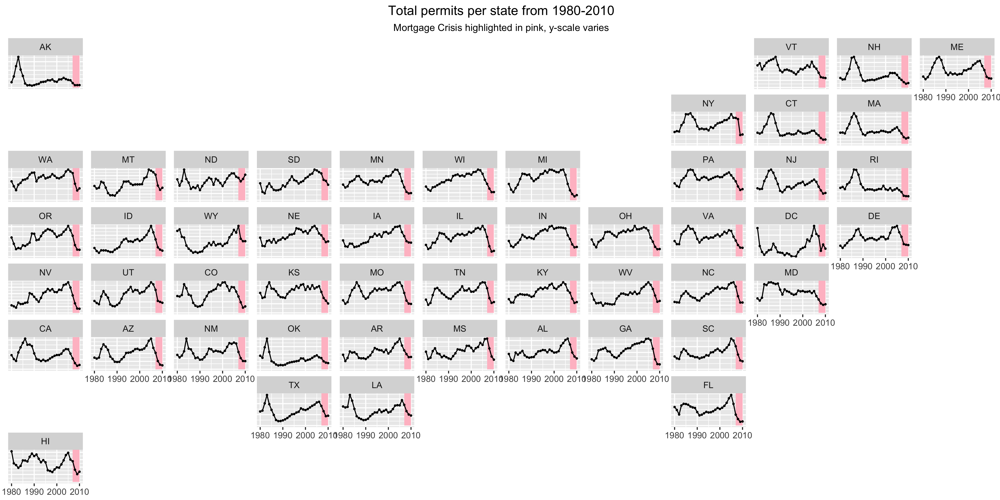
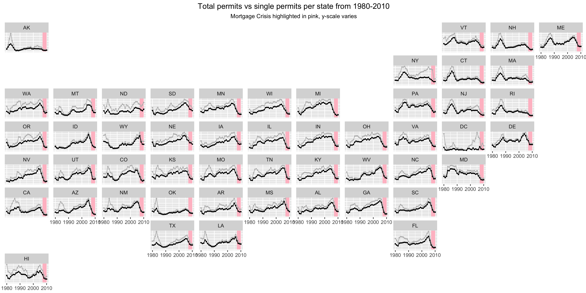
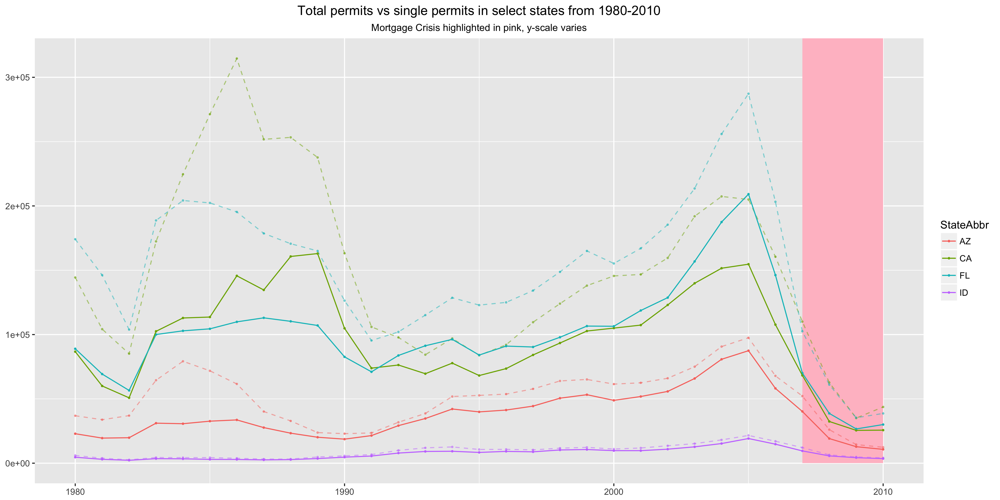
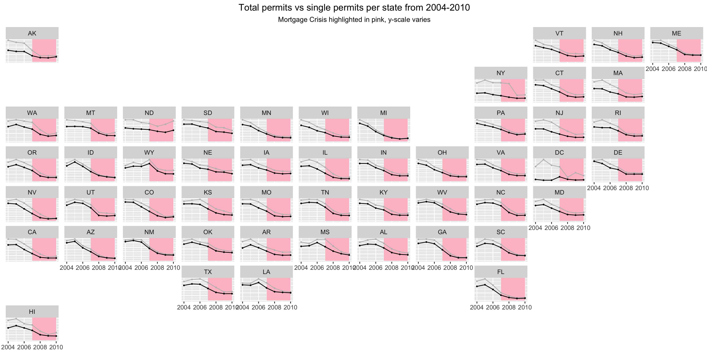

## Maps, time-series, crashes
Here is the graph that I created to display the mortage crisis in the United States. 

* I used facet_geo to facet against the map of the US
* I have the year on the x-axis, the total permits per state on the y-axis
* The scale of the y-axis is free
* I added a pink shadow to show the time of the mortage crisis

As you can see, in most states the mortgage crisis had a strong effect on the number of permits given. However, it seems that it was already slowing down even before the actual crisis, so it might indicate that there were some signs of the crisis even before the known crisis years.



```r
plot <- all.permits %>% # summarize sum by state
  group_by(StateAbbr, year) %>% 
  summarize(value = sum(value)) %>% 
  ggplot() +
  geom_rect(aes(xmin=2007, xmax=2010, ymin=0, ymax=Inf), fill = "pink") +
  geom_point(aes(x = year, y = value), size = 0.5) +
  geom_line(aes(x = year, y = value)) +
  labs(title = "Total permits per state from 1980-2010", subtitle = "Mortgage Crisis highlighted in pink, y-scale varies") +
  theme(axis.title.y = element_blank(),
        axis.text.y = element_blank(),
        axis.ticks.y = element_blank(),
        axis.title.x = element_blank(),
        plot.title = element_text(hjust = 0.5),
        plot.subtitle = element_text(hjust = 0.5)) +
  facet_geo(~StateAbbr, grid = "us_state_grid2", scale = "free_y")
```

### Second plot, created for single family permits
As Cody pointed out I was supposed to show single family permits, which I had not done. Here I show them in black compared to total permits in grey. The trend mostly follows, except for a few areas where total permits is much different from single permits.



```r
plot2 <- all.permits.sum %>% 
  ggplot() +
  geom_rect(aes(xmin=2007, xmax=2010, ymin=0, ymax=Inf), fill = "pink") +
  geom_point(aes(x = year, y = value_all), size = 0.5, col = "grey") +
  geom_line(aes(x = year, y = value_all), col = "grey") +
  geom_point(aes(x = year, y = value), size = 0.5) +
  geom_line(aes(x = year, y = value)) +
  labs(title = "Total permits vs single permits per state from 1980-2010", subtitle = "Mortgage Crisis highlighted in pink, y-scale varies") +
  theme(axis.title.y = element_blank(),
        axis.text.y = element_blank(),
        axis.ticks.y = element_blank(),
        axis.title.x = element_blank(),
        plot.title = element_text(hjust = 0.5),
        plot.subtitle = element_text(hjust = 0.5)) +
  facet_geo(~StateAbbr, grid = "us_state_grid2", scale = "free_y")
```

### Third plot, comparing select states
I selected a few states that I thought would be interesting to look at. Here I selected AZ, CA, FL, and ID and put them on the same scale. The dashed lines are total permits.



```r
plot3 <- all.permits.sum %>% 
  filter(StateAbbr == "FL" || StateAbbr == "CA" || StateAbbr == "ID" || StateAbbr == "AZ") %>% 
  ggplot() +
  geom_rect(aes(xmin=2007, xmax=2010, ymin=0, ymax=Inf), fill = "pink") +
  geom_point(aes(x = year, y = value_all, col = StateAbbr), size = 0.5, alpha = 0.5) +
  geom_line(aes(x = year, y = value_all, col = StateAbbr), alpha = 0.5, linetype = "dashed") +
  geom_point(aes(x = year, y = value, col = StateAbbr), size = 0.5) +
  geom_line(aes(x = year, y = value, col = StateAbbr)) +
  labs(title = "Total permits vs single permits in select states from 1980-2010", subtitle = "Mortgage Crisis highlighted in pink, y-scale varies") +
  theme(axis.title.y = element_blank(),
        axis.title.x = element_blank(),
        plot.title = element_text(hjust = 0.5),
        plot.subtitle = element_text(hjust = 0.5))
```

### Closer look into the recession
Here, as suggested by Cody, I made a graph of just the years leading up to the recession and the years of the recession. From 2004 - 2010.



```r
plot4 <- all.permits.sum %>% 
  filter(year <= 2004) %>% 
  ggplot() +
  geom_rect(aes(xmin=2007, xmax=2010, ymin=0, ymax=Inf), fill = "pink") +
  geom_point(aes(x = year, y = value_all), size = 0.5, col = "grey") +
  geom_line(aes(x = year, y = value_all), col = "grey") +
  geom_point(aes(x = year, y = value), size = 0.5) +
  geom_line(aes(x = year, y = value)) +
  labs(title = "Total permits vs single permits per state from 2004-2010", subtitle = "Mortgage Crisis highlighted in pink, y-scale varies") +
  theme(axis.title.y = element_blank(),
        axis.text.y = element_blank(),
        axis.ticks.y = element_blank(),
        axis.title.x = element_blank(),
        plot.title = element_text(hjust = 0.5),
        plot.subtitle = element_text(hjust = 0.5)) +
  facet_geo(~StateAbbr, grid = "us_state_grid2", scale = "free_y")
```
